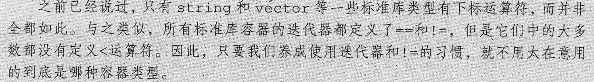

# C++容易遗忘的点


## 函数指针

+ https://blog.csdn.net/qq_40888863/article/details/119039003


## 头文件防卫式声明


`#Pragma once`也可以


## 头文件布局


## 位运算（二进制）的知识

+ |或0：与1=1，      &与：1与1=1，        ^异或（不相同为1）  （二进制对齐）

+ n&1可以判断奇偶

+ <<左移 >>右移(二进制运算)


## __int 64

+ 扩大int范围（32->64）(前面有两个_ )


## 支持随机访问(迭代器)的容器

+ vctor，deque，array


## sort的第三个参数是static类型

+ 非静态成员（non-static）函数是依赖于具体对象的，而std::sort这类函数是全局的，因此无法再sort中调用非静态成员函数。 静态成员函数或者全局函数是不依赖于具体对象的, 可以独立访问，无须创建任何对象实例就可以访问


## 当const在函数后面时

+ 当const 在函数名前面的时候修饰的是函数返回值；在函数名后面表示是C++ 常成员函数，该函数不能修改对象内的任何成员，只能发生读操作，不能发生写操作。 const 对象只能访问const 成员函数,而非const 对象可以访问任意的成员函数,包括const 成员函数.


## 顶层 const 和底层 const

从 const 指针开始说起。`const int* pInt;` 和 `int *const pInt = &someInt;`，前者是 *pInt 不能改变，而后者是 pInt 不能改变。因此指针本身是不是常量和指针所指向的对象是不是常量就是两个互相独立的问题。用**顶层**表示指针本身是个常量，**底层**表示指针所指向的对象是个常量。

更一般的，顶层 const 可以表示任意的对象是常量，这一点对任何数据类型都适用；**底层 const 则与指针和引用等复合类型有关**，比较特殊的是，指针类型**既可以是顶层** const **也可以是底层** const 或者**二者兼备**。

```cpp
int i = 0;
int *const p1 = &i;     //  不能改变 p1 的值，这是一个顶层
const int ci = 42;      //  不能改变 ci 的值，这是一个顶层
const int *p2 = &ci;    //  允许改变 p2 的值，这是一个底层
const int *const p3 = p2;   //  靠右的 const 是顶层 const，靠左的是底层 const
const int &r = ci;      //  所有的引用本身都是顶层 const，因为引用一旦初始化就不能再改为其他对象的引用，这里用于声明引用的 const 都是底层 const
```


## 只有“const static的整形成员”才可以在类定义体中进行初始化。


## exit() 和 return 区别

+ return 是语言级别的，表示调用堆栈的返回；而exit() 是系统调用级别的，表示进程的结束。 return 是退出(返回)函数，将控制权移交给递归的前一级；exit() 是直接退出进程。


## menset

+ 头文件在<cstring>？？

+ 数组也可以直接进行初始化，但 memset 是对较大的数组或结构体进行清零初始化的最快方法，因为它是直接对内存进行操作的。


## to_string(x)

+ 将数字x转化为‘x’


## assert

+ assert宏的原型定义在<assert.h>中，其作用是如果它的条件返回错误，则终止程序执行，原型定义：
  \#include <assert.h>
  void assert( int expression );

+ assert的作用是现计算表达式 expression ，如果其值为假（即为0），那么它先向stderr打印一条出错信息，
  然后通过调用 abort 来终止程序运行。

**以下是使用断言的几个原则：**

- （1）使用断言捕捉不应该发生的非法情况。不要混淆非法情况与错误情况之间的区别，后者是必然存在的并且是一定要作出处理的。
- （2）使用断言对函数的参数进行确认。
- （3）在编写函数时，要进行反复的考查，并且自问："我打算做哪些假定？"一旦确定了的假定，就要使用断言对假定进行检查。
- （4）一般教科书都鼓励程序员们进行防错性的程序设计，但要记住这种编程风格会隐瞒错误。当进行防错性编程时，如果"不可能发生"的事情的确发生了，则要使用断言进行报警。

ASSERT ()是一个调试程序时经常使用的宏，在程序运行时它计算括号内的表达式，如果表达式为FALSE (0), 程序将报告错误，并终止执行。如果表达式不为0，则继续执行后面的语句。这个宏通常原来判断程序中是否出现了明显非法的数据，如果出现了终止程序以免导致严重后果，同时也便于查找错误。

ASSERT 只有在 Debug 版本中才有效，如果编译为 Release 版本则被忽略。


## remove()

+ 名为remove()的STL函数（算法），它不是由对象调用，而是接受区间参数。因此，如果mylist是一个list<int>对象，则调用该函数的代码如下：remove(mylist.begin(), mylist.end(), 4);
  然而，由于该remove()函数不是成员，因此不能调整链表的长度。它将没被删除的元素放在链表的开始位置，并返回一个指向新的超尾值的迭代器。


## define用法

+ \#define 一般都写在函数外面，与 #include 写在一起。当然，写在函数里面也没有语法错误，但通常不那么写。#define 的作用域为自 #define 那一行起到源程序结束。如果要终止其作用域可以使用 #undef 命令，格式为：

+ define只是一种替换的形式，所以我们在宏定义的时候，养成一个良好的习惯，建议所有的层次都要加括号。

+ 麻烦点：

  ```c++
  define MACRO(arg1, arg2) do { /
      /* declarations / /
  
  stmt1; /
  
  stmt2; /
  
  / … / /
  
  } while(0) / (no trailing ; ) */
  关键是要在每一个换行的时候加上一个”/”
  ```


## auto（类型说明符）

+ 是一个类型说明符，通过变量的初始值来推断变量的类型

  + **auto||map用法**

  ```c++
      // member此处是引用类型，如果要限定语句块中不允许修改，可以使用类型修饰符const指定: const auto &
      for (auto &member : mapStudent)
      {
          member.second = "x";
      }                                                          
      // 打印结果各成员已修改为"x" 
      for (auto member : mapStudent)
      {
          cout << member.second << endl;
      }
  
      cout << "======= auto test case =========" << endl;
      mapStudent.clear();
      mapStudent[1] = "lilei";
      mapStudent[2] = "zhangsan";
      // member此处是临时变量类型，语句块内赋值并不影响mapStudent原始成员值
      for (auto member : mapStudent)
      {
          member.second = "x";
      }
      // 打印结果各成员还是与之前一样
      for (auto member : mapStudent)
      {
          cout << member.second << endl;
      }
  
  
  
      //another
      unordered_map<char, int> symbolValues = {
          {'I', 1},
          {'V', 5},
          {'X', 10},
          {'L', 50},
          {'C', 100},
          {'D', 500},
          {'M', 1000},
      };
  ```

  


## decltype（类型指示符）


## setw() 函数（头文件< iomanip >）

+ `setw()` 函数可以控制输出流的**下一个**输出内容的场宽。

+ 当包含了头文件`<iomanip>`，并运行以下语句时：

```cpp
int a=114514;
cout<<setw(10)<<114514;  //设置场宽为10
```

+ 当**下一个**输出的内容的宽度不足 `setw()` 函数中设置的参数时，输出流将自动在这个输出内容的**前面**添加字符（默认为空格）来补齐宽度。

+ 当下一个输出的内容超过 `setw()` 函数中设置的参数时，将不会产生任何效果

+ **需要特别注意， `setw()` 函数只会对下一个输出内容有效，对于多个输出内容，需要重新设置**

## setfill() 函数

```cpp
int a=114514;
cout<<setfill('*')<<setw(10)<<a;  //将补齐宽度时使用的字符设置为'*'
```

输出结果将为：

```plain
****114514
```

`setfill()` 函数将对**设置之后**输出流的所有内容有效，例如：

```cpp
int a=114,b=514;
cout<<setfill('*')<<setw(10)<<a<<" "<<setw(10)<<b;
```

输出结果将为：

```plain
*******114 *******514
```


## setprecision(x)函数

- 要求保留x位小数，可以用到 `cout<<fixed<<setprecision(x)<<a<<endl;`，意思是输出 a*a*，保留 x*x* 位小数。
- 配合**fixed**使用


## _int64

+ 64位整数


## getline()——读取一整行

+ **Ctrl+z 退出**


## 比较string对象


## 使用C++版本的C标准库头文件


## 下标运算符[]

+ 其下标是unsigned int型，所以如果传入下标小于0，会被转化位无符号整型


## rand()

+ 要取得 [a,b) 的随机整数，使用 (rand() % (b-a))+ a;

+ 要取得 [a,b] 的随机整数，使用 (rand() % (b-a+1))+ a;

+ 要取得 (a,b] 的随机整数，使用 (rand() % (b-a))+ a + 1;

+ 通用公式: a + rand() % n；其中的 a 是起始值，n 是整数的范围。

+ 要取得 a 到 b 之间的随机整数，另一种表示：a + (int)b * rand() / (RAND_MAX + 1)。

+ 要取得 0～1 之间的浮点数，可以使用 rand() / double(RAND_MAX)。


## 构造函数为什么不能是虚函数

1. 创建对象时，需要确定对象的类型，而虚函数是在运行时动态确定其类型的。在构造一个对象时，由于对象还未创建成功，编译器无法知道对象的实际类型；

2. 虚函数的调用需要通过vptr虚函数表指针，而该指针是存放在对象的内存空间中的，若构造函数声明为虚函数，那么由于对象尚未创建，还没有内存空间，也就没有对应虚函数表来调用虚构造函数了；

3.  虚函数的作用在于通过父类的指针或者引用，在调用它的时候能够通过动态链编调用子类重写的虚成员函数。而构造函数是在创建对象时是系统自动调用的，不可能通过父类或者引用去调用，因此就规定构造函数不能是虚函数。


## for语句体内不应改变其所遍历序列的大小


## 养成 != 的习惯




## 数据初始化

+ 全局的默认为0，局部的未知。


## inline和define的区别

**define**：定义预编译时处理的宏，只是简单的字符串替换，无类型检查。

**inline**：关键字用来定义一个类的内联函数，引入它的主要原因是用它替代C中表达式形式的宏定义，编译阶段完成。

+ 在类body内定义的函数时inline（但编译器要根据简易程度来认定是否inline）
+ 用来写函数编译会更快


## string::size_type

+ 它定义为与unsigned型（unsigned int或unsigned long）具有相同的含义，而且可以保证足够大可存储任意string对象的长度。
+ 任何存储string的size操作结果的变量必须为string::size_type类型。特别重要的是，不要把size的返回值赋给一个int变量。


## =default

`sales_data() = default;`

- `=default`要求编译器合成默认的构造函数。(`C++11`)


## 类之间的友元：

- 如果一个类指定了友元类，则友元类的成员函数可以访问此类包括非公有成员在内的所有成员。


## 封装的益处

- 确保用户的代码不会无意间破坏封装对象的状态。
- 被封装的类的具体实现细节可以随时改变，而无需调整用户级别的代码。


## 成员函数作为内联函数

- 成员函数作为内联函数`inline`：
  - 在类的内部，常有一些规模较小的函数适合于被声明成内联函数。
  - **定义**在类内部的函数是**自动内联**的。
  - 在类外部定义的成员函数，也可以在声明时显式地加上 `inline`。


## 可变数据成员（mutable data member）：

- `mutable size_t access_ctr;`
- 永远不会是`const`，即使它是`const`对象的成员。


## 如果成员使用了外层作用域中的某个名字，而该名字代表一种**类型**，则类不能在之后重新定义该名字。

- 


## 类成员初始化——const、引用……


## 抑制构造函数（explicit）定义的隐式转换：

- 将构造函数声明为`explicit`加以阻止。
- `explicit`构造函数只能用于直接初始化，不能用于拷贝形式的初始化。


## 如果程序崩溃，输出缓冲区不会被刷新


## 管理迭代器


## lambda表达式


## bind函数

+ ==**将函数包装为一元谓词**==
+ `lambda`表达式更适合在一两个地方使用的简单操作。
+ 如果是很多地方使用相同的操作，还是需要定义函数。
+ 函数如何包装成一元谓词？使用参数绑定。
+ 标准库bind函数：
  - 定义在头文件`functional`中，可以看做为一个通用的函数适配器。
  - `auto newCallable = bind(callable, arg_list);`
  - 我们再调用`newCallable`的时候，`newCallable`会调用`callable`并传递给它`arg_list`中的参数。
  - `_n`代表第n个位置的参数。定义在`placeholders`的命名空间中。`using std::placeholder::_1;`
  - `auto g = bind(f, a, b, _2, c, _1);`，调用`g(_1, _2)`实际上调用`f(a, b, _2, c, _1)`
  - 非占位符的参数要使用引用传参，必须使用标准库`ref`函数或者`cref`函数。==p357==

+ ==**重排参数顺序**==
+ 


## map和unordered_map的下标操作

| `c[k]`    | 返回关键字为`k`的元素；如果`k`不在`c`中，添加一个关键字为`k`的元素，对其值初始化。 |
| --------- | ------------------------------------------------------------ |
| `c.at(k)` | 访问关键字为`k`的元素，带参数检查；若`k`不存在在`c`中，抛出一个`out_of_range`异常。 |

- 下标和`at`操作只适用于非`const`的`map`和`unordered_map`。


## volatile

+ 有些变量是用volatile 关键字声明的。 **当两个线程都要用到某一个变量且该变量的值会被改变时，应该用volatile 声明**，该关键字的作用是**防止优化编译器把变量从内存装入CPU 寄存器中**。 *如果变量被装入寄存器，那么两个线程有可能一个使用内存中的变量，一个使用寄存器中的变量，这会造成程序的错误执行。*


## atoi

C 库函数 **int atoi(const char \*str)** 把参数 **str** 所指向的字符串转换为一个整数（类型为 int 型）


## #pragma once | #ifndef,#define,#endif

+ #pragma once用来防止某个头文件被多次

+ include，#ifndef，#define，#endif用来防止某个宏被多次定义。

+ #pragma once是编译相关，就是说这个编译系统上能用，但在其他编译系统不一定可以，也就是说移植性差，不过现在基本上已经是每个编译器都有这个定义了。
+ #ifndef，#define，#endif这个是C++语言相关，这是C++语言中的宏定义，通过宏定义避免文件多次编译。所以在所有支持C++语言的编译器上都是有效的，如果写的程序要跨平台，最好使用这种方式

+ **作用**：
  　　为了避免同一个文件被include多次
    　　1 #ifndef方式
    　　2 #pragma once方式
    　　在能够支持这两种方式的编译器上，二者并没有太大的区别，但是两者仍然还是有一些细微的区别。
    　　方式一：

  ​        #ifndef  \__SOMEFILE_H__

  　　#define \__SOMEFILE_H__
  　　... ... // 一些声明语句
  　　#endif
  　　方式二：
  　　#pragma once
  　　... ... // 一些声明语句
  　　#ifndef的方式依赖于宏名字不能冲突，这不光可以保证同一个文件不会被包含多次，也能保证内容完全相同的两个文件不会被不小心同时包含。当然，缺点就是如果不同头文件的宏名不小心“撞车”，可能就会导致头文件明明存在，编译器却硬说找不到声明的状况
  　　#pragma once则由编译器提供保证：同一个文件不会被包含多次。注意这里所说的“同一个文件”是指物理上的一个文件，而不是指内容相同的两个文件。带来的好处是，你不必再费劲想个宏名了，当然也就不会出现宏名碰撞引发的奇怪问题。对应的缺点就是如果某个头文件有多份拷贝，本方法不能保证他们不被重复包含。当然，相比宏名碰撞引发的“找不到声明”的问题，重复包含更容易被发现并修正。
  　　方式一由语言支持所以移植性好，方式二 可以避免名字冲突


## struct和typedef  struct

[区别](https://www.cnblogs.com/qyaizs/articles/2039101.html)


## 读文件1

```c++
ifstream ifs;

ifs.open("text.txt", ios::in);

if (!ifs.is_open()) {
	cout << "failed to open text.txt" << endl;
    return;
}

//读文件——只会一个单词一个单词输出
char buf[1024] ={0};
while (ifs >> buf) {
	cout << buf << endl;
}

//一行一行输出
char buf[1024] = { 0 };
while (ifs.getline(buf, sizeof(buf))) {
	cout << buf << endl;
}

//与第二种一样
string buf;
while (getline(ifs, buf)) {
	cout << buf << endl;
}

//一个字符一个字符的读
char c;
while ((c = ifs.get()) != EOF) {//EOF end of file
	cout << c;
}

ifs.close();
```


## 读文件2

```c++
class person {
public:
	char m_name[100];
	int m_age;
};

int main() {
	person p = { "张三",18 };

	//ofstream ofs;
	//ofs.open("class_write_test.txt", ios::out|ios::binary);

	//ofs.write((const char*)&p, sizeof(person));

	//ofs.close();

	ifstream ifs;
	ifs.open("class_write_test.txt", ios::in | ios::binary);

	if (!ifs.is_open()) {
		cout << "failed to open txt" << endl;
		return NULL;
	}

	ifs.read((char*)&p, sizeof(person));
	cout << p.m_age << " " << p.m_name << endl;

	ifs.close();

	return 0;
}
```


## 构造函数初始化类内数据

> 之所以放在 ：后，是因为这样时初始化
>
> 如果放在{ }内相当于赋值，虽然效果都一样，但是效率不如第一种方式


## emplace_back()和push_back()的区别

push_back() 向容器尾部添加元素时，首先会创建这个元素，然后再将这个元素拷贝或者移动到容器中（如果是拷贝的话，事后会自行销毁先前创建的这个元素）；而emplace_back() 在实现时，则是直接在容器尾部创建这个元素，省去了拷贝或移动元素的过程。


## 相同class的各个objects互为friends（友元）


## 临时对象&局部对象不得引用到外部


## int (*p)[5] 与 int *p[5]


## 深拷贝自我赋值检测


+ why


# end
