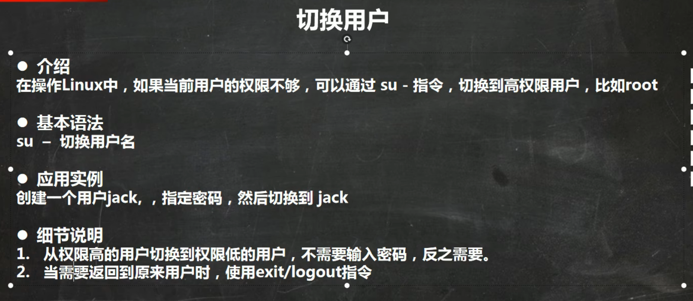
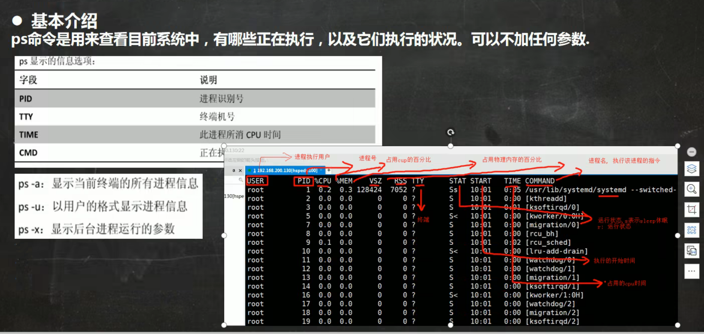
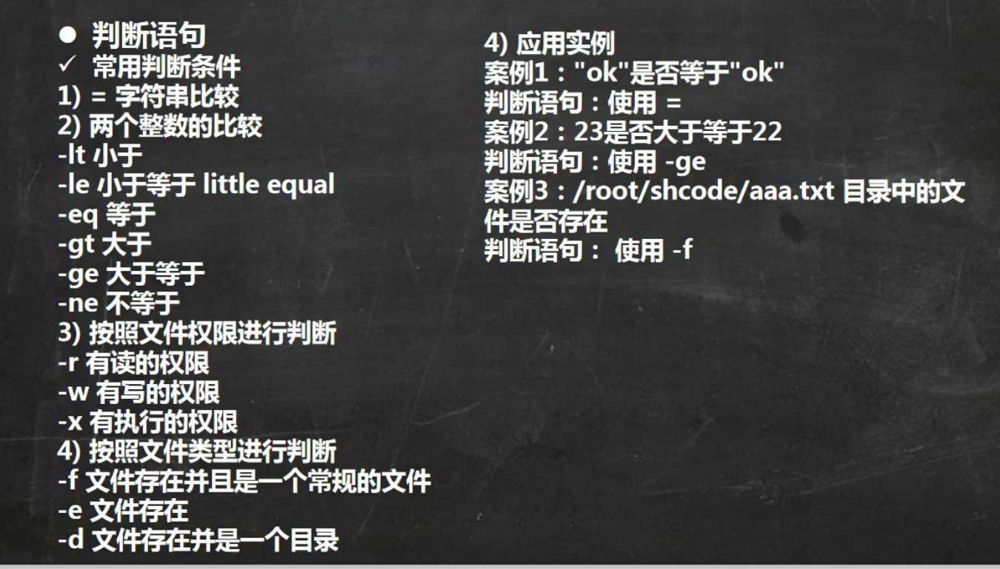
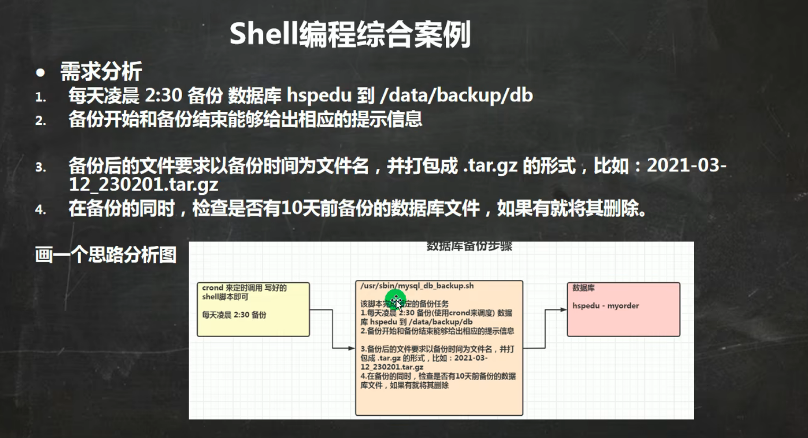
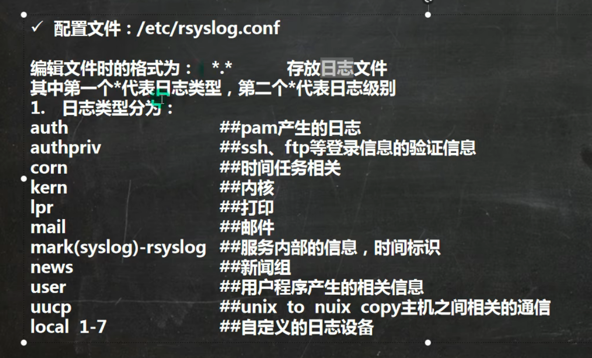
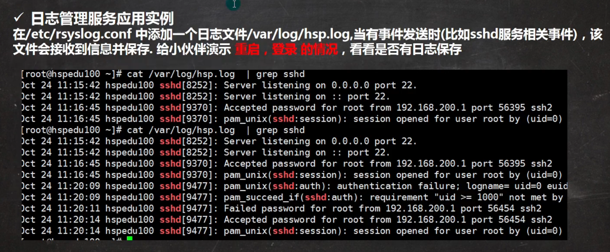
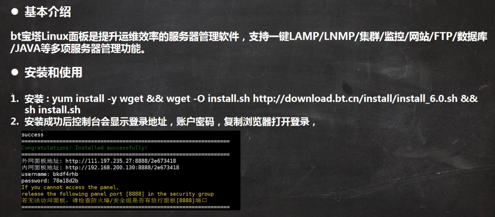
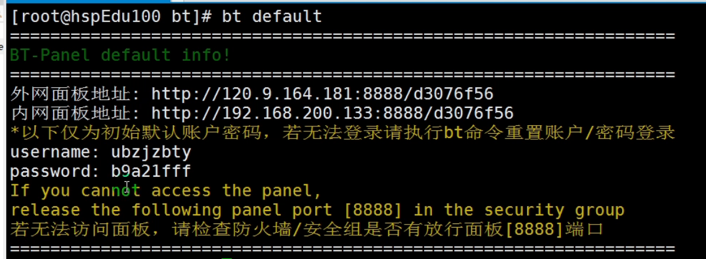

# Linux目录结构

**在Linux世界里，一切皆文件**

# 远程登陆Linux

## Xshell

> 只能对远程Linux系统进行命令的操作

## Xftp

# vim快捷键

# 关机&重启命令

+ shutdown

# 登陆注销

# 用户管理

## 添加用户

## 指定/修改密码

## 删除用户

## 切换用户

## 查看当前用户/登录用户

+ 显示初始登陆用户

## 用户组

## id usr

+ 查看当前用户所在组

## 用户和组相关文件

# Linux实用指令

+ ... & //让...后台运行 

## 指定运行级别

+ systemctl get-default
+ systemctl set-default

## root找回密码 

## 帮助指令

## 文件目录类

### pwd，ls

### cd

### mkdir

### rmdir

### touch

### cp

### rm

### mv

           

### cat与more（浏览）

### less（浏览）

### echo，head，tail

+ **ctrl+c退出监控**

### \>,>>

### ln(软连接)

### history

## 时间日期类

### date

### cal

## 搜索查找类

### find

### locate 、which

### grep

+ grep -v
  + 反向匹配

## 压缩和解压类

### gzip gunzip

### zip unzip

### tar

# Linux组管理和权限管理

## Linux组基本介绍

## 文件/目录所有者

## 文件/目录所在组

## 其他组

## 权限基本介绍

## rwx详解

## 修改权限-chmod

### 第一种方式：+ - =变更权限

### 第二种方式：通过数字变更权限

### 练习

# Linux定时任务调度

## crond任务调度

### -e -l -r

+ crontab

### 占位参数

### 特殊符号说明

### 特殊时间执行案列

### crond应用案例与相关指令

## at定时任务

### 基本介绍

#### ps -ef 与 命令格式

### at命令选项

### at时间定义

### at定时任务-案列

# Linux磁盘分区、挂载

## Linux分区

### 原理介绍

### 硬盘说明

     

### 查看所有设备挂载情况

+ lsblk
+ lsblk -f

## 挂载经典案列

### 步骤1

### 步骤2-fdisk /dev/sdb

### 步骤3-mkfs -t ext4 /dev/sdb1

### 步骤4-mount /dev/sdb1 /newdisk

### 步骤5- vim /etc/fstab

+ 永久挂载

## 磁盘情况查询

### 查询系统整体磁盘占用情况--df -h

### 查询指定目录的磁盘占用情况-du -[选项]

## 磁盘工作实用指令

# Linux网络配置

## Linux网络配置原理图

## 查看网络IP和网关

### 查看虚拟网络编辑器和修改IP地址

### 查看网关

### 在Windows和Linux查看网络配置

### ping测试主机之间的网络连通性

## Linux网络环境配置

### 第一种方法（自动获取）

### 第二种方法（指定ip）

## 设置主机名和hosts映射

### 设置主机名

### 设置hosts映射

### 主机名解析机制分析（Hosts、DNS）

# Linux进程管理

## 基本介绍

## 显示系统执行的进程-ps

### 基本介绍

### ps详解

### 应用实例

### 查看进程树-pstree

## 终止进程-kill killall

## Linux服务管理

### 介绍-service-守护进程

### 查看服务名

### 服务的运行级别

+ systemctl get-default
+ systemctl set-default

### chkconfig-服务在各个运行级别的开/关

### systemctl管理指令

### 打开或关闭指定端口-firewall

## 动态监控进程-top

### 介绍

### top交互操作说明

## 监控网络状态-netstat -ping

# Linux RPM 与 YUM

## rpm包管理

### 简单查询指令

### 其他查询指令

### ==卸载==-rpm -e RPM包名

### ==安装==-rpm -ivh RPM包全路径名

## yum

# shell编程

## shell是什么

## shell脚本的执行方式

+ shell脚本格式要求

## shell变量

### 介绍与定义

### 规则

### 设置环境变量

### 位置参数变量

### 预定义变量

## 运算符

## 条件判断

### 判断语句

### 常用判断条件

## 流程控制

### if判断

### case语句

### for循环

### while循环

## read获取输入

## 函数

### 系统函数

 

### 自定义函数

##  shell编程综合案例

# Linux日志管理

## 日志介绍和实例

### 基本介绍

### 系统常用日志

### 应用案例

## 日志管理服务rsyslogd

### 日志服务原理图

### 配置文件及格式

### 日志文件格式

### 自定义日志服务

## 日志轮替

### 介绍

### logrotate配置文件

#### 参数说明

### 自定义日志轮替

### 日志轮替机制原理

## 查看内存日志

# 定制自己的Linux

## 基本介绍

## 基本原理

## 制作mini Linux的思路分析

# Linux内核源码&内核升级

## 为什么要阅读Linux内核

## 基本介绍

## 源码阅读技巧

## Linux内核最新版和内核升级

### 最新版

### 内核升级

# 备份与恢复介绍

## 基本介绍

## 安装dump和restore

## 用dump完成备份

### 基本介绍

### 应用案例

### dump -W

### dump备份文件或目录-不支持增量备份

## 用restore完成恢复

### 基本介绍和基本语法

### 应用案例

#### 比较模式

#### 查看模式

#### 还原模式

# Linux可视化管理 webmin和bt运维工具\

## bt

### bt安装

### 查看用户密码等

# Linux面试题-12

p142-153

# end