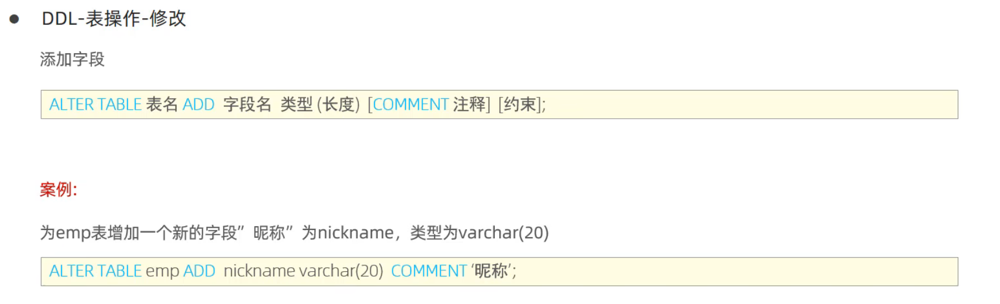
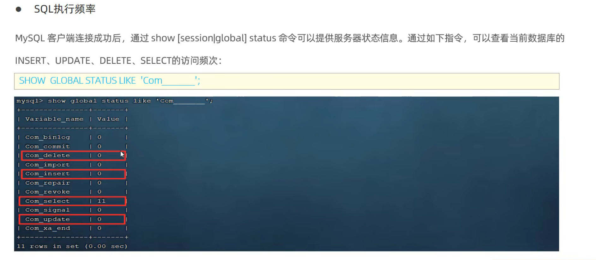
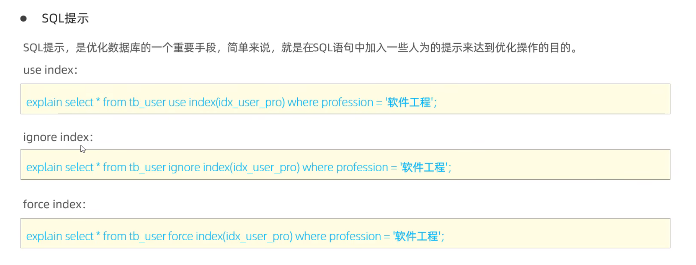
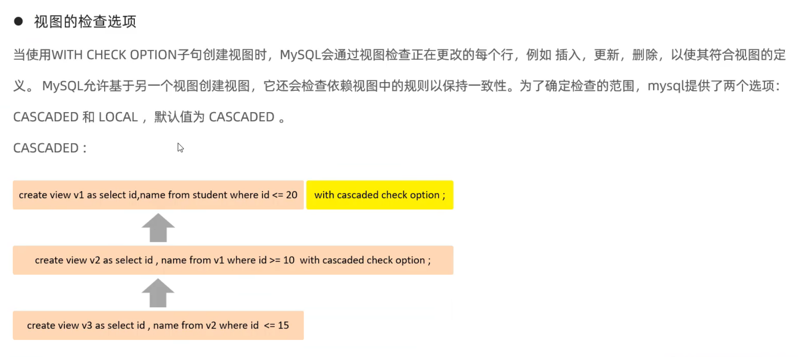
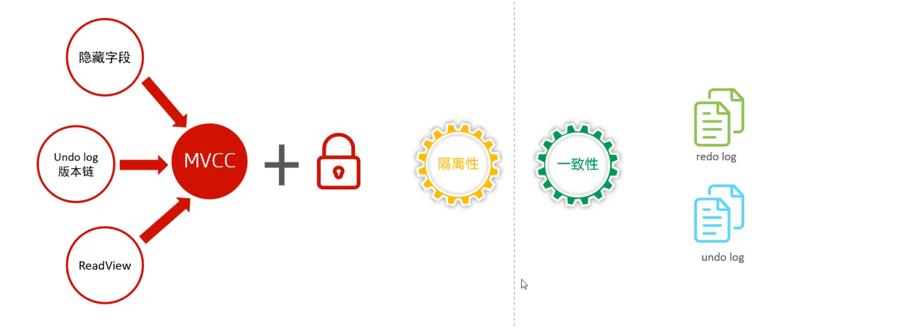
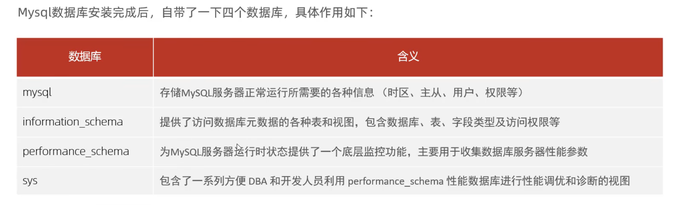

# —==基础篇==—

# SQL

## DDL

### DDL-数据库操作

### DDL-表操作

#### 查询

#### 创建

#### 数据类型

##### 数值类型

##### 字符串类型

##### 日期类型

#### 修改

### MySQL图形化界面

## DML

### 添加数据-insert

### 修改数据-update

### 删除数据-delete

	

## DQL

### 语法

+ 编写顺序

### 基本查询

### 条件查询-WHERE

### 聚合函数

### 分组查询-GROUP BY

### 排序查询-ORDER BY

### 分页查询-LIMIT

### 执行顺序

## DCL

### 管理用户

### 权限控制

# 函数

## 字符串函数

## 数值函数

## 日期函数

## 流程函数

# 约束

## 概述

## 演示

+ auto_increment

## 外键约束

### 语法

### 删除/更新行为

# 多表查询

## 多表关系

### 概述

### 一对多（多对一）

### 多对多

### 一对一

+ 单表拆分

## 多表查询概述

### 概述

### 多表查询分类

## 内连接

### 语法

### 案例

## 外连接

+ 连接起来的数据就是交集

### 语法

### 案例

## 自连接

### 解释

### 语法

+ 起别名
  + +内连接查询
  + +外连接查询

### 案例

## 联合查询-union，union all

### 语法

+ 放到where and？？

### 案例

## 子查询

### 概念

### 标量子查询

		

### 列子查询

### 行子查询

### 表子查询

## 多表查询案例

# 事务

## 事务简介

## 事务操作

### 方式一

### 方式二

## 事务的四大特性

+ 原子性、一致性、隔离性、持久性(ACID)

## 并发事务问题

### 脏读

### 不可重复读

### 幻读

## 事务的隔离级别-解决上述问题

## 事务隔离级别

+ Repeatable Read
  + 可重复读
+ Serializable
  + 串行化

# —==进阶篇==—

# 存储引擎

## MySQL体系结构

## 存储引擎简介

+ 指定存储引擎

## 存储引擎特点

+ MyISAM

+ Memory

+ 区别
  + InnoDB与MyISAM的区别：==**事务，外键，行级锁**==

## InnoDB逻辑存储结构

## 存储引擎选择

# 索引

## 索引概述

+ 优缺点

## 索引结构

### 索引结构

### 数据库支持

### 二叉树

### B-Tree

### B+-Tree

+ ### mysql中的B+Tree

### Hash

### 思考：为什么InnoDB存储引擎选择使用B+tree

## 索引分类

### 分类

### 在InnoDB存储引擎中

+ 聚集索引
+ 二级索引

### 回表查询

### 思考：InnoDB主键索引的B+tree高度为多高

## 索引语法

### 语法

### 案例

## SQL性能分析

### 查看SQL的执行频次

### 慢查询日志

### 	profile详情

### explain执行计划

## 索引使用规则

### 验证索引效率

### 最左前缀法则-联合索引

### 范围查询

### 索引失效情况一

#### 索引列运算

#### 字符串不加单引号

#### 模糊查询

### 索引失效情况二

#### or连接的条件

#### 数据分布影响

### SQL提示

### 覆盖索引&回表查询

+ 查询展示的字段在二级索引中都有不需要回表查询

#### 思考

+ 对username，password建立联合索引

### 前缀索引

### 单列&联合索引

## 索引设计原则

# SQL优化

## 插入数据

### insert优化-批量插入

+ 批量插入、手动提交事务、主键顺序插入

### 大批量插入数据

## 主键优化

### 数据组织方式

### 主键乱序==插入==会出先==页分裂==

### ==删除==时会出现==页合并==

### 主键设计原则

## order by优化

## group by优化

## limit优化

## count优化

### 优化思路

### count的几种用法及效率

## update优化

+ InooDB中用索引行级锁，反之表锁

# 视图-view

## 介绍

## 视图创建，查询，修改，删除

## 视图的检查选项 cascaded/local

+ cascaded：级联
  + 会将上层依赖的视图都加上with cascaded check option；

+ local
  + 不会将上层依赖的视图加with local check option; 但是会检查上层（是否有选择选项等）

## 视图的更新

## 视图的作用

+ 数据独立
  + 若基表中列改名了，可以如下图保证视图的列名不变

## 案例

# 存储过程-procedure

## 介绍&特点&基本语法

+ 事先定义并存储在数据库中的一段SQL逻辑

+ 特点
  + 封装，复用
  + 可以接收参数，也可以返回数据
  + 减少网络交互，效率提升

## 流程控制

### 变量

#### 系统变量

#### 用户定义变量

#### 局部变量

+ #### 用 := 赋值

### if判断

### 参数

### case

+ 与流程控制中的函数类似
+ 语法一和switch类似
+ 语法二和if else类似

+ **练习**

### 循环

#### while

#### repeat

+ 满足条件则退出循环

+ 先判断一次在进行循环

#### loop

### 游标cursor

+ 局部变量不能接收一个表的内容
+ 游标可以存储查询结果集

#### 条件处理程序handler

+ 配合游标cursor使用

## 存储函数

> 有返回的存储过程，参数类型只能是in

+ 比较少用
  + 因为存储函数能做的事情存储过程也能做，而且存储函数需要返回值

# 触发器-trigger

## 介绍

+ 可以确保数据完整性、日志记录、数据检验

+ 行级触发器表示操作了某行而触发
+ 语句触发器表示执行了某条语句，例如update而触发

## 语法

## 案例

+ **通过触发器记录表的变更日志**

### 插入触发器

### 修改触发器

### 删除触发器

# 锁

## 介绍和分类

## 全局锁

### 介绍

+ 获取一致性视图，保证数据的完整性	

+ **加了全局锁后**

### 语法和演示

+ mysqldump是MySQL提供的命令，在命令行使用
+ flush tables with read lock

### 特点

### 不加锁实现一致性数据备份

+ 加上选项
  + --single transcation

## 表级锁

### 介绍和分类

### 表锁

+ read lock
  + 自己和其他客户端都不可以write，但都可以read
+ write lock
  + 自己可以read和write，其他客户端都不可以

### 元数据锁-~解决DML和DDL的冲突~

+ 存在没有提交的事务时候，不可以对元数据进行写入操作

+ 为了**避免DML与DDL冲突**，保证读写的正确性
+ SHAREAD_READ,与SHAREAD_WRITE 共享
+ EXCLUSIVE与SHAREAD_READ, SHAREAD_WRITE 互斥

### 意向锁-~解决行锁和表锁的冲突~

+ 行锁出现时同时出现、自动加的

+ 为了解决**行锁和表锁**的冲突

+ 为了避免DML在执行时，加的**行锁和表锁**的冲突，在InnoDB中引入了意向锁，使得表锁不用检查每行数据是否加锁，使用意向锁来减少表锁的检查

+ 意向锁和表锁的兼容情况

## 行级锁

### 介绍

+ 行级锁
  + 不给update、delete该行
+ 间隙锁
  + 不给在改行前insert
+ 临建锁
  + 行级锁和间隙锁组合

### 行锁的两种类型-共享锁和排他锁

### 设置行级锁

### 索引与行锁

### 间隙锁/临建锁

+ 间隙锁-防止多个事务并发操作时出现幻读

+ next-key锁：临建锁

# InnoDB引擎

## 逻辑存储结构

+ 每个区的大小为1M，默认情况下，InnoDB存储引擎页大小为16k，即一个区中一共有64个连续的页
+ 为了保证页的连续性，InnoDB存储引擎每次从磁盘申请4-5个区

## 架构

### 总架构

### 内存架构 In-Memory Structures

> 减小磁盘I/O

#### Buffer Pool

> 缓冲区

#### Change Buffer

> 更改缓冲区

#### Adaptive Hash Index

> 自适应哈希

#### Log Buffer

> 日志缓冲区

### 磁盘架构 On-Disk Structures

#### System Tablespace ==&== File-Per-Table Tablespaces

> 系统表空间

#### General Tablespaces ==&== Undo Tablespaces ==&== Temporary Tablespaces

> 通用表空间 & 撤销表空间 & 临时表空间

#### Doublewrite Buffer Files ==&== Redo Log

> 双写缓冲区 & 重做日志

### 内存与磁盘之间-数据的传输

## 事务原理

### 介绍

+ redo log + undo log保证事务一致性
+ MVCC+锁保证事务隔离性

### redo log—保证事务持久性

### undo log—保证事务原子性

## MVCC

> 多版本并发控制

### MVCC基本概念

+ 当前读、快照读、MVCC
  + 使用当前读的语句可以在事务中直接读取当前数据，而不用看事务隔离级别

### MVCC实现原理

> 三个隐藏字段+undo long版本链+readview

#### 记录隐藏字段

+ 事务ID
+ 回滚指针

+ ibd2sdi 表名
  + 查看表空间文件

#### undo log & undo log版本连

#### readview

> 用于==当前快照读==应该读取哪个版本

##### 介绍

+ max_trx_id 为当前最大事务ID+1

##### 版本链数据访问规则

##### RC-案例

> 读已提交

##### RR-案例

> 可重复读

# MySQL管理

## 系统数据库

## 常用工具

### mysql

+ MySQL客户端工具，-e执行SQL并退出

### mysqladmin

> MySQL管理工具

### mysqlbinlong

> 二进制日志查看工具

### mysqlshow

+ 客户端对象查找工具，查看数据库、表、字段的统计信息和状态等

### mysqldump

> 数据库备份工具

### mysqlimprt/source

> 数据导入工具

> mysqlimport只能导入mysqldump -T 中备份的文本文件
>
> source用于导入sql文件

+ source需要进入到mysql的命令行中进行

# END