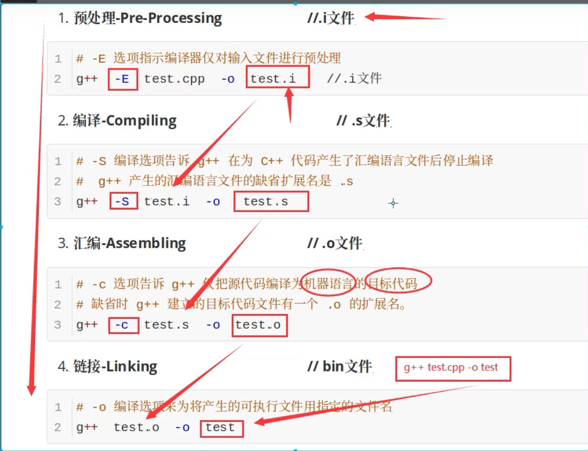

# 代码编译过程

[编译过程](https://zhuanlan.zhihu.com/p/476697014)

+ gcc编译的4个步骤

1. 将C语言源程序预处理，生成 .i 文件。
2. 预处理后的.i文件编译成为汇编语言，生成 .s 文件。
3. 将汇编语言文件经过汇编，生成目标文件 .o 文件。
4. 将各个模块的 .o 文件链接起来生成一个可执行程序文件。




# 动态链接和静态链接

+ 静态链接是main.o文件和.lib文件生成可执行文件
  + main.o文件是main.cpp编译的目标文件
  + .lib\\libxxx.a是main.cpp需要的函数编译的目标文件集合
+ 动态链接是.o问件生成可执行文件，然后.lid和.dll链接可执行文件
  + main.o文件是main.cpp编译的目标文件
  + .lib是main.cpp需要的函数编译的目标文件的索引
  + 真正的目标文件(.o)在.dll\\.so中


# 第1章 开始

## 标准输入输出

| 类型                     | 代码 |
| ------------------------ | ---- |
| 标准输入                 | cin  |
| 标准输出                 | cout |
| 输出警告和错误信息       | cerr |
| 输出程序运行时的一般信息 | clog |


# 第2章 变量和基本类型

## 指针与引用的区别

1. 指针是存储变量地址的变量；引用是变量的别名。
2. 指针变量定义时不必初始化；引用定义时必须初始化，不然会报错。


## 指向指针的引用

~~~c++
int i = 42;
int *p;
int *&r = p;
~~~


## 让const常量多文件共享——extern

~~~c++
// file_1.cc 定义并初始化了一个常量，该常量能被其他文件访问
extern const int bufSize = fcn();
// file_1.h 头文件
extern const int bufSize;	//与file_1.cc中定义的bufSize是同一个
~~~


## const 引用和指针

~~~c++
//如果引用对象或指针指向对象是const，则自身也要是const
const int i = 10;
const int &a = i; //正确
const int *b = &i; //正确
int &c = i; //错误
int *d = i; //错误

//如果引用的类型是const或指针是常量指针,指向的对象是不是常量多可以
int a = 10;
const int &i = a;	//	此时不允许通过引用或指针修改a的值
const int *j = &a;
~~~


## 顶层const和底层const

~~~c++
int i = 0;
int *const p1 = &i;			//不能改变p1的值，这是一个顶层const
const int ci = 42;			//不能改变ci的值，这是一个顶层const
const int *p2 = &ci;		//可以修改p2的值，这是一个底层const
const int *const p3 = p2;	//靠右的是顶层const，靠左的是底层const
~~~


## 常量表达式——constexpr

+ 常量表达式是指值不会改变并且在**编译过程就能得到计算结果的表达式**

~~~c++
const int max_files = 20;			//max_files是常量表达式
const int limit = max_files + 1;	//limit是常量表达式
int staff_size = 27;				//尽管27是字面值常量，但staff_size不是常量表达式
const int sz = get_size();			//sz不是常量表达式
~~~

+ **==C++11==**新新标准规定，允许变量声明为constexpr类型以便编译器来验证变量值是否是一个常量表达式
+ constexpr必须由常量表达式来初始化

~~~c++
constexpr int mf = 20;			// 20是常量表达式
constexpr int limit = mf + 1;	// mf + 1是常量表达式
constexpr int sz = size();		// 只有当size是一个constexpr函数的时候才是一条正确的声明语句
~~~

+ constexpr函数需要足够简单以使得编译时就可以计算其结果
+ constexpr指针的初始值必须是nullptr或者0，或者是存储于某个固定地址中的对象
+ constexpr指针/引用**不能指向函数体内声明的变量**，除非是static类型
+ constexpr**只对指针有效**，对指针指向的对象无关


## auto & decltype

+ auto一般会忽略掉顶层const

~~~c++
int i = 0;
const int ci = i， &cr = ci;
auto b = ci;	//b是一个整数
auto c = cr;	//c是一个整数
auto d = &i;	//d是一个整型指针
auto e = &ci;	//e是一个指向整数常量的指针（是一种底层const——>e可以改变指向）
~~~

+ 如要获取到指针、引用、const需要自己加

~~~c++
const auto f = ci;	//通过推演ci的类型为int，f为const int
auto &g = ci;		//g是一个整型常量的引用——>const int &g
auto *p = &ci;		//p是一个常量指针——>const int *p;
~~~


+ decltype
  + 从表达式中的类型判断出要定义的变量的类型
+ decltype处理顶层const和引用的方式和auto**==不同点==**
  + 如果decltype使用的表达式是一个变量，则decltype返回该变量的类型（**包括顶层const**）
  + 如果是引用，则返回引用类型，此时变量必须初始化
+ 引用从来都是作为其所指对象的同义词出现，只有用在decltype处是个例外
  + 指需要引用的引用类型，比如`int &a = b; decltype(a) c = d; `decltype(a)——>int &
+ 指针
  + `int *p = a; decltype(p) b = c`decltype(p)——>int &

+  decltype((i)) 返回i的类型的引用，`int i = 1; decltype((i)) b = c;`decltype((i))——>int &


## 自定义数据结构

+ sturct，class都是类，唯一的区别是前者默认访问类型是public，后者默认访问类型是private

+ 最好不要包对象的定义和类的定义放在一起
+ 类定义后要放 ;


## 头文件保护符

~~~c++
//定义一个Sales_data.h
#ifndef SALES_DATA_H
#define SALES_DATA_H

...

#endif
~~~


## static

+ 生命周期长：static 变量的生命周期与程序运行期间一致，即使函数返回或者调用结束，它的值也会一直保存在内存中，直到程序结束。
+ 作用域小：static 变量的作用域仅限于声明它的函数内部，即使在函数外部定义了同名的变量，也不会产生命名冲突。
+ 初值保持：第一次声明 static 变量时，它会被初始化为 0 或者空指针。随后，每次函数调用结束后，static 变量的值会被保留下来，不会被重置为初始值。
+ 只能在函数内部访问：由于作用域的限制，只有在声明 static 变量的函数内部才能访问该变量，外部无法访问。

+ 使用 static 变量可以在函数之间（相同的函数调用）共享数据，同时又能够避免变量名冲突的问题。它也常用于在函数内部存储需要保持状态的数据，例如计数器、缓存等。


# 第3章 字符串、向量和数组

## 头文件不应包含using声明

+ 这是因为头文件的内容会拷贝到所有引用它的文件中去，如果头文件里有某个using声明，那么每个使用了该头文件的文件都会有这个声明，对于某些程序来说，由于不经意间包含了些名字，反而可能产生始料未及的**名字冲突**


## getline输出一整行

+ geline(cin, line)
+ 会保留空白符
+ getline会读取到换行符，只不过传给(string)line的时候丢弃了


## size()返回无符号整型数

~~~c++
string s = 'sfasf';
auto len = s.size();	//len的类型为string::size_type——>是一个unsigned

int i = -1;
s.size()<i; //这条结果一定是true，这是因为负值i会自动转换成一个比较大的无符号值
~~~

+ 所以如果表达式中已经有了 size() 函数就不要再使用 int 了，这样可以避免混用 int 和 unsigned 可能带来的问题


## string比较规则

+ 如果两个string长度不同，但是短的是长的的子集，则长的比短的要长
+ 相反，则第一个不同的字符比较结果就是string对象的比较结果


## 字面值和string相加

+ 字面值不能直接相加，错误例子
  + `string s5 = "hello"+','+s4;`
  + `string s7 = ("hello"+",")+s6; `


## vector为元素的vector初始化——老式编译器

`vector<vector<int> >`多了空格


## 列表初始化

~~~c++
vector<int> v1(10);			//v1有10个元素，每个的值都是0
vector<int> v2{10};			//v2有1个元素，该元素值为10

vector<int> v3(10,1)		//v3有10个元素，每个的值都是1
vector<int> v4{10,1}		//v4有2个元素，值分别是10，1
~~~


+ 如果花括号提供的值不能用来列表初始化，则考虑用这些值来构造vector对象

~~~c++
vector<string> v5("hi");	//错误：不能使用字符串字面值来构造vector对象
vector<string> v6{"hi"};	//列表初始化，v6有一个元素
vector<string> v7{10};		//v7有10个默认初始化的元素
vector<string> v8{10,"hi"}
~~~

+ **不能使用字符串字面值**构造vector对象


## for循环内不应改变所遍历序列的大小，比如插入数据等

~~~c++
vector<int> v1 = ...
for(auto &a : v1){...}

for(vector<int>::iterator it = v1.begin();it!=v1.end();it++){...}

//如果序列大小改变，for循环预存了end(),end()就可能无效
~~~


## 对vector使用size_type

`vector<int>::size_type`

`vector::size_type 错误`


## vector不能使用下标添加元素


## 迭代器

+ 迭代器像指针

`vector<int>::iterator it;	//it能读写vector<int>中的元素`

`vector<int>::const_iterator it;	//it只能读vector<int>中的元素，不能写元素`

+ 迭代器这个名词有三种不同的含义
  + 迭代器概念本身
  + 指定容器定义的迭代器类型
  + 迭代器对象

+ begin()，end() 根据对象的类型而确定
  + ​	`vector<int> v1; const vector<int> v2`
    + `auto it1 = v1.begin();	//it1是vector<int>::iterator`
    + `auto it2 = v2.begin();	//it2是vector<int>::const_iterator`


## 相对于vector来说数组有什么缺点

+ 数组不够灵活
+ 数组的容量固定
+ 数组不允许拷贝和赋值
+ 数组容易越界
+ 获取数组长度不方便


## 标准库begin，end

~~~c++
int iap[] = {0,1,2,3,4,5,6,7,8,9};
int *beg = begin(iap);	//指向ia首元素的指针
int *beg = end(iap);	//指向ia尾元素下一位置的指针
~~~


## 使用数组初始化vector

+ 不能使用vector初始化数组

~~~c++
int int_arr[] = {0, 1, 2, 3, 4, 5};
vector<int> ivec(begin(int_arr), end(int_arr));
~~~


## 范围for处理多维数据~引用数组~

+ 要使用范围 for 语句处理多为数组，除了最内层的循环外，其他所有循环的控制变量都应该是引用类型

~~~c++
int ia [3][4] = ...
for(const auto &row : ia){	//row引用了大小为4的数组
	for(auto col : row){
		cout<<col<<endl;
	}
}

for(auto row : ia){			//row是一个int*
	for(auto : row){		//对指针遍历不合法
		...
	}
}
~~~


## 多维数组

+ 没有多维数组，实际上是数组的数组


# 第4章 表达式

## 左值和右值

+ 左值和右值有如下3个规则：

1. **左值和右值都是表达式。**
2. **左值是对象定位器，理论上左值指示指示一个对象。**
3. **右值是一个临时值，其他位置无法访问这个值，通常情况下在语句执行完成后右值就被丢弃。**

+ 左值：**可以进行取地址**的称为左值。

+ 右值：**不能进行取地址**的称为右值。右值包括：临时对象、匿名对象、临时变量、匿名变量、字面值常量（10）


+ 传统的左值引用：

```C++
int a = 10;
int &b = a;  // 定义一个左值引用变量
b = 20;      // 通过左值引用修改引用内存的值
```

*左值引用在汇编层面其实和普通的指针是一样的；*定义引用变量必须初始化，因为引用其实就是一个别名，需要告诉编译器定义的是谁的引用。

+ 错误的左值引用：

```C++
int &val = 10;
```

10无法进行取地址操作，无法对一个立即数取地址，因为立即数并没有在内存中存储，而是存储在寄存器中，在这一行代码执行完毕后，就被丢弃了，可以通过下述方法（**常引用**）解决：

```C++
const int& val = 10;
 
// 等价于
 
const int temp = 10; 
const int &val = temp;
```

小结：

+ **左值引用要求右边的值必须能够取地址，如果无法取地址，可以用常引用；但使用常引用后，我们只能通过引用来读取数据，无法去修改数据，因为其被const修饰成常量引用了。**

由此可知，为什么很多情况下（自定义的拷贝构造函数，运算符重载等场景下）函数的参数需要用const修饰，因为为了增强代码的健壮性。如果不用const修饰，当我们在调用函数时传入一个右值就会出问题，即普通的左值引用无法绑定到右值上，**==必须使用常左值引用才能绑定右值==。**


## 利用后置++简写

*it++ 和 *(it++)相同

~~~c++
cout<<*it++<<endl;
//代替
cout<<*it<<endl;
it++;
~~~


## 在输出表达式中使用条件运算符

+ 移位运算符的优先级比算数运算符的优先级低，比关系运算符，条件运算符，赋值运算符优先级高

~~~c++
cout<< ((grage>60)?"true":"flase");		//输出true或false
cout<< (grade>60)?"true":"false";		//输出1或0
cout<< grade>60?"true":"false";			//错误，试图比较cout和60，因为>优先级小于移位运算符
~~~


## sizeof返回的是常量表达式

+ 返回的类型为constexpr size_t

~~~
constexpr size_t sz = sizeof(ia)/sizeof(*a);
int arr2[sz];
~~~


## 算数转换

+ 整型提升
  + 把小整数类型转换成大整型类型
+ 无符号类型的运算对象
  + 如果一个运算对象是无符号类型，另一个是带符号类型
  + 谁能容纳谁，谁就转成谁
  + 当带符号类型为负数，转换成无符号类型时，会有副作用


## 显示转换

+ 虽然有时候不得不使用强制转换，但这种方法本质上是非常危险的

+ statci_cast
  + 任何具有明确定义的类型转换只要不包含顶层const，都可以使用static_cast
  + 用于将较大的算术类型赋值给较小的类型时，告诉读者或编译器我们不在乎精度损失
  + 使用static_cast找回存在于void*指针
+ dynamic_cast
  + 运行时识别

+ const_cast

  + 只有使用const_cast能改变表达式的常量属性
  + const_cast的小问题
    + const_cast可以去除一个常量的const属性，去除const属性后应该可以对“常量”进行修改，通过调试器发现内存中的值是被改变的，可是再传递这个“常量”的时候，值却一直保持原状
      + 因为输出这个常量的时候，**预处理器**会用其值替换掉该常量
  + const_cast常用于函数重载的上下文中

+ reinterpret_cast

  + reinterpret：重新解释

  + 为运算对像的位模式提供较低层次上的重新解释

    ~~~c++
    int *ip;
    char *pc = reinterpret_cast(ip);
    //pc不是一个普通的char指针，其指向的数据变成了int型
    ~~~

  + reinterpret_cast本质上依赖于机器。要想安全地使用reinterpret_cast必须对涉及的类型和编译器实现转换过程都非常了解


+ 旧式的显示类型转换

  ~~~c++
  type (expr);		//函数类型的强制类型转换
  (type) expr;;		//C语言风格的强制类型转换
  ~~~

  + 根据所涉及的类型不同，旧式的强制类型转换分别具有于const_cast、static_cast或reinterpret_cast相似的行为
  + 在执行旧式转换成，如果换成const_cast，static_cast也合法，则其行为与对应的命名转换一致
  + 如果替换后不合法，则旧式强制类型转换将使用reinterpret_cast类似的功能
  + 使用旧式类型强制转换，出现问题时**难追踪**


## void*指针的典型属性

+ void的指针大小和int*，float*一样，都是4字节
+ void* 指针并不指向任何确切的类型（但不可理解为void* 指向任何类型），当指向的地址上的内存的类型被指定时，void* 指针在调用时被强制转型为该类型的指针。
+ void指针的操作比其他指针要少，只能和另一个指针比较，主要用于向函数传递或者被函数返回，给同类型的指针赋值，
+ void* 指针不能操作它所指向的对象，不能对void 类型进行解引用，不能对它进行算数操作。
+ 可以将一些结构体指针变成void*,在函数参数列表中可以隐藏结构体信息


# 第5章 语句

## 空语句

~~~c++
while(cin>>s && s != sought)	//重复读入数据直到文件末尾或者某次输入的值等于sought
	;	//空语句
~~~

+ 使用空语句时要加上注释，从而令读代码的人能够直到该语句是有意省略的


## case

+ 标签必须是整型常量表达式

+ 一般不要注释case分支最后的break语句。如果没写break语句，最好加一段注释说清楚程序的逻辑

+ 即使不准备再default标签下做任何工作，定义一个default标签也是有用的。其目的是告诉读者，我们已经考虑了默认的情况，只是目前什么都没做


## switch内部的定义

+ case语句如果没有花括号的话，会绕过对变量的显示/隐式初始化，但可以定义变量，然而该变量出现其他case语句中可能造成变量未定义就使用
+ 如果要在case语句中定义并初始化变量的话，用块 {} ，这样可以将该变量限制在块作用域内，其他case语句不能使用


## 不要在程序中使用goto语句，因为它使得程序既难理解又难修改


## throw

~~~c++
if(item1.isbn() != item2.isbn())
	throw runtime_error("Data must refer to same ISBN");
//如果程序执行到这一步，证明两个ISBN相等
cout<<item1 + item2<<endl;
~~~


## try catch

~~~c++
while(cin >> item1 >> item2){
	try{
		if(item1.isbn() != item2.isbn())
			throw runtime_error("Data must refer to same ISBN");
		//如果程序执行到这一步，证明两个ISBN相等
		cout<<item1 + item2<<endl;
	}catch (runtime_error err){
		cout<<err.what()
			<<"\nTry Again? Enter y or n"<<endl;
		char c;
		cin>>c;
		if(!cin||c=='n')
			break;	//退出while循环
	}
}
~~~

+ 函数在寻找处理代码的过程中退出
  + 当异常被throw出时，首先搜索抛出该异常的函数，如果没有找到匹配的catch语句，则终止该函数，并在调用该函数的函数中找，以此类推，如果还没找到，程序就会转到terminate的标准库函数。
  + terminate函数的行为与系统相关，一般情况下，执行该函数会导致程序非正常退出
+ 如果一段程序没有try catch语句，系统会直接调用terminate函数并终止当前程序的执行
  + 只有单独的throw


# 第6章 函数

## 函数的返回类型

+ 函数不能返回数组或者函数类型
+ 但是可以返回指向数组的指针（引用）、函数的指针


## 传引用参数

+ 熟悉C的程序员常常用指针类型的形参访问函数外部的对象，在C++语言中，建议使用引用类型的形参代替指针
+ 如果函数无需改变引用形参的值，最好将其声明为常量引用（const type &）


## 数组引用形参

+ 数组指针形参同理
+ 需要指定引用或者指向数组的大小

~~~c++
void print(int (&arr)[10]){
	for(auto elem : arr){
		cout << elem <<endl;
	}
}

//&arr两端的括号必不可少
f(int &arr[10])		//错误：将arr声明成了引用的数组
f(int (&arr)[10])	//正确：arr是一个含有10个整数的整型数组的引用


int main(){
	int i = 0, j[2] = {0, 1};
	int k[10] = {0, 1, 2, 3, 4, 5, 6, 7, 8, 9};
	print(&i);			//错误：实参不是含有10个整数的数组
	print(j);			//错误：实参不是含有10个整数的数组
	print(k);			//正确
}
~~~


## main：处理命令行选项

~~~c++
int main(int argc, char *argv[]);
/
int main(int argc, char **argv);

//命令行下
//函数main位于可执行文件prog下
$ prog -d -o ofile data0

//此时argc为5，argv包含如下C风格字符串
argv[0] = "prog";		//或者argv[0]也可以指向一个空字符串
argv[1] = "-d";
argv[2]	= "-o";
argv[3] = "ofile";
argv[4] = "data0";
~~~

+ 当使用argv中的实参时，一定要记得可选的实参从argv[1]开始；
+ argv[0]保存程序的名字，而非用户输入


## 不要返回局部对象的引用和指针

~~~c++
const string &manip(){
	string ret;
	//以某种方式改变了ret
	if(!ret.empty())
		return ret;			//错误：返回局部对象的引用
	else
		return "Empty";		//错误：“Empty”是一个局部临时量
}
~~~

+ 要想保证返回值安全，我们不妨提问：引用所引的是在函数之前已经存在的那个对象

+ **当函数返回的是引用，对函数可以做为==左值==**


## 列表初始化返回值

~~~c++
vector<string> process(){
	//...
	// expected he actual 是string对象
	if(expected.empty())
		return {};							// 返回一个空vector对象
	else if(expected == actual)				// 返回列表初始化的vector对象
		return {"functionx", "okay"};
	else
		return {"functionx", expected, actual};
}
~~~


## 主函数main的返回值

+ 如果控制到达了main函数的尾处发现没有return语句，编译器将隐式地插入一条返回0的return语句
+ main函数的返回值可以看作状态指示器，返回0表示执行成功，返回其他值表示执行失败，这个非零值的具体含义依机器而定
+ 在\<cstdlib>头文件里定义了两个预处理变量

~~~c++
int main(){
	if(some_failure)
		return EXIT_FAILURE;
	else
		return EXIT_SUCCESS;
}
~~~

 

## 返回数组指针

+ 使用类型别名

~~~c++
typedef int arrT[10];		//arrT是一个类型别名，它表示的类型是10个整数的数组
using arr = int[10];		//等价声明
arrT* func(int i);			//func返回一个指向含有10个整数的数组的指针
~~~

+ 定义一个返回数组指针的函数

~~~c++
Type (*func(parameter_list))[dimension]

//例子
int (*func(int i))[10];
//func(int i)表示调用func函数需要一个int类型的实参
//*func(int i)意味着我们可以对函数调用的结果进行解引用
//(*func(int i))[10]表示解引用func的调用将得到一个大小为10的数组
~~~

+ 使用尾置返回类型(auto)**==c++11==**

~~~c++
auto func(int i) -> int*[10]
~~~

+ 使用decltype

~~~c++
int odd[] = {1, 3, 5, 7, 9};
int even[] = {0, 2, 4, 6, 8};
decltype(odd) *func(int i){
	return (i % 2) ? &odd : &even;
}
//decltype的结果是个数组，所以要加上*
~~~


## 函数指针

+ 声明一个名为pf的函数指针

~~~c++
bool lengthCompare(const string &, const string &);
bool (*pf)(const string &, const string &);	//未初始化
pf = lengthCompare;
pf = &lengthCompare;		//一样效果
~~~


+ 函数指针做形参

~~~c++
//第三个形参为函数类型，他会自动转化成指向函数的指针
void useBigger(const string &s1, const string &s2
               bool pf(const string &, const string &));
//显示指出
void useBigger(const string &s1, const string &s2
               bool (*pf)(const string &, const string &));
~~~


+ 返回指向函数的指针

~~~c++
using F = int(int*, int);		//	F是函数类型
using PF = int(*)(int*, int);	//	PF是函数指针

PF f1(int);
F f1(int);		//错误
F *f1(int);

//直接声明
int (*f1(int))(int*, int);

auto f1(int) -> int (*)(int* ,int);

void sumlength(const string &, const string &)；
decltype(sumlength) *getFun(const string &)；
~~~


## const_cast和重载

~~~c++
 string &shorterString(string &s1, string &s2){
	auto &r = shorterString(const_cast<const string&>(s1),
							const_cast<const string&>(s2));
	return const_cast<string&>(r);
}
~~~

+ 需要一种新的函数，传入的不是常量，得到的结果是一个普通的引用


## 重载和作用域

~~~c++
string read();
void print(const string &);
void print(double);
void fooBar(int ival){
	bool read = false;		//新作用域：隐藏了外部的read
	string s = read();		//错误：read是一个bool值，而非一个函数
	//不好的习惯：通常来说，在局部作用域声明函数是一个不好的习惯
	void print(int);		//新作用域：隐藏了之前的print
	print("Value: ");		//错误，没有这个函数，虽然之前声明了void print(const string &);
	print(ival);			//正确，当前print可见
	print(3.14);			//调用的还是print(int)
}
~~~


## 默认实参

+ 只能省略尾部的实参
+ 默认实参声明

~~~c++
typedef string::size_type sz;
string screen(sz, sz, char = ' ');
string screen(sz, sz, char = '*');		//错误：重复声明
string screen(sz = 24, sz = 80, char);	//正确：添加默认实参
~~~


## 内联函数

+ 可以避免函数调用的开销

~~~c++
inline const string &
shorterString( const string &s1, const string &s2 )
{
	return s1.size() <= s2.size() ? s1, s2;
}
~~~

+ 内联说明只是向编译器发送一个请求，编译器可以选择忽略这个请求 


## constexpr函数

+ 函数的形参和返回类型都得是字面值类型，而且函数中有且只有一条return语句
+ constexpr函数中允许空语句，类型别名，using声明
+ constexpr返回的不一定是常量表达式，只有满足上诉要求的才会返回返回常量表达式
+ 如果将constexpr函数用在需要常量表达式的地方，且不满足上述要求，编译器在检查过后会报错


## 调试帮助

+ 程序可以包含一些用于调试的代码，但是这些代码只在调试的时候使用。当应用程序编写完成准备发布时，要先屏蔽掉调试代码，这种方法用到两项预处理功能：assert和NDEBUG
+ c++primer：p216


# 第7章 类

## const成员函数

+ 常量对象，以及常量对象的引用或指针都只能调用常量成员函数


## class和struct的唯一区别就是访问权限

+ class默认是private的，struct默认是public


## 一般来说，最好在类定义一开始或结束前的位置集中声明友元

+ 友元的声明仅仅只是指定了访问权限，而非一个通用意义上的声明，如果希望类的用户能够调用某个友元函数，我们必须在对友元函数的声明之外再对函数进行一次声明。我们通常吧友元的声明和类本身放置在一个头文件中


## 封装的益处

+ 确保用户不会无意间破坏封装对象的状态
+ 被封装的类的具体实现细节可以随时更改，而无需调整用户级别的代码


## inline成员函数应该与头文件放在同一个头文件中


## 可变数据成员mutable

+ 如果需要修改一个数据成员，即使是在一个const成员函数中，就将加上mutable关键字


## 当我们提供一个类内初始值时，必须以符号=或者花括号表示

+ 不能使用()

~~~
class name{
public:
	...
private:
	int cur = 0
	int pre{0};
};
~~~


## 友元关系不存在传递性


## 类型名的特殊处理

~~~c++
typedef double Money;
class Account{
public:
	Money balance() {return bal;}	//使用外层作用域的Money
private:
	typedef double Money;			//错误：不能重新定义Money
	Money bal;
};
~~~

+ 尽管重新定义数据类型名字是一种错误的行为，但是编译器并不为此负责。一些编译器任将顺利通过这样的代码，而忽略代码有错的实事
+ 类型别名的定义通常出现在类的开始处，这样确保所有使用该类型的成员都出现在类型名定义之后


## 通常情况下，不建议参数和成员的名字一样


## 令构造函数初始值的顺序与成员函数的声明顺序保持一致


## 委托构造函数

+ 目的是**简化构造函数的书写，提高代码的可维护性，避免代码冗余膨胀**。

~~~c++
class Sales_data{
public:
	//dtor1
	Sales_data(std::string s, unsigned cnt, double prices):
			bookNo(s), units_sold(cnt), revenue(cnt*price){ }
	
	//委托构造
	Sales_data(): Sales_data('', 0, 0);		//dtor2	//委托dtor1
	Sales_data(std::string s): Sales_data(s, 0, 0);	//委托dtor1
	Sales_data(std::istream &is): Sales_data()		//委托dtor2，dtor2再委托dtor1
										{ read(is, &istream); }
};
~~~


## 在实际中，如果定义了其他构造函数，那么最好也提供一个默认构造函数


## explicit构造函数

+ 该构造函数不支持需要隐式转换来初始化

  ~~~c++
  className a = "asdasd"//像这种字面值的，需要借助临时对象，不允许调用explicit构成函数
  ~~~

+ 只允许出现再类内的构造函数处
+ 这个构造函数只能用于初始化


# 第8章 IO类

## 宽字符

+ wchar_t 16位
+ 应用例子：可以报汉字变成一个字符

1. 多字节字符集 (窄字符)
2. Unicode字符集（用来解决国际化）（宽字符）
3. 宽字符有一个宏指令 L(常量宽字符的标识符)，加上它就代表宽字符。

`wchar_r ch1 = L‘A’;`


## IO库设施

- **istream**：输入流类型，提供输入操作。
- **ostream**：输出流类型，提供输出操作
- **cin**：一个`istream`对象，从标准输入读取数据。
- **cout**：一个`ostream`对象，向标准输出写入数据。
- **cerr**：一个`ostream`对象，向标准错误写入消息。
- **>>运算符**：用来从一个`istream`对象中读取输入数据。
- **<<运算符**：用来向一个`ostream`对象中写入输出数据。
- **getline函数**：从一个给定的`istream`对象中读取一行数据，存入到一个给定的`string`对象中。


## IO对象无拷贝或赋值

~~~c++
ofstream out1, out2;
out1 = out2;				//错误：不能为流对象赋值
ofstream print(ofstream);	//错误：不能初始化ofstream参数
out2 = print(out2);			//错误：不能拷贝流对象
~~~

+ 1.IO对象不能存在容器里.
+ 2.形参和返回类型也不能是流类型。
+ 3.形参和返回类型一般是流的**引用**。
+ 4.读写一个IO对象会改变其状态，因此传递和返回的引用不能是`const`的。


## IO条件状态

| 状态                | 解释                                                         |
| ------------------- | ------------------------------------------------------------ |
| `strm:iostate`      | 是一种机器无关的**类型**，提供了表达条件状态的完整功能       |
| `strm:badbit`       | 用来指出流已经崩溃                                           |
| `strm:failbit`      | 用来指出一个IO操作失败了                                     |
| `strm:eofbit`       | 用来指出流到达了文件结束                                     |
| `strm:goodbit`      | 用来指出流未处于错误状态，此值保证为零                       |
| `s.eof()`           | 若流`s`的`eofbit`置位，则返回`true`                          |
| `s.fail()`          | 若流`s`的`failbit`置位，则返回`true`                         |
| `s.bad()`           | 若流`s`的`badbit`置位，则返回`true`                          |
| `s.good()`          | 若流`s`处于有效状态，则返回`true`                            |
| `s.clear()`         | 将流`s`中所有条件状态位复位，将流的状态设置成有效，返回`void` |
| `s.clear(flags)`    | 将流`s`中指定的条件状态位复位，返回`void`                    |
| `s.setstate(flags)` | 根据给定的标志位，将流`s`中对应的条件状态位置位，返回`void`  |
| `s.rdstate()`       | 返回流`s`的当前条件状态，返回值类型为`strm::iostate`         |

+ 上表中，`strm`是一种IO类型，（如`istream`）， `s`是一个流对象。


## 管理输出缓冲

- 每个输出流都管理一个缓冲区，执行输出的代码，文本串可能立即打印出来，也可能被操作系统保存在缓冲区内，随后再打印。
- 刷新缓冲区，可以使用如下IO操纵符：
  - `endl`：输出一个换行符并刷新缓冲区。
  - `flush`：刷新流，单不添加任何字符。
  - `ends`：在缓冲区插入空字符`null`，然后刷新。
  - `unitbuf`：告诉流接下来每次操作之后都要进行一次`flush`操作。
  - `nounitbuf`：回到正常的缓冲方式。

~~~c++
cout << "hi" << endl;
cout << "hi" << flush;
cout << "hi" << ends;

cout << unitbuf;
//	每次操作之后都要进行一次`flush`操作
cout << nounitbuf;
~~~


+ 关联输入和输出流

  + 任何试图从输入流中读取数据的操作都会先刷新关联的输出流

  + 标准的cout和cin关联到了一起

    `in.tie( &out );`

+ 每个流同时最多关联到一个流
+ 但多个流可以关联到一个ostream


## 文件输入输出

- 头文件

  ```
  fstream
  ```

  定义了三个类型来支持文件IO：

  - `ifstream`从一个给定文件读取数据。
  - `ofstream`向一个给定文件写入数据。
  - `fstream`可以读写给定文件。

- **文件流**：需要读写文件时，必须定义自己的文件流对象，并绑定在需要的文件上。

### fstream特有的操作

| 操作                      | 解释                                                         |
| ------------------------- | ------------------------------------------------------------ |
| `fstream fstrm;`          | 创建一个未绑定的文件流。                                     |
| `fstream fstrm(s);`       | 创建一个文件流，并打开名为`s`的文件，`s`可以是`string`也可以是`char`指针 |
| `fstream fstrm(s, mode);` | 与前一个构造函数类似，但按指定`mode`打开文件                 |
| `fstrm.open(s)`           | 打开名为`s`的文件，并和`fstrm`绑定                           |
| `fstrm.close()`           | 关闭和`fstrm`绑定的文件                                      |
| `fstrm.is_open()`         | 返回一个`bool`值，指出与`fstrm`关联的文件是否成功打开且尚未关闭 |

上表中，`fstream`是头文件`fstream`中定义的一个类型，`fstrm`是一个文件流对象。

+ 用read，print函数来读写文件
+ fstream代替**iostream==&==**

~~~c++
int main( int argc, char *argv[] )
{
	ifstream input(argv[1]);			//打开销售文件
	ofstream output(argv[2]);			//打开输出文件
	Sales_data total;
	if(read(intput, total))	{			//读取第一条销售记录
		Sales_data trans;				//保存下一条销售记录的数据
		while(read(intput, trans)){
			if(total.isbn() == trans.isbn())
				total.combine(trans);	//更新销售总额
			else{
				print(output, total) <<endl;	//打印结果到输出文件
				total = trans;
			}
		}
	}else
		cerr << "No data?!" <<endl;
}
~~~

+ 成员函数open和close

~~~
ifstream in(ifile);			//构筑一个ifstream并打开指定文件
ofstream out;				//输出文件流并未与任何文件关联
out.open(ifile + ".copy")	//打开指定文件，调用失败，filebit会置位
if(out)			//检查open是否成功
~~~

+ 进行open是否成功的检测通常是一个好习惯
+ 每个fstream对象被销毁时，close会自动调用


## 文件模式

| 文件模式 | 解释                         |
| -------- | ---------------------------- |
| `in`     | 以读的方式打开               |
| `out`    | 以写的方式打开               |
| `app`    | 每次写操作前均定位到文件末尾 |
| `ate`    | 打开文件后立即定位到文件末尾 |
| `trunc`  | 截断文件                     |
| `binary` | 以二进制方式进行IO操作。     |


## string流

- 头文件

  ```
  sstream
  ```

  定义了三个类型来支持内存IO：

  - `istringstream`从`string`读取数据。
  - `ostringstream`向`string`写入数据。
  - `stringstream`可以读写给定`string`。

### stringstream特有的操作

| 操作              | 解释                               |
| ----------------- | ---------------------------------- |
| `sstream strm`    | 定义一个未绑定的`stringstream`对象 |
| `sstream strm(s)` | 用`s`初始化对象                    |
| `strm.str()`      | 返回`strm`所保存的`string`的拷贝   |
| `strm.str(s)`     | 将`s`拷贝到`strm`中，返回`void`    |

上表中`sstream`是头文件`sstream`中任意一个类型。`s`是一个`string`。

~~~c++
#include <string>
#include <sstream>//
#include <iostream>
using namespace std;
//ostringstream 用于执行C风格字符串的输出操作
void ostringstream_test()
{
	//ostringstream 只支持 << 操作符
	std::ostringstream oss;
	oss << "this is test" << 123456;
 	std::cout<<oss.str()<<std::endl;
	oss.str("");//清空之前的内容
	//oss.clear();//并不能清空内存
	//浮点数转换限制
	double tmp = 123.1234567890123;
	oss.precision(12);
	oss.setf(std::ios::fixed);//将浮点数的位数限定为小数点之后的位数
	oss << tmp;
 
	std::cout << oss.str() << "\r\n" << std::endl;
}
 
//istringstream 用于执行C风格字符串的输入操作
void istringstream_test()
{
	//istringstream 只支持 >> 操作符
	std::string str = "welcome to china";
	std::istringstream iss(str);
 
	//把字符串中以空格隔开的内容提取出来
	std::string out;
	while(iss >> out)
	{
		std::cout << out << std::endl;
	}
	std::cout << "\r\n" << std::endl;
}
 
//stringstream 同时支持C风格字符串的输入输出操作
void stringstream_test()
{
	//输入
	std::stringstream ss;
	ss << "hello this is kandy " << 123;
	std::cout << ss.str() << "\r\n" << std::endl;
 
	//输出
	std::string out;
	while(ss >> out)
	{
		std::cout << out.c_str() << std::endl;
	}
	std::cout << "\r\n" << std::endl;
}
 
int main()
{
	ostringstream_test();	
	istringstream_test();
	stringstream_test();
	system("pause");
	return 0;
}
~~~


# 第9章 顺序容器

## 顺序容器概述

- **顺序容器**（sequential container）：为程序员提供了控制元素存储和访问顺序的能力。这种顺序不依赖于元素的值，而是与元素加入容器时的位置相对应。

### 顺序容器类型

| 容器类型       | 介绍                                                         |
| -------------- | ------------------------------------------------------------ |
| `vector`       | 可变大小数组。支持快速随机访问。在尾部之外的位置插入或删除元素可能很慢。 |
| `deque`        | 双端队列。支持快速随机访问。在头尾位置插入/删除速度很快。    |
| `list`         | 双向链表。只支持双向顺序访问。在`list`中任何位置进行插入/删除操作速度都很快。 |
| `forward_list` | 单向链表。只支持单向顺序访问。在链表任何位置进行插入/删除操作速度都很快。 |
| `array`        | 固定大小数组。支持快速随机访问。不能添加或者删除元素。       |
| `string`       | 与`vector`相似的容器，但专门用于保存字符。随机访问块。在尾部插入/删除速度快。 |

- 除了固定大小的`array`外，其他容器都提供高效、灵活的内存管理。
- `forward_list`和`array`是新C++标准增加的类型。
- 通常使用`vector`是最好的选择，除非你有很好的理由选择其他容器。
- 新标准库的容器比旧版的快得多。


## 容器操作

### 类型

| 操作              | 解释                                               |
| ----------------- | -------------------------------------------------- |
| `iterator`        | 此容器类型的迭代器类型                             |
| `const_iterator`  | 可以读取元素但不能修改元素的迭代器类型             |
| `size_type`       | 无符号整数类型，足够保存此种容器类型最大可能的大小 |
| `difference_type` | 带符号整数类型，足够保存两个迭代器之间的距离       |
| `value_type`      | 元素类型                                           |
| `reference`       | 元素的左值类型；和`value_type &`含义相同           |
| `const_reference` | 元素的`const`左值类型，即`const value_type &`      |

### 构造函数

| 操作                      | 解释                                                         |
| ------------------------- | ------------------------------------------------------------ |
| `C c;`                    | 默认构造函数，构造空容器                                     |
| `C c1(c2);`或`C c1 = c2;` | 构造`c2`的拷贝`c1`                                           |
| `C c(b, e)`               | 构造`c`，将迭代器`b`和`e`指定范围内的所有元素拷贝到`c`       |
| `C c(a, b, c...)`         | 列表初始化`c`                                                |
| `C c(n)`                  | 只支持顺序容器，且不包括`array`，包含`n`个元素，这些元素进行了值初始化 |
| `C c(n, t)`               | 包含`n`个初始值为`t`的元素                                   |

- 只有顺序容器的构造函数才接受大小参数，关联容器并不支持。
- `array`具有固定大小。
- 和其他容器不同，默认构造的`array`是非空的。
- 直接复制：将一个容器复制给另一个容器时，类型必须匹配：容器类型和元素类型都必须相同。
- 使用迭代器复制：不要求容器类型相同，容器内的元素类型也可以不同。


### 当将容器初始化为另一个容器的拷贝时，两个容器类型和元素类型都必须一致


### array支持拷贝和赋值，内置数组不行


### 容器之间容器类型和元素类型不一致的时候，如果可以转换，==assign方式用于赋值==，==迭代器方式用于初始化==


### 向一个vector，string或deque插入元素会使所有指向容器的迭代器、引用和指针失效


### emplace函数在容器中直接构造函数，所以要传递给emplace函数的参数必须与元素类型的构造函数相同


### 对一个空容器调用front和back，就像使用一个越界的下标一样，是一种严重的程序设计错误

+ 所以要先判断容器是否为空


### 如果我们希望确保下标是合法的，可以使用.at成员函数，at成员函数类似下标运算符，但如果下标越界，.at会抛出一个==out_of_range==异常


### 如果在一个循环中插入/删除deque、string或vector中的元素，不要缓存end()迭代器


# 第10章 泛型算法

## 对于只读取而不改变元素的算法，通常最好使用 cbegin() 和 cend() 


## ==lambda==表达式

~~~
[capture list](parameter list) -> return type{ function body };
~~~


## 捕获列表只用于局部非 static 变量，lambda 可以直接使用 static 局部变量和在它所在函数之外声明的变量


+ 函数传递lambda以及auto定义一个用lambda初始的变量时，定义了一个从lambda生成大的类型的对象

## 如果函数返回一个lambda，lambda不能包含引用捕获


## 默认情况下，对于一个值被拷贝的变量，lambda不会改变其值，如果我们希望改变，+==mutable==

~~~C++
void func(){
	size_t v1 = 42;
	auto f = [v1]() mutable {v1++;};
	v1 = 0;
	auto j = f();	//j=43
}
~~~


## 何时需要指定lambda的返回类型

+ 如果一个lambda体包含return之外的任何语句，则编译器假定lambda返回void，此时需要指定返回值类型

~~~c++
transform(v1.begin(), v1.end(), v1,begin(), [](int i)->int{if(i<0) return -i;else return i;});
~~~


## ==bind函数+函数体==替换lambda表达式-解决有时可能希望操作可以接受更多的参数。

+ bind函数在\<functional>中

~~~c++
auto newCallable = bind(Callable, arg_list);
~~~

+ callable-可调用对象
+ find_if 的第三个参数只接受一元谓词

~~~c++
bool check_size(const std::string &a, std::string::size_type sz){
        return a.size() > sz;
    }
int main()
{
    std::vector<std::string> words = {"hell", "hello", "helloworld", "fpic"};
    auto end_f = find_if(words.begin(), words.end(), bind(check_size, std::placeholders::_1, 6));
    std::cout << *end_f << std::endl;
    return 0;
}
~~~


## bind参数-修改绑定的可调用对象的参数调用顺序

~~~c++
auto g = (f, a, b, _2, c, _1);
g(X, Y);
//相当于
f(a, b, Y, c, X);

//应用案例
sort(words.begin(), words.end(), isShorter);
sort(words.begin(), words.end(), bind(isShorter, std::placeholders::_2, std::placeholders::_1));
~~~


## bind绑定引用参数-ostream

~~~c++
//lambda
functino{
	ostream os;
    char c = ' ';
    for_each(words.begin(), words.end(), [&os, c](const string &a){ os << a << c; });
}

//bind - bind只能拷贝参数给可调用对象-但os不能被拷贝-就要用到ref
ostream &print(ostream &os, const string &a, char c){
	return os << a << c;
}
for_each(words.begin(), worde,end(), bind(print, ref(os), std::placeholders::_1, ' '))
~~~

+ ref(os)
  + 函数ref返回一个对象(类)，包含给定的引用，此对象时==可以拷贝==的。
+ cref( object )
  + 生成一个保存const引用的类


## 插入迭代器-用于==持续插入==

+ back_inserter
  + 创建一个使用push_back() 的迭代器
+ front_inserter 
  + 创建一个push_front() 迭代器
+ inserter
  + 创建一个使用insert的迭代器。此函数接受第二个参数，这个参数必须是一个指定给容器的迭代器。元素将被插入到给定迭代器所表示的元素之前

~~~c++
#include <iostream>
#include <vector>
#include <algorithm>
#include <list>
#include <iterator>
using namespace std;

int main()
{
    vector<int> vec = {1,6,4,2,7,3,8,9,2,3,8};
    sort(vec.begin(), vec.end(), [](const int &a, const int &b)			//排序-为了去重
         { return a < b; });
    list<int> lis;
    unique_copy(vec.begin(), vec.end(), back_inserter(lis));			//back_inserter
    unique_copy(vec.begin(), vec.end(), front_inserter(lis));			//front_inserter
    unique_copy(vec.begin(), vec.end(), inserter(lis, lis.begin()));	//inserter:此处与back_inserter类似
    for_each(lis.begin(), lis.end(), [](const int &a)
             { cout << a << ' '; });
    return 0;
}
~~~


## iostream迭代器-流迭代器

+ *和++不会对ostream_iterator做任何事情	
+ 向输入迭代器写入数据的算法都假定目标空间足够容纳写入的数据

+ 从标准输入中读取数据，存入vector的例子，再从vector中读取数据到标准输出中

~~~c++
#include <iostream>
#include <vector>
#include <algorithm>
#include <iterator>
using namespace std;

int main()
{
    istream_iterator<int> it(cin);
    istream_iterator<int> eof;		//不初始化时，默认初始为尾后迭代器
    //————1————
    //vector<int> vec;
    // while(it != eof){
    //     vec.push_back(*it++);    //可以读多个数，ctrl+z输入结束
    // }
    //————2————
    vector<int> vec(it, eof);
    ostream_iterator<int> os(cout, " ");	//第三个参数指的是在每个cout后都加字符串
    										//必须是C风格指针，即字面值或者指向以空字符结尾的字符数组的指针
    //for(const auto vec_it : vec){
    //    //*os++ = vec_it;					//*和++不会对ostream_iterator做任何事情
   	//	  os = vec_it;
    //}
    copy(vec.begin(), vec.end(), os);
    cout << endl;
    return 0;
}
~~~

+ 编写程序，接受三个参数：一个输入文件和两个输出文件的文件名。输入文件保存的应该是整数。使用 `istream_iterator` 读取输入文件。使用 `ostream_iterator` 将奇数写入第一个输入文件，每个值后面都跟一个空格。将偶数写入第二个输出文件，每个值都独占一行。

~~~c++
#include <iostream>
#include <fstream>
#include <vector>
#include <iterator>
using namespace std;

int main()
{
    ifstream ifs("./file.txt");
    ofstream os1("./jishu.txt"), os2("./oushu.txt");
    istream_iterator<int> in(ifs), eof;
    ostream_iterator<int> out1(os1, " "), out2(os2, "\n");
    while(in!=eof){
        if(*in%2==0){
            out2 = *in++;
        }else{
            out1 = *in++;
        }
    }
    return 0;
}
~~~


## 使用算法操作流迭代器-accumulate-\<numeric>

~~~c++
#include <iostream>
#include <vector>
#include <algorithm>
#include <numeric>
#include <iterator>
using namespace std;

int main()
{
    istream_iterator<int> it(cin), eof;			//不初始化时，默认初始为尾后迭代器
    cout << accumulate(it, eof, 0) << endl;
    return 0;
}
~~~


## reverse_iterator（反向迭代器）

+ 反向迭代器转换为普通迭代器

~~~c++
string s = "hello, welcome to my channel, end";
auto rcomma = find(s.crbegin(), s.crend(), ',');		//逆向找第一个逗号,commma是一个反向迭代器
cout<<string(rcomma.base(), s.end());
//rcomma.base()会跳到rcomma下一位，并且方向改为正向
~~~


## 接受单独beg2的算法假定从beg2开始的序列与beg 和 end 所表示的范围至少一样大


## 对于 list 和 forward_list，应该优先使用成员函数版本的算法而不是通用算法


# 第11章 关联容器

## set、map不可重复，multiset、multimap可重复


## set、map、multimap、multiset底层是红黑树实现的，所以是有序的


## map的value_type 是一个pair类型

+ key_type -> pair.first
+ mapped_type -> pair.second


## set的迭代器是const的

+ 尽管是iterator，还是const_iterator


## 创建一个pair最简单的方法是用花括号

~~~c++
word_count.intsert({word, 1});
word_count.intsert(make_pair(word, 1));
word_count.intsert(pair<string, int>(word, 1));
word_count.intsert(std::map<string, int>::value_type(word, 1));
~~~


## 由于下标运算符会插入一个新元素，我们只可以对非const的map使用下标操作


## 访问元素 find() 和 count()


## 在multiset和multimap中查找元素

+ cout() + find()
+ .upper_bound 和 .lower_bound
+ .equal_range


## map插入元素-下标和insert的区别

+ 如果key重复
  + 下标运算符会保留最后一次添加的mapped_type
  + insert保留第一次添加的mapped_type


## 如果关键字类型固有就是无序的，或者性能测试发现问题可以用哈希奇数解决，就可以使用无序容器


# 第12章 动态内存

## make_shared 函数

+ 在头文件\<memory>中

+ 最安全的分配和使用动态内存的方法是调用make_shared 的标准库函数。

~~~C++
shared_ptr<int> p3 = make_shared<int>(42);
shared_ptr<string> p4 = make_shared<string>(10, '9');
shared_ptr<int> p5 = make_shared<int>();			//值初始化
auto p6 = make_shared<vector<int>>();
~~~


## shared_ptr 的拷贝和赋值

~~~C++
auto r = make_shared<int>(42);
r = q;			//	给r赋值，令它指向另一个地址
				//	递增q指向的对象的额引用计数
				//	递减r原来指向的对象的引用计数
				//	r原来指向的对象已没有引用者，会自动释放
~~~


## 如果你将shared_ptr 存放于一个容器中，而后不再需要全部元素，而只是用其中一部分，要记得用erase 删除不在需要的那些元素


## 使用了==动态生存期的资源==的类

+ 程序使用动态内存处于一下三种原因之一：
  + 程序不知道自己需要多少对象
    + 容器类就是出于这个原因使用动态内存
  + 程序不知道所需对象的准确类型
  + 程序需要多个对象共享内存


## 使用动态内存的一个常见原因是允许多个对象共享相同的状态 


## 出于与变量初始化相同的原因，对动态分配的对象进行初始化通常是一个好主意


## 直接管理内存-内存耗尽

+ balloc和nothrow都定义在\<new>中

~~~
//如果分配失败，new返回一个空指针
int *p1 = new int;	//如果分配失败，new抛出 std::bad_alloc
int *p2 = new (nothrow) int;
~~~


## 有内置指针（而不是智能指针）管理的动态内存在被显示释放前一直都会存在


## 空悬指针

+ 当我们delete一个指针之后，指针值就会变为无效。虽然指针已经无效，但在很多机器上指针仍然保存着（已经释放了的）动态内存的地址。在delete之后，指针就变成了空悬指针


## 接受指针参数的智能指针构造函数时explicit的

~~~c++
shared_ptr<int> p1 = new int(1024);		//错误：必须使用直接初始化的形式
shared_ptr<int> p2(new int(1024));		//正确：使用了直接初始化
~~~


## 使用一个内置指针来访问一个智能指针所负责的对象是很危险的，因为我们无法知道对象何时会被销毁


## 智能指针——get()函数，用于向不能使用智能指针的代码传递一个内置指针，使用get返回的指针的代码==不能delete此指针==


## 智能指针——ret()函数配合unique()函数

~~~
p = new int[1024];			//错误：不能用指针赋予shared_ptr——和shared_ptr初始化一样
p.reset(new int(1024));		//正确：p指向一个新对象
~~~


~~~C++
if (!p.unique)
	p.reset(new string(*p));	//我们不是唯一用户；分配新的拷贝
*p += newValue;					//现在我们知道自己是唯一的用户，可以改变对象的值
~~~


## 注意：智能指针陷阱

+ 不使用相同的内置指针值初始化（或reset）多个智能指针
+ 不delete get() 返回的指针
+ 不适用get() 或reset另一个智能指针
+ 如果你使用get()返回的指针，记住当最后一个对应的智能指针销毁后，你的指针就无效了
+ 如果你使用智能指针管理的资源不是new分配的内存，记得传入一个删除器


## unique_ptr

- 某一个时刻只能有一个`unique_ptr`指向一个给定的对象。
- 不支持拷贝或者赋值操作。
- 向后兼容：`auto_ptr`：老版本，具有`unique_ptr`的部分特性。特别是，不能在容器中保存`auto_ptr`，也不能从函数返回`auto_ptr`。

**unique_ptr操作**:

| 操作                    | 解释                                                         |
| ----------------------- | ------------------------------------------------------------ |
| `unique_ptr<T> u1`      | 空`unique_ptr`，可以指向类型是`T`的对象。`u1`会使用`delete`来是释放它的指针。 |
| `unique_ptr<T, D> u2`   | `u2`会使用一个类型为`D`的可调用对象来释放它的指针。          |
| `unique_ptr<T, D> u(d)` | 空`unique_ptr`，指向类型为`T`的对象，用类型为`D`的对象`d`代替`delete` |
| `u = nullptr`           | 释放`u`指向的对象，将`u`置为空。                             |
| `u.release()`           | `u`放弃对指针的控制权，返回指针，并将`u`置空。               |
| `u.reset()`             | 释放`u`指向的对象                                            |
| `u.reset(q)`            | 令`u`指向`q`指向的对象                                       |
| `u.reset(nullptr)`      | 将`u`置空                                                    |

~~~C++
p.release();			//错误：p不会释放内存，而且我们丢失了指针
auto p2 = p.release()	//正确：但我们必须记得delete(p);
~~~


## weak_ptr

- `weak_ptr`是一种不控制所指向对象生存期的智能指针。
- 指向一个由`shared_ptr`管理的对象，不改变`shared_ptr`的引用计数。
- 一旦最后一个指向对象的`shared_ptr`被销毁，对象就会被释放，不管有没有`weak_ptr`指向该对象。

**weak_ptr操作**:

| 操作                | 解释                                                         |
| ------------------- | ------------------------------------------------------------ |
| `weak_ptr<T> w`     | 空`weak_ptr`可以指向类型为`T`的对象                          |
| `weak_ptr<T> w(sp)` | 与`shared_ptr`指向相同对象的`weak_ptr`。`T`必须能转换为`sp`指向的类型。 |
| `w = p`             | `p`可以是`shared_ptr`或一个`weak_ptr`。赋值后`w`和`p`共享对象。 |
| `w.reset()`         | 将`w`置为空。                                                |
| `w.use_count()`     | 与`w`共享对象的`shared_ptr`的数量。                          |
| `w.expired()`       | 若`w.use_count()`为0，返回`true`，否则返回`false`            |
| `w.lock()`          | 如果`expired`为`true`，则返回一个空`shared_ptr`；否则返回一个指向`w`的对象的`shared_ptr`。 |


## 动态数组

### new和数组

- `new`一个动态数组：
  - 类型名之后加一对方括号，指明分配的对象数目（必须是整型，不必是常量）。
  - 返回**指向第一个对象的指针**。
  - `int *p = new int[size];`
- `delete`一个动态数组：
  - `delete [] p;`
- `unique_ptr`和数组：
  - 指向数组的`unique_ptr`不支持成员访问运算符（点和箭头）。

| 操作                   | 解释                                                         |
| ---------------------- | ------------------------------------------------------------ |
| `unique_ptr<T[]> u`    | `u`可以指向一个动态分配的数组，整数元素类型为`T`             |
| `unique_ptr<T[]> u(p)` | `u`指向内置指针`p`所指向的动态分配的数组。`p`必须能转换为类型`T*`。 |
| `u[i]`                 | 返回`u`拥有的数组中位置`i`处的对象。`u`必须指向一个数组。    |

### allocator类——将内存分配和对象构造分离开

- 标准库`allocator`类定义在头文件`memory`中，帮助我们**将内存分配和对象构造分离开**。——**new是将内存分配和对象构造绑定了**
- 分配的是原始的、未构造的内存。
- `allocator`是一个模板。
- `allocator<string> alloc;`

**标准库allocator类及其算法**：

| 操作                   | 解释                                                         |
| ---------------------- | ------------------------------------------------------------ |
| `allocator<T> a`       | 定义了一个名为`a`的`allocator`对象，它可以为类型为`T`的对象分配内存 |
| `a.allocate(n)`        | 分配一段原始的、未构造的内存，保存`n`个类型为`T`的对象。     |
| `a.deallocate(p, n)`   | 释放从`T*`指针`p`中地址开始的内存，这块内存保存了`n`个类型为`T`的对象；`p`必须是一个先前由`allocate`返回的指针。且`n`必须是`p`创建时所要求的大小。在调用`deallocate`之前，用户必须对每个在这块内存中创建的对象调用`destroy`。 |
| `a.construct(p, args)` | `p`必须是一个类型是`T*`的指针，指向一块原始内存；`args`被传递给类型为`T`的构造函数，用来在`p`指向的内存中构造一个对象。 |
| `a.destroy(p)`         | `p`为`T*`类型的指针，此算法对`p`指向的对象执行析构函数。     |

**allocator伴随算法**：

| 操作                             | 解释                                                         |
| -------------------------------- | ------------------------------------------------------------ |
| `uninitialized_copy(b, e, b2)`   | 从迭代器`b`和`e`给定的输入范围中拷贝元素到迭代器`b2`指定的未构造的原始内存中。`b2`指向的内存必须足够大，能够容纳输入序列中元素的拷贝。 |
| `uninitialized_copy_n(b, n, b2)` | 从迭代器`b`指向的元素开始，拷贝`n`个元素到`b2`开始的内存中。 |
| `uninitialized_fill(b, e, t)`    | 在迭代器`b`和`e`执行的原始内存范围中创建对象，对象的值均为`t`的拷贝。 |
| `uninitialized_fill_n(b, n, t)`  | 从迭代器`b`指向的内存地址开始创建`n`个对象。`b`必须指向足够大的未构造的原始内存，能够容纳给定数量的对象。 |

- 定义在头文件`memory`中。
- 在给定目的位置创建元素，而不是由系统分配内存给他们。


# 第13章 拷贝控制


## 赋值运算符通常应该返回一个指向其左侧运算对象的引用


**拷贝控制操作**（copy control）:

- 拷贝构造函数（copy constructor）
- 拷贝赋值运算符（copy-assignment operator）
- 移动构造函数（move constructor）
- 移动赋值函数（move-assignement operator）
- 析构函数（destructor）

## 拷贝、赋值和销毁

### 拷贝构造函数

- 如果一个构造函数的第一个参数是**自身类类型的引用**，且任何额外参数都有默认值，则此构造函数是**拷贝构造函数**。
- `class Foo{ public: Foo(const Foo&); }`
- **合成的拷贝构造函数**（synthesized copy constructor）：会将参数的成员逐个拷贝到正在创建的对象中。
- **拷贝初始化**：
  - 将右侧运算对象拷贝到正在创建的对象中，如果需要，还需进行类型转换。
  - 通常使用拷贝构造函数完成。
  - `string book = "9-99";`
  - 出现场景：
    - 用`=`定义变量时。
    - 将一个对象作为实参传递给一个非引用类型的形参。
    - 从一个返回类型为非引用类型的函数返回一个对象。
    - 用花括号列表初始化一个数组中的元素或者一个聚合类中的成员。

### 拷贝赋值运算符

- **重载赋值运算符**：
  - 重写一个名为`operator=`的函数.
  - 通常返回一个指向其左侧运算对象的引用。
  - `Foo& operator=(const Foo&);`
- **合成拷贝赋值运算符**：
  - 将右侧运算对象的每个非`static`成员赋予左侧运算对象的对应成员。

### 析构函数

- 释放对象所使用的资源，并销毁对象的非`static`数据成员。
- 名字由波浪号接类名构成。没有返回值，也不接受参数。
- `~Foo();`
- 调用时机：
  - 变量在离开其作用域时。
  - 当一个对象被销毁时，其成员被销毁。
  - 容器被销毁时，其元素被销毁。
  - 动态分配的对象，当对指向它的指针应用`delete`运算符时。
  - 对于临时对象，当创建它的完整表达式结束时。
- **合成析构函数**：
  - 空函数体执行完后，**成员会被自动销毁。**
  - 注意：析构函数体本身并不直接销毁成员。

### 三/五法则

- 需要析构函数的类也需要拷贝和赋值操作。
- 需要拷贝操作的类也需要赋值操作，反之亦然。

### 使用=default

- 可以通过将拷贝控制成员定义为`=default`来显式地要求编译器生成合成的版本。
- 合成的函数将隐式地声明为内联的。

### 阻止拷贝

- 大多数类应该定义默认构造函数、拷贝构造函数和拷贝赋值运算符，无论是隐式地还是显式地。
- 定义删除的函数：`=delete`。
- 虽然声明了它们，但是不能以任何方式使用它们。
- 析构函数不能是删除的成员。
- 如果一个类有数据成员不能默认构造、拷贝、复制或者销毁，则对应的成员函数将被定义为删除的。
- 老版本使用`private`声明来阻止拷贝。

## 拷贝控制和资源管理

- 类的行为可以像一个值，也可以像一个指针。
  - 行为像值：对象有自己的状态，副本和原对象是完全独立的。
  - 行为像指针：共享状态，拷贝一个这种类的对象时，副本和原对象使用相同的底层数据。

## 交换操作

- 管理资源的类通常还定义一个名为`swap`的函数。
- 经常用于重排元素顺序的算法。
- 用`swap`而不是`std::swap`。
- 在使用swap前加一个using std::swap是一个好习惯

## 对象移动

- 很多拷贝操作后，原对象会被销毁，因此引入移动操作可以大幅度提升性能。
- 在新标准中，我们可以用容器保存不可拷贝的类型，只要它们可以被移动即可。
- 标准库容器、`string`和`shared_ptr`类既可以支持移动也支持拷贝。`IO`类和`unique_ptr`类可以移动但不能拷贝。

### 右值引用

- 新标准引入右值引用以支持移动操作。
- 通过`&&`获得右值引用。
- 只能绑定到一个将要销毁的对象（字面值、临时对象）。
- 常规引用可以称之为左值引用。
- 左值持久，右值短暂。
- 变量是左值，因此我们不能将一个右值引用直接绑定到一个变量上，即使这个变量是右值引用类型也不行

**move函数**：

- `int &&rr2 = std::move(rr1);`
- `move`告诉编译器，我们有一个左值，但我希望像右值一样处理它。
- 调用`move`意味着：除了对`rr1`赋值或者销毁它外，我们将不再使用它。

### 移动构造函数和移动赋值运算符

- **移动构造函数**：
  - 第一个参数是该类类型的一个引用，关键是，这个引用参数是一个**右值引用**。
  - `StrVec::StrVec(StrVec &&s) noexcept{}`
  - 移动构造必须加上noexcept，否则vector不会使用移动构造，依然使用拷贝构造。
  - 不分配任何新内存，只是接管给定的内存。
  
- **移动赋值运算符**：
  
  - `StrVec& StrVec::operator=(StrVec && rhs) noexcept{}` 
  
- 移动右值，拷贝左值。

- 如果没有移动构造函数，右值也被拷贝。

- 拷贝并交换赋值运算符——**既可以用于拷贝赋值，也可以用于移动赋值**

  ~~~c++
  className &operator=(className cln)
  					{swap(*this, cln); return *this;
  ~~~
  
- 更新三/五法则：如果一个类定义了任何一个拷贝操作，它就应该定义所有五个操作。

- 移动迭代器：
  - `make_move_iterator`函数讲一个普通迭代器转换为一个移动迭代器。
  
- 建议：小心地使用移动操作，以获得性能提升。

  - 确保移后源没有其他用户


### 右值引用和成员函数

- 区分移动和拷贝的重载函数通常有一个版本接受一个`const T&`，而另一个版本接受一个`T&&`。
- 引用限定符：
  - 在参数列表后面放置一个`&`，限定只能向可修改的左值赋值而不能向右值赋值。
  - 在参数列表后面放置&&则相反
  - 同时有const和&时，顺序为const &
  - 如果一个成员函数有引用限定符，则具有相同参数列表的所有版本都必须有限定符


# 第14章 重载运算和类型转换

## 基本概念

- 重载运算符是具有特殊名字的函数：由关键字`operator`和其后要定义的运算符号共同组成。
- 当一个重载的运算符是成员函数时，`this`绑定到左侧运算对象。动态运算符符函数的参数数量比运算对象的数量**少一个**。
- 只能重载大多数的运算符，而不能发明新的运算符号。
- 重载运算符的优先级和结合律跟对应的内置运算符保持一致。
- 调用方式：
  - `data1 + data2;`
  - `operator+(data1, data2);`
- 是否是成员函数：
  - 赋值（`=`）、下标（`[]`）、调用（`()`）和成员访问箭头（`->`）运算符必须是成员。
  - 复合赋值运算符一般来说是成员。
  - 改变对象状态的运算符或者和给定类型密切相关的运算符通常是成员，如递增、解引用。
  - 具有对称性的运算符如算术、相等性、关系和位运算符等，通常是非成员函数。

**运算符**:

| 可以被重载                                        | 不可以被重载            |
| ------------------------------------------------- | ----------------------- |
| `+`, `-`, `*`, `/`, `%`, `^`                      | `::`, `.*`, `.`, `? :`, |
| `&`, `                                            | `, `~`, `!`, `,`, `=`   |
| `<`, `>`, `<=`, `>=`, `++`, `--`                  |                         |
| `<<`, `>>`, `==`, `!=`, `&&`, `                   |                         |
| `+=`, `-=`, `/=`, `%=`, `^=`, `&=`                |                         |
| \|=, `*=`, `<<=`, `>>=`, `[]`, `()`               |                         |
| `->`, `->*`, `new`, `new[]`, `delete`, `delete[]` |                         |


## 输入和输出运算符

### 重载输出运算符<<

- 第一个形参通常是一个非常量的`ostream`对象的引用。非常量是因为向流中写入会改变其状态；而引用是因为我们无法复制一个`ostream`对象。
- 通常，输出运算符应该主要负责打印对象的内容而非控制格式。输出运算符不应该打印换行符
- 输入输出运算符必须是非成员函数。

### 重载输入运算符>>

- 第一个形参通常是运算符将要读取的流的引用，第二个形参是将要读取到的（非常量）对象的引用。
- 输入运算符必须处理输入可能失败的情况，而输出运算符不需要。


## 算数和关系运算符（+、-、*、/）

- 如果类同时定义了算数运算符和相关的复合赋值运算符，则通常情况下应该使用复合赋值来实现算数运算符。

### 相等运算符==

- 如果定义了`operator==`，则这个类也应该定义`operator!=`。
- 相等运算符和不等运算符的一个应该把工作委托给另一个。
- 相等运算符应该具有传递性。
- 如果某个类在逻辑上有相等性的含义，则该类应该定义`operator==`，这样做可以使用户更容易使用标准库算法来处理这个类。

### 关系运算符

- 如果存在唯一一种逻辑可靠的`<`定义，则应该考虑为这个类定义`<`运算符。如果同时还包含`==`，则当且晋档`<`的定义和`++`产生的结果一直时才定义`<`运算符。


## 赋值运算符=

- 我们可以重载赋值运算符。不论形参的类型是什么，赋值运算符都必须定义为成员函数。
- 赋值运算符必须定义成类的成员，复合赋值运算符通常情况下也应该这么做。这两类运算符都应该返回左侧运算对象的引用。


## 下标运算符[]

- 下标运算符必须是成员函数。
- 一般会定义两个版本：
  - 1.返回普通引用。
  - 2.类的常量成员，并返回常量引用。

## 递增和递减运算符（++、--）

- 定义递增和递减运算符的类应该同时定义前置版本和后置版本。
- 通常应该被定义成类的成员。
- 为了和内置版本保持一致，前置运算符应该返回递增或递减后对象的引用。
- 同样为了和内置版本保持一致，后置运算符应该返回递增或递减前对象的值，而不是引用。
- 后置版本接受一个额外的，不被使用的`int`类型的形参。因为不会用到，所以无需命名。

## 成员访问运算符（*、->）

- 箭头运算符必须是类的成员。解引用运算符通常也是类的成员，尽管并非必须如此。
- 重载的箭头运算符必须返回类的指针或者自定义了箭头运算符的某个类的对象。
- 解引用和乘法的区别是一个是一元运算符，一个是二元运算符。


## 函数调用运算符

- 可以像使用函数一样，调用该类的对象。因为这样对待类同时也能存储状态，所以与普通函数相比更加灵活。
- 函数调用运算符必须是成员函数。
- 一个类可以定义多个不同版本的调用运算符，相互之间应该在参数数量或类型上有所区别。
- 如果累定义了调用运算符，则该类的对象称作**函数对象**。

### `lambda`是函数对象

- `lambda`捕获变量：`lambda`产生的类必须为每个值捕获的变量建立对应的数据成员，同时创建构造函数。


### 标准库定义的函数对象

**标准库函数对象**:

| 算术               | 关系                  | 逻辑                |
| ------------------ | --------------------- | ------------------- |
| `plus<Type>`       | `equal_to<Type>`      | `logical_and<Type>` |
| `minus<Type>`      | `not_equal_to<Type>`  | `logical_or<Type>`  |
| `multiplies<Type>` | `greater<Type>`       | `logical_not<Type>` |
| `divides<Type>`    | `greater_equal<Type>` |                     |
| `modulus<Type>`    | `less<Type>`          |                     |
| `negate<Type>`     | `less_equal<Type>`    |                     |

- 可以在算法中使用标准库函数对象。

### 可调用对象与function

**标准库function类型**：

| 操作                            | 解释                                                         |
| ------------------------------- | ------------------------------------------------------------ |
| `function<T> f;`                | `f`是一个用来存储可调用对象的空`function`，这些可调用对象的调用形式应该与类型`T`相同。 |
| `function<T> f(nullptr);`       | 显式地构造一个空`function`                                   |
| `function<T> f(obj)`            | 在`f`中存储可调用对象`obj`的副本                             |
| `f`                             | 将`f`作为条件：当`f`含有一个可调用对象时为真；否则为假。     |
| 定义为`function<T>`的成员的类型 |                                                              |
| `result_type`                   | 该`function`类型的可调用对象返回的类型                       |
| `argument_type`                 | 当`T`有一个或两个实参时定义的类型。如果`T`只有一个实参，则`argument_type` |
| `first_argument_type`           | 第一个实参的类型                                             |
| `second_argument_type`          | 第二个实参的类型                                             |

- 例如：声明一个`function`类型，它可以表示接受两个`int`，返回一个`int`的可调用对象。`function<int(int, int)>`
- 函数表——利用map和function（没有不行）可以把函数，lambda，函数指针，函数对象类弄在一起
  - map<std::string, function<..(.., ..)>)


## 重载、类型转换、运算符

### 类型转换运算符

- 类型转换运算符是类的一种特殊成员函数，它负责将一个类类型的值转换成其他类型。类型转换函数的一般形式如下：`operator type() const;`

- 一个类型转换函数必须是类的成员函数；它不能声明返回类型，形参列表也必须为空。类型转换函数通常应该是`const`。

- 避免过度使用类型转换函数。

- C++11引入了显式的类型转换运算符。

  ~~~c++
  static_cast<int>(classObeject) + 1;
  ~~~

- 向`bool`的类型转换通常用在条件部分，因此`operator bool`一般定义成`explicit`的。

  - 防止在其他地方自动转换

    ~~~c++
    int i = 42;
    cin << i;		//如果向bool的类型转换不是显式的，则该代码在编译器看来将是合法的
    ~~~

  - 将cin转换成bool，而bool值会被提升成int并用内置的左移运算符的左侧运算对象，这样bool值就会被左移42个位置 


### 函数匹配与重载运算符

- 如果`a`是一种类型，则表达式`a sym b`可能是：
  - `a.operatorsym(b);`
  - `operatorsym(a,b);`
- 表达式中运算符的候选函数集既应该包括成员函数，也应该包括非成员函数
- 如果我们队同一个类既提供了转换目标是算术类型的类型转换，也提供了重载的运算符，则将会遇到重载运算符与内置运算符的二义性问题。


# 第15章 面向对象程序设计

## OOP：概述

- 面向对象程序设计（object-oriented programming）的核心思想是数据抽象、继承和动态绑定。

- 继承

  （inheritance）：

  - 通过继承联系在一起的类构成一种层次关系。
  - 通常在层次关系的根部有一个**基类**（base class）。
  - 其他类直接或者简介从基类继承而来，这些继承得到的类成为**派生类**（derived class）。
  - 基类负责定义在层次关系中所有类共同拥有的成员，而每个派生类定义各自特有的成员。
  - 对于某些函数，基类希望它的派生类个自定义适合自己的版本，此时基类就将这些函数声明成**虚函数**（virtual function）。
  - 派生类必须通过使用**类派生列表**（class derivation list）明确指出它是从哪个基类继承而来 。形式：一个冒号，后面紧跟以逗号分隔的基类列表，每个基类前都可以有访问说明符。`class Bulk_quote : public Quote{};`
  - 派生类必须在其内部对所有重新定义的虚函数进行声明。可以在函数之前加上`virtual`关键字，也可以不加。C++11新标准允许派生类显式地注明它将使用哪个成员函数改写基类的虚函数，即在函数的形参列表之后加一个`override`关键字。

- 动态绑定

  （dynamic binding，又称运行时绑定）：

  - 使用同一段代码可以分别处理基类和派生类的对象。
  - 函数的运行版本由**实参**决定（形参是基类的引用），即在运行时选择函数的版本。


## 定义基类和派生类

### 定义基类

- 基类通常都应该定义一个虚析构函数，即使该函数不执行任何实际操作也是如此。
- 基类通过在其成员函数的声明语句前加上关键字`virtual`使得该函数执行**动态绑定**。
- 如果成员函数没有被声明为虚函数，则解析过程发生在编译时而非运行时。
- 访问控制：
  - `protected` ： 基类和和其派生类还有友元可以访问。
  - `private` ： 只有基类本身和友元可以访问。

### 定义派生类

- 派生类必须通过类派生列表（class derivation list）明确指出它是从哪个基类继承而来。形式：冒号，后面紧跟以逗号分隔的基类列表，每个基类前面可以有一下三种访问说明符的一个：`public`、`protected`、`private`。
- C++11新标准允许派生类显式地注明它将使用哪个成员函数改写基类的虚函数，即在函数的形参列表之后加一个`override`关键字。
- 派生类构造函数：派生类必须使用基类的构造函数去初始化它的基类部分。
- 静态成员：如果基类定义了一个基类成员，则在整个继承体系中只存在该成员的唯一定义。
- 派生类的声明：声明中不包含它的派生列表。
- C++11新标准提供了一种防止继承的方法，在类名后面跟一个关键字`final`。

### 类型转换与继承

- 理解基类和派生类之间的类型抓换是理解C++语言面向对象编程的关键所在。
- 可以将基类的指针或引用绑定到派生类对象上。
- 不存在从基类向派生类的隐式类型转换。
- 派生类向基类的自动类型转换只对指针或引用类型有效，对象之间不存在类型转换。
  - 当我们用一个派生类对象为一个基类对象初始化或赋值时，只有该派生类对象中的基类部分被拷贝、移动或赋值，它的派生类部分将被忽略掉


## 虚函数

- 使用虚函数可以执行动态绑定。
- OOP的核心思想是多态性（polymorphism）。
- 当且仅当对通过指针或引用调用虚函数时，才会在运行时解析该调用，也只有在这种情况下对象的动态类型才有可能与静态类型不同。
- 派生类必须在其内部对所有重新定义的虚函数进行声明。可以在函数之前加上`virtual`关键字，也可以不加。
- C++11新标准允许派生类显式地注明它将使用哪个成员函数改写基类的虚函数，即在函数的形参列表之后加一个`override`关键字。
- 如果我们想覆盖某个虚函数，但不小心把形参列表弄错了，这个时候就不会覆盖基类中的虚函数。加上`override`可以明确程序员的意图，让编译器帮忙确认参数列表是否出错。
- 如果虚函数使用默认实参，则基类和派生类中定义的默认实参最好一致。
- 通常，只有成员函数（或友元）中的代码才需要使用**作用域运算符**（`::`）来回避虚函数的机制。

## 抽象基类

- **纯虚函数**（pure virtual）：清晰地告诉用户当前的函数是没有实际意义的。纯虚函数无需定义，只用在函数体的位置前书写`=0`就可以将一个虚函数说明为纯虚函数。
- 含有纯虚函数的类是**抽象基类**（abstract base class）。不能创建抽象基类的对象。

## 访问控制与继承

- 受保护的成员：
  - `protected`说明符可以看做是`public`和`private`中的产物。
  - 类似于私有成员，受保护的成员对类的用户来说是不可访问的。
  - 类似于公有成员，受保护的成员对于派生类的成员和友元来说是可访问的。
  - 派生类的成员或友元**只能通过派生类对象来访问基类的受保护成员**。派生类对于一个基类对象中的受保护成员没有任何访问特权。
- 派生访问说明符：
  - 对于派生类的成员（及友元）能否访问其直接基类的成员没什么影响。
  - 派生访问说明符的目的是：控制派生类用户对于基类成员的访问权限。比如`struct Priv_Drev: private Base{}`意味着在派生类`Priv_Drev`中，从`Base`继承而来的部分都是`private`的。
- 友元关系不能继承。
- 改变个别成员的可访问性：使用`using`。
  - 派生类只能为那些他可以访问的名字提供using声明
- 默认情况下，使用`class`关键字定义的派生类是私有继承的；使用`struct`关键字定义的派生类是公有继承的。


## 继承中的类作用域

- 每个类定义自己的作用域，在这个作用域内我们定义类的成员。当存在继承关系时，派生类的作用域嵌套在其基类的作用域之内。
- 派生类的成员将隐藏同名的基类成员。
- 除了覆盖继承而来的虚函数之外，派生类最好不要重用其他定义在基类中的名字。
- 使用using声明语句指定一个名字而不指定形参列表，所以一条基类成员函数的using声明语句就可以把该函数的**所有重载实列**都添加到派生类作用域中，此时，派生类只需要override其中需要的虚函数就可以了


## 构造函数与拷贝控制

### 虚析构函数

- 基类通常应该定义一个虚析构函数，这样我们就能动态分配继承体系中的对象了。
- 如果基类的析构函数不是虚函数，则`delete`一个指向派生类对象的基类指针将产生未定义的行为。
- 虚析构函数将阻止合成移动操作。


### 合成拷贝控制与继承

- 基类或派生类的合成拷贝控制成员的行为和其他合成的构造函数、赋值运算符或析构函数类似：他们对类本身的成员依次进行初始化、赋值或销毁的操作。

### 派生类的拷贝控制成员

- 当派生类定义了拷贝或移动操作时，该操作负责拷贝或移动包括基类部分成员在内的整个对象。
- 派生类析构函数：派生类析构函数先执行，然后执行基类的析构函数。
- 如果构造函数或析构函数调用了某个虚函数，我们应该执行与构造函数或析构函数所属类型一致的虚函数版本
  - 如果基类构造的时候调用了虚函数，则只能使用基类的虚函数，而不能使用派生类的，因为此时派生类版本的虚函数还未定义


### 继承的构造函数

- C++11新标准中，派生类可以重用其直接基类定义的构造函数。
- 如`using Disc_quote::Disc_quote;`，注明了要继承`Disc_quote`的构造函数。


## 容器与继承

- 当我们使用容器存放继承体系中的对象时，通常必须采用间接存储的方式。
- 派生类对象直接赋值给基类对象，其中的派生类部分会被切掉。
  - 当派生类对象被赋值给基类对象时，其中的派生类部分将被“切掉”，因此**容器和存在继承关系的类型无法兼容**
- 在容器中放置（智能）指针而非对象。（智能指针是更好的选择）——放置（智能）指针保证多态性
- 对于C++面向对象的编程来说，一个悖论是我们无法直接使用对象进行面向对象编程。相反，我们必须使用指针和引用。因为指针会增加程序的复杂性，所以经常定义一些辅助的类来处理这些复杂的情况。


# 第16章 模板和泛型编程

- 面向对象编程和泛型编程都能处理在编写程序时不知道类型的情况。
  - OOP能处理类型在程序运行之前都未知的情况；
  - 泛型编程中，在编译时就可以获知类型。

## 定义模板

- **模板**：模板是泛型编程的基础。一个模板就是一个创建类或函数的蓝图或者说公式。

### 函数模板

- `template <typename T> int compare(const T &v1, const T &v2){}`
- 模板定义以关键字 `template`开始，后接**模板形参表**，模板形参表是用**尖括号**`<>`括住的一个或多个**模板形参**的列表，用逗号分隔，**不能为空**。
- 使用模板时，我们显式或隐式地指定模板实参，将其绑定到模板参数上。
- 模板类型参数：类型参数前必须使用关键字`class`或者`typename`，这两个关键字含义相同，可以互换使用。旧的程序只能使用`class`。
- 非类型模板参数：表示一个值而非一个类型。实参必须是常量表达式。`template <class T, size_t N> void array_init(T (&parm)[N]){}`
- 内联函数模板： `template <typename T> inline T min(const T&, const T&);`
- 模板程序应该尽量减少对实参类型的要求。
- 函数模板和类模板成员函数的定义通常放在头文件中。

### 类模板

- 类模板用于生成类的蓝图。

- 不同于函数模板，编译器不能推断模板参数类型。

- 定义类模板

  ：

  - `template <class Type> class Queue {};`

- 实例化类模板：提供显式模板实参列表，来实例化出特定的类。

  - 一个类模板中所有的实例都形成一个独立的类。

- **模板形参作用域**：模板形参的名字可以在声明为模板形参之后直到模板声明或定义的末尾处使用。

- 类模板的成员函数：

  - `template <typename T> ret-type Blob::member-name(parm-list)`

- 默认情况下，对于一个实例化了的类模板，其成员只有在使用时才被实例化。

- 新标准允许模板将自己的类型参数成为友元。`template <typename T> class Bar{friend T;};`。

- 模板类型别名：因为模板不是一个类型，因此无法定义一个`typedef`引用一个模板，但是新标准允许我们为类模板定义一个类型别名：`template<typename T> using twin = pair<T, T>;`


### 模板参数

- 模板参数与作用域：一个模板参数名的可用范围是在声明之后，至模板声明或定义结束前。

- 一个特定文件所需要的所有模板的声明通常一起放置在文件开始位置。

- 当我们希望**通知编译器一个名字表示类型**时，必须使用关键字`typename`，而不能使用`class`。

  ~~~c++
  typename T::size_type			//以防编译器认为是static成员
  ~~~

- 默认模板实参：`template <class T = int> class Numbers{}`


### 成员模板

- 成员模板（member template）：本身是模板的函数成员。
  - 普通（非模板）类的成员模板。
  - 类模板的成员模板。


### 控制实例化

- 动机：**在多个文件中实例化相同模板的额外开销可能非常严重。**
- 显式实例化：
  - `extern template declaration;  // 实例化声明`
  - `template declaration;  // 实例化定义`


### 类型转换与模板类型参数

- 能够自动转换类型的只有：
  - 和其他函数一样，顶层`const`会被忽略。
  - 数组实参或函数实参转换为指针。
- `const` 转换：可以将一个非 `const` 对象的引用（或指针）传递给一个 `const` 的引用（或指针）形参。
- 数组或函数指针转换：如果函数形参不是引用类型，则可以对数组或函数类型的实参应用正常的指针转换。一个数组实参可以转换为一个指向其首元素的指针。类似的，一个函数实参可以转换为一个该函数类型的指针。


### 函数模板显式实参

- 某些情况下，编译器无法推断出模板实参的类型。

- 定义：`template <typename T1, typename T2, typename T3> T1 sum(T2, T3);`

- 使用函数显式实参调用：`auto val3 = sum<long long>(i, lng); // T1是显式指定，T2和T3都是从函数实参类型推断而来`

- **注意**：正常类型转换可以应用于显式指定的实参。

  ~~~c++
  int i = 3;
  double j = 3.14;
  cout << max<int>(i, j);		//3
  cout << max<double>(i, j);	//3.14
  ~~~


### 尾置返回类型与类型转换

- 使用场景：并不清楚返回结果的准确类型，但知道所需类型是和参数相关的。
- `template <typename It> auto fcn(It beg, It end) -> decltype(*beg)`
- 尾置返回允许我们在参数列表之后声明返回类型。

~~~c++
template <typename It>
auto func(It beg, It end) -> typename remove_reference<decltype(*beg)>::type
{
	return *beg;
}
~~~

标准库的**类型转换**模板：

+ remove_reference<...>脱去引用

- 定义在头文件`type_traits`中。

| 对`Mod<T>`，其中`Mod`是： | 若`T`是：             | 则`Mod<T>::type`是： |
| ------------------------- | --------------------- | -------------------- |
| `remove_reference`        | `X&`或`X&&`           | `X`                  |
|                           | 否则                  | `T`                  |
| `add_const`               | `X&`或`const X`或函数 | `T`                  |
|                           | 否则                  | `const T`            |
| `add_lvalue_reference`    | `X&`                  | `T`                  |
|                           | `X&&`                 | `X&`                 |
|                           | 否则                  | `T&`                 |
| `add_rvalue_reference`    | `X&`或`X&&`           | `T`                  |
|                           | 否则                  | `T&&`                |
| `remove_pointer`          | `X*`                  | `X`                  |
|                           | 否则                  | `T`                  |
| `add_pointer`             | `X&`或`X&&`           | `X*`                 |
|                           | 否则                  | `T*`                 |
| `make_signed`             | `unsigned X`          | `X`                  |
|                           | 否则                  | `T`                  |
| `make_unsigned`           | 带符号类型            | `unsigned X`         |
|                           | 否则                  | `T`                  |
| `remove_extent`           | `X[n]`                | `X`                  |
|                           | 否则                  | `T`                  |
| `remove_all_extents`      | `X[n1][n2]...`        | `X`                  |
|                           | 否则                  | `T`                  |


​	

### 函数指针和实参推断

- 当使用一个函数模板初始化一个函数指针或为一个函数指针赋值时，编译器使用指针的类型来推断模板实参。

~~~C++
template <typename T> int compare(const T&, const T&);
int (*pf)(const int&, const int&) = compare;

void func(int(*) (const int&, const int&));
void func(int(*) (const string&, const string&));
func(compare);	//错误：不知道使用哪个
func(compare<int>);
~~~


### 模板实参推断和引用

- 从左值引用函数推断类型：若形如`T&`，则只能传递给它一个左值。但如果是`const T&`，则可以接受一个右值。

- 从右值引用函数推断类型：若形如`T&&`，则只能传递给它一个右值。

- 引用折叠和右值引用参数：

  - 规则1：当我们将一个左值传递给函数的右值引用参数，且右值引用指向模板类型参数时（如`T&&`），编译器会推断模板类型参数为实参的左值引用类型。

  - 规则2：如果我们间接创造一个引用的引用，则这些引用形成了

    折叠

    。折叠引用只能应用在间接创造的引用的引用，如类型别名或模板参数。对于一个给定类型`x`:

    - `X& &`、`X& &&`和`X&& &`都折叠成类型`X&`。
    - 类型`X&& &&`折叠成`X&&`。

  - 上面两个例外规则导致两个重要结果： 

    - 1.如果一个函数参数是一个指向模板类型参数的右值引用（如`T&&`），则它可以被绑定到一个左值上；
    - 2.如果实参是一个左值，则推断出的模板实参类型将是一个左值引用，且函数参数将被实例化为一个左值引用参数（`T&`）。


### 理解std::move

- 标准库`move`函数是使用右值引用的模板的一个很好的例子。
- 从一个左值`static_cast`到一个右值引用是允许的。

```c++
template <typename T>
typename remove_reference<T>::type&& move(T&& t)
{
  return static_cast<typename remove_reference<T>::type&&>(t);
}
```


### 转发

- 使用一个名为`forward`的新标准库设施来传递参数，它能够保持**原始实参的类型**。（如果是右值，让其保持右值，如果是左值，让其保持左值）

- 定义在头文件`utility`中。

- 与move不同**必须通过显式模板实参**来调用。

  ~~~c++
  std::forward<Type>(arg);
  
  template <typename Type> intermediary(Type &&arg)
  {
  	finalFcn(std::forward<Type>(arg));
      //..
  }
  ~~~

- std::forward\<Type>返回的是右值引用

  - 如果实参是一个右值，则Type是一个普通（非引用）类型，forward\<Type>将返回Type&&（**右值引用**）
  - 如果实参是一个左值，则通过**引用折叠**，Type本身是一个左值引用类型，返回类型是一个指向左值引用类型的**右值引用**

+ 与std::move相同，对std::forward不适用using声明是一个好主意。


## 重载与模板

- 多个可行模板：当有多个重载模板对一个调用提供同样好的匹配时，会选择最特例化的版本。
- 非模板和模板重载：对于一个调用，如果一个非函数模板与一个函数模板提供同样好的匹配，则选择非模板版本。

## 可变参数模板

**可变参数模板**就是一个接受可变数目参数的模板函数或模板类。

- 可变数目的参数被称为参数包。
  - 模板参数包：标识另个或多个模板参数。
  - 函数参数包：标识另个或者多个函数参数。
- 用一个省略号来指出一个模板参数或函数参数，表示一个包。
- `template <typename T, typename... Args>`，`Args`第一个模板参数包。
- `void foo(const T &t, const Args& ... rest);`，`rest`是一个函数参数包。
- `sizeof...`运算符，返回参数的数目。

### 编写可变参数函数模板

- 可变参数函数通常是递归的：第一步调用处理包中的第一个实参，然后用剩余实参调用自身。

### 包扩展

- 对于一个参数包，除了获取它的大小，唯一能做的事情就是**扩展**（expand）。
- 扩展一个包时，还要提供用于每个扩展元素的**模式**（pattern）。

### 转发参数包

- 新标准下可以组合使用可变参数模板和`forward`机制，实现将实参不变地传递给其他函数。

#### 转发和可变参数模板

~~~C++
template<typename... Args>
void fun(Args&&... args){
	// work的实参及拓展Args有拓展args
	work(std::forward<Args>(args)...);
}
~~~


## 模板特例化（Specializations）

- 定义函数模板特例化：关键字`template`后面跟一个空尖括号对（`<>`）。
- 特例化的本质是实例化一个模板，而不是重载它。特例化不影响函数匹配。
- 模板及其特例化版本应该声明在同一个头文件中。所有同名模板的声明应该放在前面，然后是特例化版本。
  - 编译器不会检测到模板特例化的丢失
- 类模板特例化（hash\<Sales_data>）
  - 给hash特例化Sales_data类型——p627
- 我们可以部分特例化类模板，但不能部分特例化函数模板。


## move和forward

[c++11特性之move和forward应用与区别](https://wendeng.github.io/2019/05/14/c++%E5%9F%BA%E7%A1%80/c++11move%E5%92%8Cforword/)


# end


