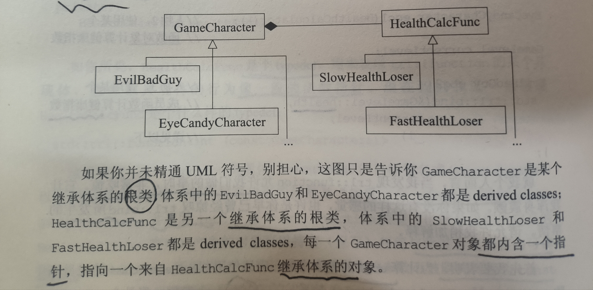

# 条款0：导读

+ 每个函数的声明揭示其签名式（signature），也就是参数和返回类型
+ 除非有一个好理由允许构造函数被用于隐式类型转换，否则把它**声明为explicit**


# 1. 让自己习惯C++

## 条款1：视C++为一个语言联邦

+ C++语言的四个层次：

  - C。没有C++的面向对象，没有模板，没有异常，没有重载等。
  - Object-Oriented C++。这部分也就是C with Classes。classes、封装、继承、多态、虚函数。这部分是面向对象的特性。
  - Template C++。这部分是C++的泛型编程部分。这部分带来的是template metaprogramming，也就是所谓的模板元编程。
  - STL。STL是个template程序库。它对容器、迭代器、算法及函数对象的规约，并且是以templates及程序库的方式构建出来。

  每个层次应该有自己的最佳实践。例如对于C层次，传入函数最佳的实践应该是传入值，而不是指针，而对于C with classes层次，则以传递引用为最佳的实践。


## 条款2：尽量以const，enum，inline代替 #define

> 宁可以编译器代替预处理器

+ 对于单纯常量，最好使用 const 对象或 enums 替代 #defines
+ 对于形似函数的宏（macros），最好使用 inline 函数替换 #defines


- 对于全局的，用define定义的值，在预处理的时候会被替换成相应的值，这对于调试的符号表不利。并且用define的符号在多处使用都会要替换，会使编译生成的代码量变大。

- 对于class的常量，为了只提供一份定义，一般用static const。用define无法创建一个class专属常量，因为#define并不重视作用于，一旦宏被定义，它就在其后的编译过程中有效。有时候，**为了不让获取常量的定义地址，则可以用enum来代替#define**

  ```
  class Test
  {
  enum {NumTurns = 5};
  int scores[NumTurns];
  };
  ```

- 有时候需要用模板函数来代替宏

  宏的一些副作用：

  ```
  #define CALL_WITH_MAX(a, b) f((a) > (b) ? (a) : (b))
  int a = 5, b = 0;
  CALL_WITH_MAX(++a, b); //a被累加两次
  CALL_WITH_MAX(++a, b+10); //a被累加一次
  ```

  这时候可以用模板函数来代替

  ```
  template<typename T>
  inline void callWithMax(const T &a, const T &b)
  {
    f(a > b ? a : b);
  }
  ```

  有了consts、enums和inlines，我们对预处理器的需求降低了，但是不等于没有。#include仍然是必需品，而#ifdef/#ifndef也继续扮演控制编译的重要角色。


## 条款3：尽可能使用const

> 加了mutable的成员变量可能总是被更改，即使在const成员函数内

+ 将某些东西声明成const可帮助编译器侦测出错误用法。const可被施加于任何作用域的对象、函数参数、函数返回类型、成员函数本体
+ 编译器强制实施 bitwise constness，但你编写程序时**应该使用 “概念上的常量性” **（conceptual constness）
+ 当 const 和 non-const 成员函数有着实质等价的实现时，令 non-const 版本调用 const 版本**避免代码重复**
+ const 修饰的 operator* 的返回类型，可以阻止客户因 ”用户自定义类型“而犯错

  ~~~c++
  if(a * b = c) ... 		//愿意其实是做一次比较操作
  ~~~


## 条款4：确定对象被使用前已被初始化

> 编译单元：指产出单一目标文件（single object file）的那些源码。
>
> 基本上它时单一源代码文件加上其所含入的头文件（#include files）

+ 为内置型对象进行手动初始化，因为C++不保证初始化它们
+ 构造函数最好使用成员初值列（ member initialization list ），而不要在构造函数本体内使用赋值操作（ assignment )。初值列列出的成员变量，其排序次序应该和它们在class中的声明次序相同
+ 为免除 “跨编译单元之**初始化次序**” 问题，请以 local static 对象替换 non-local static 对象
  + local static：在函数体内定义初始化static对象，然后返回该对象引用，这个是单例模式一个常见的实现手法。
  + C++对于 “定义在不同编译单元内的 non-local static 对象” 的初始化次序并无明确定义


# 2. 构造/析构/赋值运算

## 条款5：了解C++默默编写并调用哪些函数

> 内含 reference 成员和 const 成员，编译器会拒绝生成赋值构造函数
>
> 如果某个base classes 将 copy assignment 操作符声明为 private 其 derived classes 编译器会拒绝生成赋值构造函数

+ 编译器可以暗自为 class 创建 default 构造函数、copy 构造函数、copy assignment 操作符，以及析构函数


## 条款6：若不想使用编译器自动生成的函数，就该明确拒绝

+ 为驳回编译器自动（暗自）提供的机能，可将相应的成员函数声明为private并且不予实现。使用想**Uncopyable**这样的base class也是一种做法
  + Uncopyable：derived class 继承 Uncopyable 来把自身的默认拷贝/赋值函数给禁止（因为 Uncopyable 的拷贝/复制构造函数时 private 的）


## 条款7：为多态基类声明 virtual 析构函数

+ 必须为pure virtual 析构函数提供定义

  ~~~c++
  class AWOV{
  public:
  	virtual ~AWOV() = 0;
  };
  AWOV::~AWOV(){ }	//pure virtual析构函数的定义
  ~~~

+ polymorphic（带多态性质）base classes 应该声明一个 virtual 析构函数。如果 class 带有任何 virtual 函数，它就应该拥有一个virtual 析构函数
+ Classes 的设计目的如果不是作为 base classes 使用，或不是为了具备多态性质（polymorphically），就不应该声明为 virtual 函数


## 条款8：别让异常逃离析构函数

+ 析构函数绝对不要突出异常。如果一个被析构函数调用的函数可能抛出异常，**析构函数应该捕捉任何异常**，然后吞下它们（不传播）或结束程序。
+ 如果用户需要对某个操作函数运行期间抛出异常**做出反应**，那么 class 应该**提供一个普通函数**（下文提供的close()）（而非在析构函数中）执行该操作


+ 假设一个数据库连接的类，为了防止客户忘记关闭连接，往往会在析构的时候尝试关闭连接，例如

```
class DBCONN
{
~DBCONN()
{
  try
  {
  	db.close();
  }catch 
  {
  	//记下错误，继续执行或者调用abort，终止程序
  }
}
private:
	DB db;
};
```

+ 这种处理方式的缺点是，客户没有太多选择，要么是abort终止程序，要么是继续执行。

+ 为了让客户有选择，可以**单独提供一个close函数**，让用户自己处理异常。如果用户决定自己不处理，那么析构函数的时候再采用一个默认的方式来处理。


## 条款9：绝不在构造函数和析构函数过程中调用 virtual 函数

+ 在构造和析构期间不要调用 virtual 函数，因为这类调用从不下降至 derived class（比起当前执行构造函数和析构函数的那层）

+ 由于无法使用 virtual 函数从 base classes 向下调用，在构造期间你可以籍由“令 derived classes 将必要信息向上传递至 base classes 构造函数”替换之而加以弥补

  ~~~C++
  //virtual logTranscation(...) const = 0; 在base classes中调用无法向下传递
  class Transaction {
  public:
  	explicit Transcation(const std::string& logInfo);
  	void logTranscation(const std::string& logInfo) const;
  
  	...
  };
  Transcation::Transcation(const std::string& logInfo){
  	...
  	logTranscation
  }
  class BuyTranscation: public Transcation{
  public:
  	BuyTrancation( parameters );
  	: Transcation(createLogString( parameters ))	//将log信息传递给 base classes 构造函数
  	{ ... }
  	...
  private:
  	static std::string createLogString( parameters ); //先于其他初始化，所以Transcation的构造函数在之后
  };
  ~~~


+ 在构造函数中，调用构造函数的顺序是基类->子类，当基类在构造的时候，子类的部分还没有开始构造，这时候，如果调用虚函数，**只会调用基类版本**的，不符合虚函数的语义。
+ 在析构函数中，调用析构函数的顺序是子类->基类，当基类在析构的时候，子类的部分已经析构完成，这时候，如果调用虚函数，同样**只会调用基类版本**的，不符合虚函数的语义。


## 条款10：令 operator= 返回一个 *reference to* *this

+ 令赋值（assignment）操作符返回一个reference to *this


## 条款11：在 operator= 中处理“自我赋值“

+ 确保当对象自我赋值时operator= 有良好的行为。其中技术包括比较”来源对象“和”目标对象“的地址、精心周到的语句顺序、以及copy and swap

  ~~~C++
  class Base { ... };
  class Widget {
  	...
  private:
  	Bitmap* pb;
  };
  //比较”来源对象“和”目标对象“的地址
  Widget& Widget::operator=(const Widget& rhs){
  	if(this = &rhs) return *this;		//证同测试（identity test），如果是自我赋值就不做任何事
  	delete pb;
  	pb = new Bitmap(*rhs.pb);
  	return *this;
  }
  //精心周到的语句顺序
  Widget& Widget::operator=(const Widget& rhs){
      Bitmap* pOring = pb;		//记住原先的pb
      pb = new Bitmap(*rhs.pb);	//令pb指向 *pb的一个复件（副本）
      delete pOring;				//删除原先的pb
      return *this;
  }
  //copy and swap
  //————1————
  void swap(Widget& rhs);		//交换*this和rhs的数据
  Widget& Widget::operator=(const Widget&rhs){
      Widget temp(rhs);
      swap(temp);			//temp离开作用域后自动释放了原来的pb
      return this;
  }
  //————2————
  Widget& Widget::oprator=(Widget rhs){	//rhs是一份拷贝，相当于temp
  	swap(rhs);
      return this;
  }
  ~~~

+ 确定任何一个函数如果操作一个以上的对象，而其中多个对象是同一个对象时，其行为仍然正确


## 条款12：复制对象时勿忘其每一个成分

+ Copying 函数应该确保复制 ”对象内的所有成员变量“ 以及 ”所有 base classes 成分“
+ 不要尝试以某个 copying 函数 实现另一个 copying（比如赋值） 函数。应该将共同机能放进第三个函数中，并由两个copying函数共同调用


# 3. 资源管理

## 条款13：以对象管理资源

> RAII：Resource Acquisition Is Initialization
>
> 资源取得时机就是初始化时机

+ 为防止资源泄露，请**使用RAII对象**，它们**在构造函数中获得资源并在析构函数中释放资源**
+ 两个常被使用的 RAII classes 分别是 tr1::shared_ptr 和 auto_ptr。前者通常是最佳选择，因为copy行为比较直观。若选择 auto_ptr，复制动作会使它（被复制物）指向 null


## 条款14：在资源管理类中小心 copying 行为

+ 复制 RAII 对象必须一并复制它管理的资源，所以资源的 copying 行为决定 RAII 对象的 copying 行为
+ 普遍而常见的 RAII class copying 行为是：**抑制 copying**（继承 Uncopyable base classes）、施行引用计数法（reference counting）。不过其他行为也能被实现
+ 引用计数法—>shared_ptr：可以自定义删除器（客制化析构函数，例如析构操作是释放锁（解开）而不是将锁资源释放）
+ 复制底部资源（heap上的）：需要进行**深度拷贝**，不论指针或其所指内存都会被复制出一个复件（避免重复delete资源）、
+ 转移底部资源的所有权：确保RAII对象指向一个未加工的资源。即使复制，此时资源的拥有权从被复制物转移到目标物（auto_ptr）


## 条款15：在资源管理类中提供对原始资源的访问

+ APIs往往要求访问原始资源（raw resources），所以每一个 RAII classes 应该提供一个 ”取得其所管理之资源“ 的办法

+ 对原始资源的访问可能经由显示转换或隐式转换。一般而言**显示转换比较安全**，但**隐式转换**对客户**比较方便**


## 条款16：成对使用 new 和 delete 时要采用相同形式

+ 如果你在new表达式中使用[]，必须在相应的 delete 表达式中也使用[]。如果你在 new 表达式中不使用[]，一定不要在相应的 delete 表达式中使用[]

+ 为避免诸如此类的错误，最好尽量不要对数组形式做 typedefs 动作

  ~~~c++
  typedef std::string AddressLines[4];	//每个人的地址有4行，每行都是一个string
  std::string *pa1 = new AddressLines; 	//注意，”new AddressLines“返回一个string*，就像”new string[4]“一样
  
  delete pa1； 	//未定义
  delete [] pa1;	 //很好
  ~~~


## 条款17：以独立语句将 newed 对象置入智能指针

+ 以独立语句将 newed 对象存储于（置入）智能指针中。如果不这样做，**一旦异常被抛出**，有可能导致**难以察觉的资源泄露**

  ~~~C++
  processWidget(std::tr1::shared_ptr<Widget>(new Widget), priority());  //shared_ptr的构造函数是explicit的
  //new Widget一定在构造函数前发生，如果在调用new Widget之后，先调用了priority()，万一对priority()的调用导致异常，此时new Widget返回的指针将会遗失，引发资源泄漏
  
  std::tr1::shared_ptr<Widget> pw(new Widget);		//完成new Widget和调用pw的构造函数两步操作——独立语句
  processWidget(pw, priority());						//和调用priority()分开
  ~~~

  

# 4. 设计与声明

## 条款18：让接口容易被正确使用，不易被误用

+ 好的接口很容易被正确使用，不容易被勿用。你应该在你的所有接口中努力达成这些性质

  + 要设计不易被误用的接口

  + 例如，要创建一个时间类型

  ```
  Date(int month, int year, int day);
  ```

  + 上面的接口就是容易被误用的接口，因为可能把年月日的顺序给搞错了。

  + 可以给年月日分别设计一个类型，构造函数中传入对应的类型才能正确编译。

+ ”促进正确使用“ 的办法包括**接口一致性**（比如string，vector，list等通过调用相同名字的size()获取长度），以及与内置类型的行为兼容

+ ”阻止误用“ 的办法包括**建立新类型**（12月份->Month::Dec()）、**限制类型上的操作**（比如opeator *的返回值类型为const），**束缚对象值**（例如返回智能指针，强制用户使用智能指针），以及消除客户的资源管理责任（将delete和其他操作~引用计数-1~封装起来给用户释放资源，如shared_ptr）

+ tr1::shared_ptr 支持定制性删除器（custom deleter）。这可防范DLL问题（new/delete这对操作在不同动态链接库中，shared_ptr会自动调用本模块的delete函数），可被用来自动解除互斥锁（mutexes）等等


## 条款19：设计 class 犹如设计 type

+ Class 的设计就是 type 的设计。在定义一个新的 type 之前，请确定你已经考虑过本条款覆盖的所有讨论主题

  + 新type的对象应该如何被创建和销毁

  + 对象的初始化和对象的赋值该有什么样的差别

  + 新type的对象如果被passed by value，意味着什么？即copy构造函数该如何实现

  + 什么是新type的“合法值”？成员函数必须对菲合法值进行必要的错误检查

  + 你的新type需要配合某个继承图系？

  + 你的新type需要什么样的转换？是否需要隐式或者显式转换成其他类型。

  + 什么样的操作符和函数对此新type而言是合理的?该声明哪些函数，哪些应该是member函数，某些则不是。

  + 什么样的标准含税应该驳回？例如，自动生成的拷贝构造函数，赋值函数和析构函数等等。

  + 谁该取用新type的成员？哪些为public、哪些为protected、哪些为private。

  + 什么是新type的“未声明接口”？这个不太懂

  + 你的新type有多么一般化？或许你其实并非定义一个新type，而是定义一整个

    types家族。

  + 你真的需要一个新type吗？如果只是定义新的derived class以便为既有的class添加机能，那么说不定单纯定义一个或多个non-member函数或者template更能达到目标。


## 条款20：宁以 pass-by-reference-to-const 替换 pass-by-value

+ 尽量以 pass-by-reference-to-const 替换 pass-by-value。前者通常比较高效，并可避免切割问题（slicing problem）
  + 切割问题：参数类型为Window w，**如果传递其子类，则其子类的特化信息会被切除**
+ 以上规则**并不适用于内置类型**，以及 STL 的迭代器和函数对象。对它们而言，pass-by-value 往往比较合适


## 条款21：必须返回对象时，别妄想返回其 reference

+ 绝不要返回 pointer 或 reference 指向一个 local stack 对象，或返回 reference 指向一个 heap-allocated 对象（这个需要外部调用delete，而且如果**连续赋值**可能导致内存空间无法释放），或返回 pointer 或 reference 指向一个 local static 对象而**有可能同时需要多个这样的对象**。条款4已经为 ”在单线程模型中合理返回 reference 指向一个 local static 对象“ 提供了一份设计实例


## 条款22：将成员变量声明为 private

+ 切记将变量声明为 private。这可赋予客户**访问数据的一致性**、可细微划分访问控制、允诺约束条件获得保证、并提供 class 作者充分的实现弹性
+ protected 并不比 public 更具封装性


## 条款23：宁以 non-member、non-friend 替换 member 函数

+ 宁可拿non-member non-friend 函数替换 member 函数。这样做可以增加封装性、包裹弹性（packaging flexibility）和技能扩展性

```c++
class WebBrowser
{
public:
	void clearCache();
    void clearHistory();
    void removeCookies();
};
//————1————
class WebBrowser
{
public:
	void clearEverything();
};
//————2————
void clearBrowser(WebBrowser &wb)
{
  wb.clearCache();
  wb.clearHistory();
  wb.removeCookies();
};
```

+ 从上面代码看出，以 non-member-non-friend 函数方式形式来实现 clear 操作会更有封装性，因为它不能访问类里面的数据，更加符合封装的思想。


## 条款24：若所有参数皆需要类型转换，请为此采用 non-member 函数

+ 如果你需要为某个函数的所有参数（**包括被 this 指针所指的那个隐喻参数**）进行类型转换，那么这个函数必须是个 non-member

```C++
class Rational
{
public:
	Rational(int numerator = 0, int denominator = 1);
    int numberator() const;
    int denominator() const;
private:
	...
};
class Rational
{
public:
	const Rational operator* (const Rational &rhs) const;
};
```

对于上面代码

```C++
Rational result = oneHalf * oneEighth;
result = result * oneEighth;
result = oneHalf * 2;
result = 2 * oneHalf; //有错误
```

为了使得第四个赋值也能支持，可以把operator*实现成以下

```C++
const Rational operator*(const Rational &lhs, const Rational &rhs);
```


## 条款25：考虑写出一个不抛出异常的 swap 函数

+ 当 std::swap 对你的类型效率不高时，提供一个swap成员函数，并确定这个函数**不抛出异常**
+ 如果你提供一个 **member** swap，也该提供一个 **non-member** swap 用来调用前者。对于 **classes**（而非 **template**），也请特化std::swap
+ 调用 swap 时应针对 std::swap 使用 using 声明式，然后调用 swap 并且不带任何“命名空间资格修饰”（让编译器自己选择，如果类型匹配，会选择用户自己特化的）
+ 为“用户定义类型”进行 std templates 全特化是好的，但千万不要尝试在std内加入某些对std而言全新的东西

~~~C++
namespace WidgetStuff {
	...									//模板化的WidgetImpl等等
	template<typename T>				//内含swap成员函数
	class Widget {
	public:
		...
		void swap(Widget<T>& other){
			using std::swap;			//使用标准库的swap
			swap(pImpl, other.pImpl);	//交换的基本数据类型（底层指针），内置类型上的操作绝不会抛出异常
		}
		...
	private:
		WidgetImpl* pImpl;				//指针，所指对象内含Widget数据
	}
	...
	template<typename T>
	void swap(Widget<T>& a, Widget<T>& b){
		a.swap(b);
	}
}

template<typename T>
void doSomething(T& obj1, T& obj2)
{
	using std::swap;	//令std::swap在此函数可用
    ...
    swap(obj1, obj2);	//为T型对象调用最佳的swap版本
    ...
}
~~~


# 5. 实现

## 条款26：尽可能延后变量定义式的时间

+ 尽可能**延后变量定义式的出现**。这样做可增加程序的清晰度并改善程序的效率
  + 定义变量会有构造的时间消耗，若之后一段时间没使用，此时中间发生异常，又会有这个变量析构的时间消耗

对于循环：

```C++
//方法A：定义循环外
Widget w;
for (int i = 0; i < n; ++i)
{
  w = 取决于i的某个值;
}
//方法B：定义循环内
for (int i = 0; i < n; ++i)
{
  Widget w(取决于i的某个值);
}
```

- 做法A：1个构造函数+1个析构函数+n个赋值函数
- 做法B：n个构造函数+n个析构函数

如果classes的一个赋值成本低于一组构造+析构成本，做法A大体而言比较高效。尤其当n比较大的时候。否则做法B或许比较好。

另外A带的是w的作用域变大，有时候会对程序的可理解性和易维护性造成冲突。

因此：

- 你知道赋值成本比“构造+析构”成本低
- 你正在处理代码中效率高度敏感的部分，否则你应该使用做法B


## 条款27：尽量少做转型动作

- const_cast通常被用来**将对象的常量性剔除**
- dynamic_cast主要用来执行“**安全向下转型**”，也就是用来判断某对象是否归属继承体系中的某个类型
- reinterpret_cast意图执行**低级转型**，实际动作及结果可能取决于编译器，这也就表示它不可移植
  - 允许将任何指针转换为任何其他指针类型。 也允许将任何整数类型转换为任何指针类型以及反向转换。
- static_cast用来强迫隐式转换，但它无法将const转为non-const
- 如果可以，尽量避免转型，特别是在注重效率的代码中避免dynamic_casts。如果有个设计需要转型动作，试着发展无需转型的替代设计
- 如果转型是必要的，试着将它隐藏于某个函数背后。客户可以调用该函数，而不需要将转型放进他们自己的代码内（应该用 “基于virtual 函数调用” 替代 dynamic_cast）
- 宁可以C++-style转型，不要使用旧式转型。前者很容易辨认出来，而且也比较有着分门别类的职掌


## 条款28：避免返回 handles 指向对象内部成分

> handles：号码牌，用于获得某个对象

+ **避免返回 handles**（包括 reference 、指针、迭代器）指向内部对象。遵守这个条款可增加封装性，帮助 const 成员函数的行为像个 const，并将发生 “虚拟号码牌” （dangling handles）的可能性降到最低（返回临时对象的内部对象的引用，一旦临时对象销毁，这个引用就是变成了空悬、虚吊（dangling））


## 条款29：为 “ 异常安全” 而努力是值得的

+ 异常安全函数（Exception-safe functions）即使发生异常也不会泄漏资源或允许任何数据结构败坏。这样的函数区分为三种可能的保证：基本型、强烈型、不抛异常型
  + **基本型**：如果异常被抛出，程序内的任何事务仍然保持在有效的状态下（但是不能预料现实状态，**程序可能处于任何状态**——只要这个状态是合法的）
  + **强烈保证型**：如果异常被抛出，程序状态不改变；如果函数成功，则完全成功，如果函数失败，程序会回复到 “调用函数之前” 的状态
  + **不抛掷（nothrow）保证**：承诺绝不抛出异常，因为它们总是能够完成它们原先承诺的功能。作用于**内置类型**（例如 ints，指针等等）身上的所有操作都提供 nothrow 保证。这是异常安全码中一个**必不可少的关键基础材料**
+ “强烈保证” 往往能够以 copy-and-swap 实现出来，但 “强烈保证” 并非对所有函数都可实现或具备现实意义
+ 函数提供的 “异常安全保证” 通常最高只等于其所调用之各个函数的 “异常安全保证” 最低者


## 条款30：透彻了解 inlining 的里里外外

- inline函数如果起作用了，会在每次调用的时候用实现的代码替换它，所以会**造成程序体积变大**。
- inline只是向编译器的一个申请，可以明确用inline关键字，也可以在类体内部定义。
- template的实例化和inline无关，如果需要template函数为inline，需要显式地声明它。
- inline函数无法随着程序库的升级而升级。换句话说如果f是程序库内的一个inline函数，客户讲“f函数本体”编进其程序中，一旦程序库设计者决定改变f，所有用到f的客户端程序都必须重新编译。
- 将大多数inline限制在小型、被频繁调用的函数身上。这可使日后的调试过程和二进制升级更容易，也可使潜在的代码膨胀问题最小化，使程序的速度提升机会最大化。
- 80-20 法则：一个典型的程序有 80% 的执行时间花费在 20%的代码身上


## 条款31：将文件间的编译依存关系降到最低

+ 支持 “编译依存性最小化” 的一般构想是：**相依于声明式**，**不要相依于定义式**。基于此构想的两个手段是 Handle classes 和 Interface classes。
+ 程序库头文件应该以 “完全且仅有声明式”（full and declaration-only forms）的形式存在。这种做法不论是否涉及 templates 都适用
  + **Handles classes**：将声明和定义分类编写，声明类和定义类有同名成员函数，声明类通过成员智能指针指向实现类，声明类的成员函数通过这个指针调用定义式中的函数
  + **Interface classes**：父类中通过虚函数 “声明” ，子类继承父类重写虚函数提供 “定义”，通过 factory 函数返回一个指向子类的父类智能指针
  + 将声明与定义分离，可以**将 “非真正必要之类型定义” 与 客户端之间的编译依存关系去除掉**


# 6. 继承与面向对象设计

## 条款32：确定你的 public 继承塑模出 is-a 关系

+ “**public 继承**” 意味着 **is-a**。适用于base classes身上的每一件事情一定也适用于derived classes身上，因为每一个derived class对象也都是一个base class 对象。


## 条款33：避免遮掩继承而来的名称

+ 以下代码中加的 virtual 只是为了说明不管成员函数是不是pure virtual 、impure virtual 、non-virtual，**只看名称**

```
class Base
{
private:
	int x;
public:
	virtual void mf1() = 0;
    virtual void mf1(int);
    virtual void mf2();
    void mf3();
    void mf3(double);
    ...
};
class Derived : public Base
{
public:
	virtual void mf1();
    void mf3();
    void mf4();
}；
Derived d;
int x;
...
d.mf1(); //没问题，调用Dervied::mf1
d.mf1(x); //错误，因为Derived::mf1遮掩了Base::mf1
d.mf2(); //没问题，调用Base::mf2
d.mf3(); //没问题，调用Dervied::mf3
d.mf3(x); //错误！因为Derived::mf3遮掩了Base::mf3
```

- 如果你正在使用public继承而又不继承那些重载函数，就是违反Base和derived classes之间的is-a关系，而is-a是public的基石。

- 为了被遮掩的名称再见天日，可**使用using声明式**


## 条款34：区分接口继承还是实现继承

+ 考虑如下一段代码

```
class Shape
{
public:
	virtual void draw() const = 0;
    virtual void error(const std::string &msg);
    int objectID() const;
    ...
};
class Rectangle : public Shape {...};
class Ellipse : public Shape {...};
```

- 对于一个pure virtual函数，且不带定义，目的是为了让derived classes**只继承函数接口**。然后，**继承类必须实现它自身的行为**。
- 声明impure virtual函数的目的是，让derived classes继承该函数的**接口和缺省实现**。也就是，如果某个集成类不想对该功能做特殊处理的时候，可以采用缺省的默认实现，否则，需要自己提供实现。这种方法可能会造成继承类忘记实现自己该实现的功能，这时候编译照样是过的。
- 声明pure virtual函数且带定义，也是让derived classes继承该函数的接口和缺省实现。这种方法跟上面的区别是**，它可以防止集成类忘记实现自己功能的情况**，**因为是pure virual**，采用默认实现也得显式地调用基类的函数。
- 声明non-virtual函数的目的是为了令derived classes继承函数的接口及一份**强制性实现**。


## 条款35：考虑 virtual 函数以外的其他选择

+ 场景：假如你打算为游戏内的人物设计一个继承体系。你的游戏属于暴力砍杀类型，剧中人物被伤害或因其他因素而降低健康状态的情况并不罕见。因此，你决定提供一个成员函数healthValue，它会返回一个整数，表示人物的健康程度。由于不同的人物可能已不同的方式计算它们的健康指数，将healthValue声明为virtual似乎是再明白不过的做法。

### 方案1-虚函数方法

```
class GameCharacter
{
public:
	virtual int healthValue() const; //返回人物的健康指数
                                     //derived classes可重新定义它
};
```

### 方案2-借由 Non-Virtual Interface 手法实现 Template Method 模式

+ 这个方案的思路是保留healthValue为public成员函数，但让它成为non-virtual，表调用一个private virtual函数，进行实际工作：

```
class GameCharacter
{
public:
	int healthValue() const
    {
  		... //derived classes不重新定义它
        int retVal = doHealthValue(); //做一些事情工作，详下
        ... //做一些事后工作
        return retVal;
	}
private:
	virtual int doHealthValue() const //derived classes可重新定义它
    {
  		... //缺省算法，计算健康指数
	}	
};
```

+ 令客户通过 public non-virtual 成员函数间接调用 private virtual 函数，**称为 non-virtual interface 手法(NVI)**。它是所谓Template Method 设计模式的一个独特表现形式。我把这个 non-virtual 函数称为 virtual 函数的**外覆器**（wrapper）。

+ **优点**：可以使得 virtual 函数在调用的时候，之前**可以设定好适当场景**，并在调用结束后清理场景。事前工作可以是锁定互斥器、制造运转日志记录项目、验证 class 约束条件。**事后工作**可以包括互斥器解除锁定，验证函数的时候条件、再次验证 class 约束条件等等。

### 方案3-借由 Function Pointers 实现 Strategy 模式

```
class GameCharacter
{
public:
	explict GameCharacter(HealthCalcFunc hcf = defaultHealthCalc);
  	void setHealthCalculator(HealthCalcFunc hcf);
private:
	HealthCalcFunc healthFunc;
};
```

+ 优点：**运用函数指针替换 virtual 函数**， “每个对象可各自拥有自己的健康计算函数” 和 “可在运行期间改变计算函数”

+ 缺点：**降低了封装性**——>如果计算血量，需要依赖non-public的信息，**就需要弱化 class 的封装**，例如 class 可声明这个 non-member 函数为 friends，或为其实现的某一部分提供 public 访问函数

### 方案4-借由tr1::function完成strategy模式

+ tr1::function对象的行为就像一般函数指针。这样的对象可接纳“与给定的目标标签格式兼容”的所有可调用物，也就是函数指针、函数对象或成员函数指针。

```
class GameCharacter
{
public:
	typedef std::tr1::function<int (const GameCharacter &)> HealthCalcFunc;
private:
    HealthCalcFunc healthCalcFunc;
};
```

+ 优点：灵活性，可以使用**任何可调用的对象**。

### 方案5-古典的 Strategy 策略模式



+ 这个解法的吸引力在于，熟悉标准 Strategy 模式的人很容易辨认它，而且它还提供 “将一个既有的健康算法纳入使用” 的可能性——只要为 HealthCalcFunc 继承体系添加一个 derived class 即可


## 条款36：绝不重新定义继承而来的 non-virtual 函数


# end
