## 操作系统学习建议

不过说实话，如果你还在校大二大三，我真的墙裂建议你去做一些国外的计算机 lab，比如OS、Network。

等到毕业了，几乎就不太可能从头开始系统学习那些基础知识了，除非你能自己闭关两三年，啥也不做，待在一个地方专心修炼。

好好珍惜在学校大把的空闲时间，做一些让在专业上让自己受益一生的事情。

这里我可以列举几个，国内不少喜欢 System 的同学都会去跟 MIT、CMU、UCB 这些计算机名校的课程。

比如 MIT 的 **6.824 Distributed System**、**6.830 Database Systems**、**MIT 6.828 Operating System Engineering** .....

> 6.828是MIT的操作系统导论课，网上流传了一个录制质量不高的版本，可能可以在B站找到。 这门课教了操作系统的原理，并带学生简单实现了操作系统的主要部分。 要学习6.828的Lab，最好已经对C语言非常熟悉，而且上过了诸如 计算机组成原理 和 操作系统 等等课程，否则可能非常吃力，看着大佬的讲义不明所以。

## [操作系统lab项目](https://chyyuu.gitbooks.io/ucore_os_docs/content/)

RTFM是Read The Fucking Manual的意思，STFW是Search The Fucking Web的意思。

# 第一章

## 操作系统的概念

+ 是指控制和管理整个计算机系统的硬件和软件资源，并合理组织和调度计算机工作和资源分配，以提供给用户和其他软件方便的接口和环境，它是计算机系统中最基本的==系统软件==

## 操作系统的功能和目标

+ **作为系统资源的管理者**
  + 

+ **作为用户和计算机硬件之间的接口**

  + 

  + 命令接口

    + 联机命令接口：交互式命令接口

    + 脱机命令接口：批处理命令接口

  + 程序接口(允许用户通过程序间接使用)

    + 有一组系统调用组成（程序接口==系统调用）————系统调用\==系统调用命令\==广义指令（易懵指令）

  + GUI

    + 就是图形化操作界面

+ **作为最接近硬件的层次**
  + 实现对硬件资源的拓展（封装思想）
  + 没有任何软件支持的计算机称为==裸机==。在裸机上安装操作系统，可以提供资源管理功能和方便用户的服务功能、将裸机改造成功能更强、使用更方便的机器
  + 通常把覆盖了软件的机器称作为==扩充机器==，又称之为==虚拟机==

 

## 操作系统的特征

### **并发**

+ 指两个或多个事件在同一时间间隔内发生。这些事件宏观上是同时发生的，但微观上是交替发生的
+ 混淆概念——并行：指两个或多个事件在同一时刻同时发生
+ **操作系统的并发性**
  + 计算机系统中同时存在多个运行着的程序
    + 一个单核处理机（CPU）同一时刻只能执行一个程序，因此操作系统会协调多个程序的交替执行，这些程序在微观上是交替进行的，但宏观上好像是同时进行的
      + 事实上，操作系统就是伴随着“多到程序技术”诞生的。因此操作系统和程序并发是同时出现的
    + 当今的计算机，一般都是多核CPU，比如4核CPU，这意味着同一时刻可以有4个程序并行执行，但操作系统的并发性依然必不可少，因为有4个以上程序在运行的可能

### **共享**

+ 即资源共享，是指系统中的资源可提供给内存中多个并发执行的进程共同使用

+ 互斥共享方式
  + 系统中的某些资源虽然可以提供给多个进程使用，但**一个时间段内只允许一个进程访问该资源**
    + 例子：如qq和微信视屏聊天，同一时间段内摄像头只能分配给一个进程
  + 系统中的某些资源，**允许一个时间段内有多个进程“同时”对它们访问**（同时是宏观的，微观上，进程是交替访问的，即分时共享）
    + 使用qq发送文件A，使用微信发送文件B。从宏观上看，两边同时读取并发送文件，说明两个进程都在访问硬盘资源，在读取数据。从微观上看是交替访问硬盘（**所以为什么说并发和共享互为存在条件**）

### **虚拟**

+ 是指把一个物理上的实体变为若干个逻辑上的对应物。物理实体（前者）是实际存在的，而逻辑上对应物（后者）是用户感受到的
+ 例子：
  + 
  + .assets/image-20220903105908446 - 副本.png)
+ **虚拟技术**
  + **空分复用技术**（如虚拟存储器技术）
  + **时分复用技术**（如虚拟处理器）
  + *没有并发性就谈不上虚拟性*

### **异步**

+ 在多道程序下，允许程序并发执行，但由于资源有限，进程的执行不是一贯到底的，而是走走停停的，以不可预知的速度向前推进，这就是进程的异步性
  + 例子：
  + 一个进程调用了一个资源，但由于并发性，轮到下一个进程占用CPU，其也要调用这个资源，但是上个进程还未归还，所以要等到其归还才可以调用这个资源
  + *只有系统拥有并发性，才有可能导致异步性*

## 操作系统的发展和分类

+ **手工操作阶段**
  + 主要缺点用户独占全机，人机速度矛盾导致的资源利用率低

+ **批处理阶段**——单道批处理系统

  + 引入脱机输入／输出技术（用磁带完成），并监督程序负责控制作业的输入、输出

  + ==主要优点==：缓解了一定程度的人机速度矛盾，资源利用率有所提升。主要缺点：内存中仅能有一道程序运行，只有该程序运行结束之后才能调入下一道程序。CPU有大量的时间是在空闲等待1／0完成。资源利用率依然很低。

+ **批处理阶段**—一多道批处理系统

  + 每次往内存中输

  + 操作系统正式诞生，并引入了中断入多道程序技术，由操作系统负责管理这些程序的运行。各个程序并发执行

  + 多道批处理系统：
  + ==主要优点==：多道程序并发执行，共享计算机资源。资源利用率大幅提升，CPU和其他资源保持“忙碌”状态，系统吞吐量增大。

  + ==主要缺点==：用户响应时间长，没有人机交互功能（用户提交自己的作业之后就只能等待计算机处理完成，中间不能控制自己的作业执行）

+ **分时操作系统**

  + 计算机以时间片为单位轮流为各个用户／作业服务，各个用户可通过终端与计算机进行交互。

  + 主要优点：用户请求可以被即时响应，解决了人机交互问题。允许多个用户同时使用一台计算机，并且用户对计算机的操作相互独立，感受不到别人的存在。

  + 主要缺点：**不能优先处理一些紧急任务**。操作系统对各个用户／作业都是完全公平的，循环地为每个用户／作业服务一个时间片，不区分任务的紧急性。

+ **实时操作系统**：

  + 主要优点：能够优先响应一些紧急任务，某些紧急任务不需时间片排队。

  + 在实时操作系统的控制下，计算机系统接收到外部信号后及时进行处理，并且要在严格的时限内处理完事件。实时操作系统的主要特点是及时性和可靠性

  + 硬实时操作系统
    + 必须在绝对严格的时间内完成处理，*例如：导弹控制系统，自动驾驶系统*

  + 软实时操作系统
    + 能接受偶尔违反时间规定，*例如：12306火车订票系统*

+ **网络操作系统**：
  + 是伴随着计算机网络的发展而诞生的，能把网络中各个计算机有机地结合起来，实现数据传送等功能，实现网络中各种资源的共享（如文件共享）和各台计算机之间的通信。（如：Windows NT就是一种典型的网络操作系统，网站服务器就可以使用）

+ **分布式操作系统**：
  + 主要特点是分布性和并行性。系统中的各台计算机地位相同，任何工作都可以分布在这些计算机上，由它们并行、协同完成这个任务。

+ **个人计算机操作系统**：
  + 如Windows XP、MacOS，方便个人使用。

## 操作系统运行机制和体系结构

### 运行机制

+ **两种指令**
  + **特权指令**：如内存清零指令（不允许用户程序来使用）
  + 非特权指令：如普通的运算指令
  
+ **两种处理器状态**——*==都是在CPU上执行==*

+ ——*用程序状态字寄存器（PSW）的某种标志位来标识当前处理器处于什么状态。如0为用户态，1为核心态*
  + **核心态**
    + 此时CPU*只能执行非特权指令*
  
  + 用户态
    + 特权指令和非特权指令都可以执行
  
+ **两种程序应用程序**
  + 内核程序
    + 操作系统的内核程序是系统的管理者既可以执行特权指令，也可以执行非特权指令，运行在==核心态==
  + 应用程序
    + 为了保证系统能安全运行，普通应用程序只能执行非特权指令，运行在==用户态==

### 操作系统的内核

### 操作系统体系结构

## 中断和异常（*操作系统的内核*）

+ **中断机制的诞生**
  + 引入中断机制，实现了多道程序并发执行，**本质**：==发生中断==就意味着需要==操作系统介入，开展管理工作==

+ **中断的概念和应用**
  + 

+ **中断的分类**
  + 
  
  + ==另一种分类方式==
  + 
  
+ **外中断处理过程**
  + 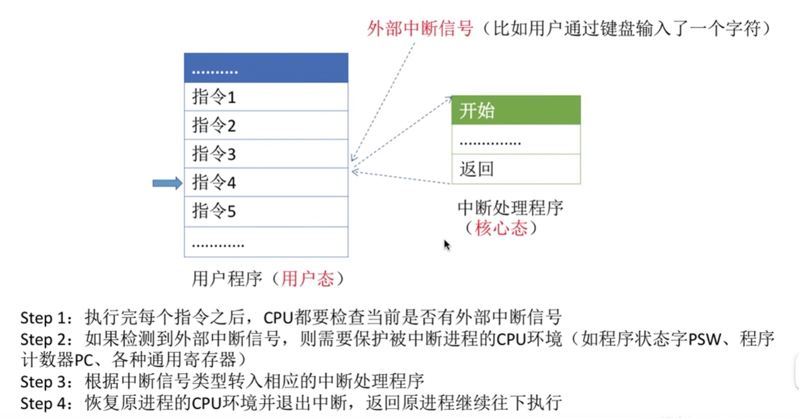

## 系统调用

### **什么是系统调用，有何作用**

+ 

------------

+ 

### **系统调用和库函数的区别**

+ 

### **系统调用背后的过程**

+ 

### ==**总结**==

​	

# 第二章

## 进程的定义、组成、组织方式、特征

### **进程的定义**

+ 

### **进程的组成**

+ 

+ 

+ #### **PCB组成**

  + 

### **进程的==组织方式==**

+ 

  + #### **链接方式**
    
    + 
    
  + #### **索引方式**
    
    + 

### **进程的特征**

+ 进程和程序是两个截然不同的概念。相比较于程序，进程拥有以下特征
+ 

+ #### ==**总结**==

  + 

## 进程的状态与转换

#### 与处理机调度的联系

### **进程的状态**

+ 

+ #### **三种基本状态**

  + 

+ #### **另外两种状态**
  
  + 

### 进程状态的转换

+ 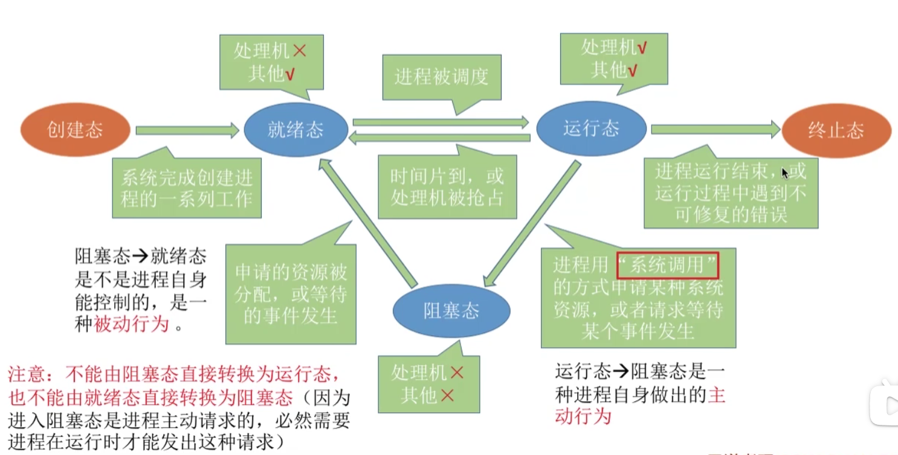

+ #### ==**总结**==

  + 

.assets/image-20220905091709237.png)

## 进程控制（*控制进程状态==转换具体细节==*）

+ 进程控制的主要功能是对系统中的所有进程实施有效的管理，它具有创建新进程、撤销已有进程、实现进程状态之间的转换

+ 

  ### **如何实现**

  + 
  + 为了防止进程标志位的出错（即运行态……），==用“原语”实现==

### **原语**——*即具体细节*

+ 

+ .assets/image-20220905092719927.png)

### **进程相关原语**

#### **进程的创建**

+ .assets/image-20220905093351769.png)

#### **进程的终止**

+ 

#### **进程的阻塞和唤醒**

+ .assets/image-20220905093611975.png)

#### **进程的切换**

+ 

### ==总结==

+ 

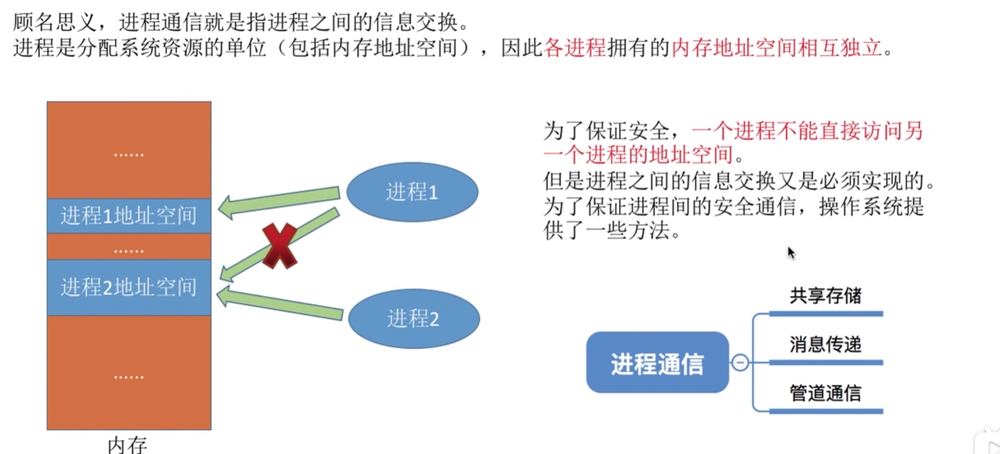

## 进程通信

+ 进程是分配系统资源的单位（包括内存地址空间），因此==各进程==拥有的==内存地址空间相互独立==
  + 为了保证安全，一个进程不能直接访问另一个进程的地址空间
  + 但是进程之间的信息交换又是必须实现的。为了保证进程间的安全通信，操作系统提供了一些方法
+ 总览
  +  	

### **共享通信**

+ 
  + ==互斥==：读和写不能同时进行

### **消息传递**

+ 

### **管道通信**

+ 

### ==总结==

+ 

## 线程和多线程模型（*在进程之下*）

### **知识总览**

### **什么是线程**

+ .assets/image-20220907091052985.png)
+ 可以把线程理解为“轻量级进程”。
+ 线程是一个==基本的CPU执行单位==，也可以是==程序执行流的最小单位==
+ 引入线程之后，不仅是进程之间可以==并发==，进程内的==各线程之间==也可以==并发==，从而进一步提升了==系统的并发度==，使得一个进程内也可以并发处理各种任务（如QQ视频、文字聊天、传文件）
+ 引入线程后，==进程==只作为==除CPU之外的系统资源的分配单位==（如打印机、内存地址空间等都是分配给进程的）。 

+ **引入线程带来的变化**

### **线程的属性**

+ 

### **线程的实现方式**

+ **用户级线程**
  + 
+ **内核级线程**
  + 
+ 在同时支持用户级线程和内核级线程的系统中，可采用二者结合的方式：将n个用户级线程映射到m个内核级线程上（n>=m）
  + 

### 多线程模型（*用户级线程映射在内核级线程*）

#### **多对一**

+ 

#### 一对一

+ 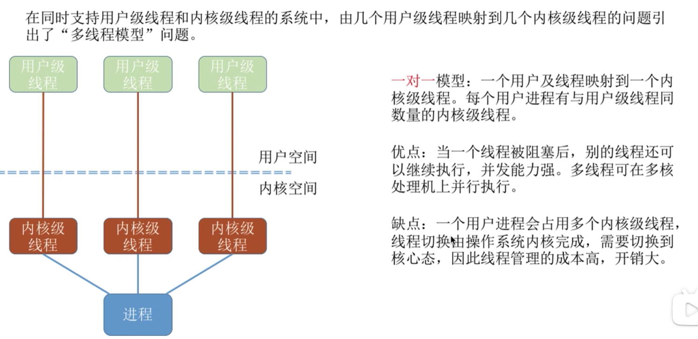

#### 多对多

+ 

### ==总结==

+ 

## 处理机调度（控制不同状态==进程的执行顺序==）

+ **什么是处理机**：*处理机包括中央处理器，主存储器，输入-输出接口，加接外围设备就构成完整的计算机系统。*

### 知识总览

+ 

### 调度的基本概念

+ 

### 调度的三个层次

#### 高级调度（作业调度）

+ 主要指调入的问题
+ 

#### 中级调度（内存调度）

+ 

#### 进程的挂起态与七状态模型

#### 低级调度（进程调度）

#### 三层调度的联系和对比（*==以及对进程状态影响==*）

+ 

### ==总结==

+ 

### 进程调度/低级调度（*细节*）

#### ==我的理解==：

+ **选择进程进行进程状态（就绪态和运行态）的切换**

#### 知识总览

+ 

#### 进程调度时机

+ 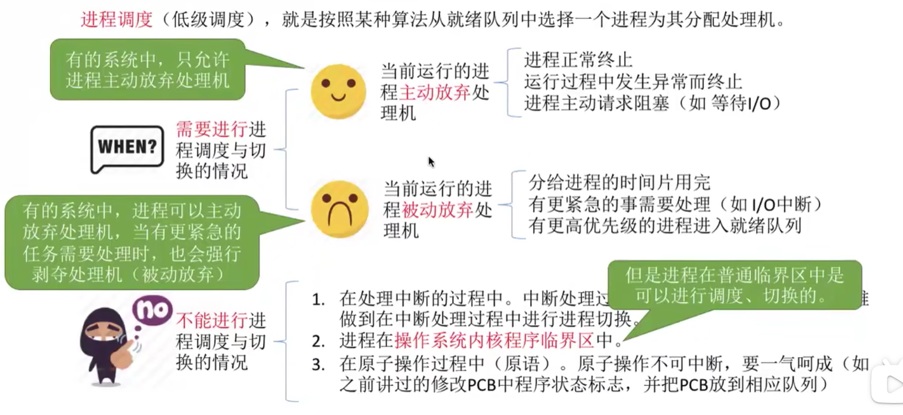

#### 进程调度的方式（*对应两个调度时机*）

+ 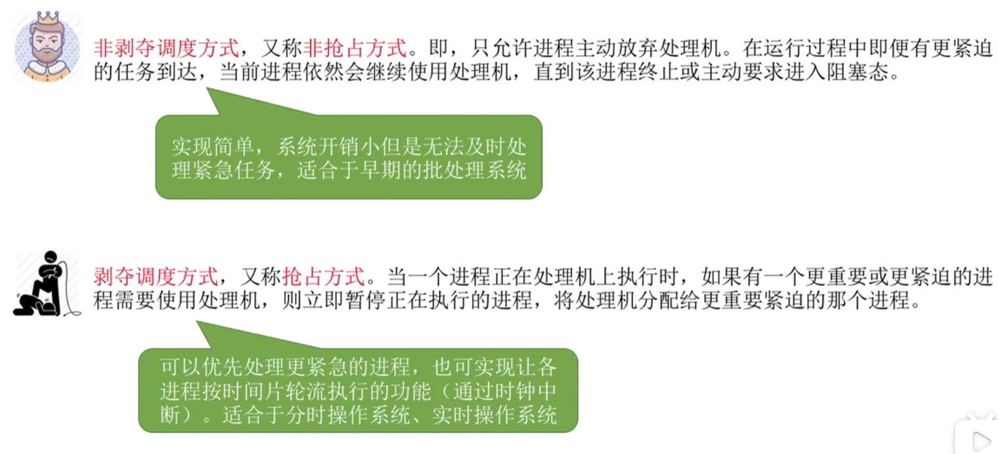

#### 进程的切换与过程

##### “==狭义==的进程调度”和”进程切换”的区别——==广义==的进程调度

.assets/image-20220907111433426.png)

##### 过程

#### ==总结==

+ 

### 调度算法的评价指标

#### 知识总览

+ 

#### cpu利用率

#### 系统吞吐量

#### 周转时间

##### 进一步：带权周转时间

+ *可计算出作业周转时间是作业实际运行时间的多少倍*

#### 等待时间

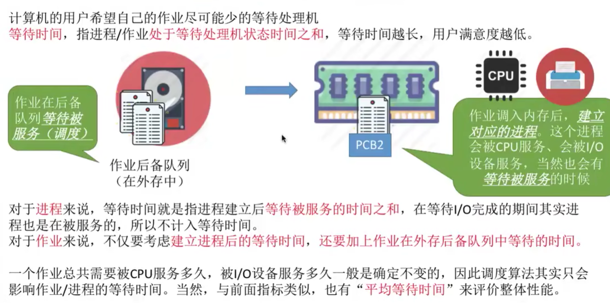

#### 响应时间

#### ==总结==

### ==调度算法==

#### 知识总览

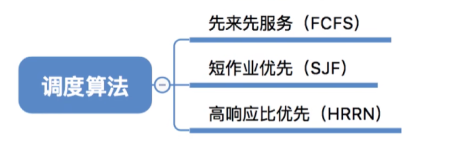

#### 学习思路

#### FCFS算法

> First Come Fisrt Serve

#### SJF算法

> Shortest Job(作业) First \ SPF : Shortest Proccess(进程) First

##### 非抢占式

+ **==注意是在当前已到达里选运行时间最短的作业/进程==**

.assets/image-20220910104813142.png)

##### 抢占式——SRTN

> Short Remaining Time Next

##### 注意一些细节

#### HRRT算法

> Highest Response Ratio Next——高响应比优先算法

#### ==总结==

------------------

#### 时间片轮转调度算法（RR）

+ #### ***一般来说，设计时间片时让让切换进程的开销占比不超过1%***

#### 优先级调度算法

##### 补充

#### 多级反馈队列调度算法(MLFQ)

> Multi-level Feedback Queue

> 对于短时间运行的交互型工作，获得类似于SJF/STCF的很好的全局性能，同时对长时间运行的CPU密集型负载也可以公平地、不断稳步前进

#### ==总结==

#### 彩票调度（lottery scheduling）

> 比例份额(proportional-shared)调度程序，又称公平份额(fair-share)调度程序
>
> 书p65

##### 基本思想

+ 每隔一段时间，都会举行一次彩票抽奖，以确定接下来应该运行哪个程序。越是应该频繁运行的程序，越是应该拥有更多地赢得彩票的机会。

#### 步长调度（stride scheduling）

> 彩票数小的步长在整体中大，彩票数小的步长在整体中小
>
> 书p69

## 进程同步/进程互斥

### 什么是进程同步

#### 例子

### 什么是进程互斥

#### 为了实现临界资源的互斥访问，同时保证系统性能，需要遵循以下规则

### ==总结==

### 进程互斥==软件==实现方法

#### 单标志法——问题：？？其他就不会出现空闲让进吗？？

#### 双标志先检查法——问题：一起进入

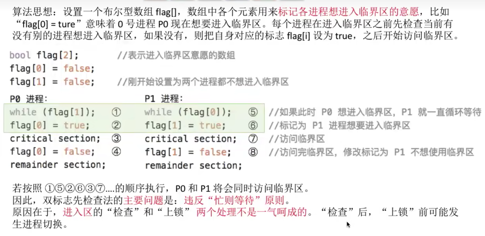

#### 双标志后检查法——问题：一起等待

#### Peterson算法

#### ==总结==

### 进程互斥==硬件==实现方法

#### 中断屏蔽法

##### 优点

+ 简单、高效

##### 缺点

+ 不适用于多处理机（可能导致多台处理机同时访问临界资源）
+ 只适用于操作系统内核进程，不适用于用户进程（因为开/关中断指令只能运行在内核态，这组指令如果让用户随意使用会很危险）

#### TestAndSet指令

#### Swap指令

#### ==总结==

### 信息量机制

#### 介绍

#### 信号量

##### 整型信号量

+ ***其中wait原语中while（S<=0）导致有一段时间在等待——问题是原语是不可中断的？？？***

##### 记录型信号量——阻塞队列

#### 进程互斥==信号量==实现方法

#### 进程同步==信号量==实现方法

#### 实现进程的前驱关系

#### ==总结==

#### p-v

##### 生产者-消费者问题

+ ***实现互斥的操作要放在实现同步操作之后避免死锁现象***

##### 多生产者多消费者

##### 吸烟者问题

##### 读者-写者问题

+ #### 如何实现

##### 哲学家进餐问题

### 管程

#### 为什么要引入管程

#### 管程定义和基本特征

#### ==总结==

.assets/image-20220913092013915.png)

## 死锁

+ 在并发环境下，各进程因***竞争资源***而造成的一种***互相等待对方手里的资源，导致各进程都阻塞，都无法向前推进***的现象，这就是“死锁”。发生死锁后若无外力干涉，这些进程将无法向前推进。

### 死锁，饥饿和死循环的区别

### 死锁的必要条件

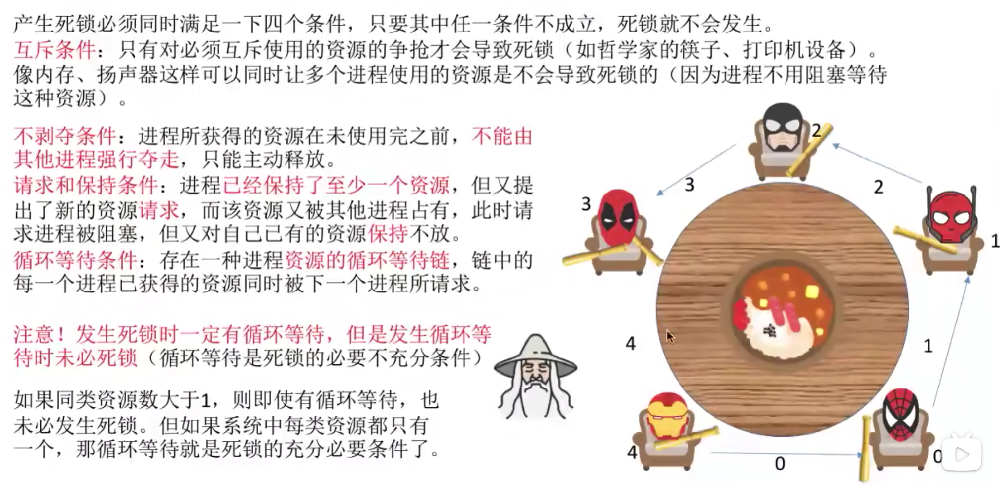

### ==总结==

### 死锁的处理策略——预防死锁

#### 破坏互斥条件

#### 破坏不剥夺条件

#### 破坏请求和保持条件

#### 破坏循环等待条件

#### ==总结==

### 死锁的处理策略——避免死锁

#### 什么是安全策略

#### 安全序列、不安全状态、死锁的联系

#### 银行家算法

#### ==总结==

### 死锁的处理策略——检测和解除

#### 死锁的检测

#### 死锁的解除

#### ==总结==

# 第三章

## 内存的基础知识

## 内存管理的概念

.assets/image-20220928103815815.png)

## 覆盖与交换

.assets/image-20220928104945243.png)

### 覆盖技术

.assets/image-20220928104757996.png)

### 交换技术

.assets/image-20220928104557541.png)

### ==总结==

.assets/image-20220928104718770.png)

## 连续分配管理方式

.assets/image-20220928105947680.png)

### 单一连续分配

> 产生内部碎片

.assets/image-20220928105250897.png)

### 固定分区分配

.assets/image-20220928105452739.png)

.assets/image-20220928105629140.png)

.assets/image-20220928105919026.png)

.assets/image-20220928110035114.png)

### 动态分区分配

> 产生外部碎片
>
> 紧凑处理

.assets/image-20220928110544000.png)

### ==总结==

.assets/image-20220928110759660.png)

### 动态分区与分配算法

#### 首次适应算法

.assets/image-20220928111406132.png)

#### 最佳适应算法

.assets/image-20220928111347571.png)

#### 最坏适应算法

.assets/image-20220928111549018.png)

#### 邻近适应算法

.assets/image-20220928111938021.png)

#### ==总结==

.assets/image-20220928112059913.png)

### 连续分配方式的缺点

.assets/image-20220929143654486.png)

## 非连续分配管理方式

### ==基本分页存储管理==的基本概念

.assets/image-20220929143937043.png)

==**注意页面和页框的区别**==

.assets/image-20220929144129324.png)

#### 如何实现地址的转换

.assets/image-20220929144700357.png)

.assets/image-20220929145322271.png)

.assets/image-20220929145543201.png)

#### 结论

.assets/image-20220929145609060.png)

#### 逻辑地址结构

.assets/image-20220929145842562.png)

#### 页表——隐式页号

.assets/image-20220929150604253.png)

#### ==总结==

.assets/image-20220929150740306.png)

### 基本地址变换机构

#### **用页面来存页表项**

.assets/image-20220929152247752.png)

.assets/image-20220929152916786.png)

#### 例子

.assets/image-20220929153507002.png) 	

.assets/image-20220929153945754.png)

#### ==总结==

.assets/image-20220929154310874.png)

### 具有快表的地址转换机构

> 是基本地址变换机构的改进版本

.assets/image-20220929161519767.png)

.assets/image-20220929162253194.png)

#### 快表（TLB）

> Translation Lookaside Buffer / 可以理解为页表缓冲

+ TLB,cache 本身都是存储器，但TLB,CACHE材质相较于内存更好，访存更快，速度差距几十倍不等。 TLB本质上也是Cache，只不过是做为页表的Cache。

#### 引入快表后，地址的变换过程

.assets/image-20220929162814330.png)

#### ==总结==

.assets/image-20220929163004207.png)

### 两级页表

#### 问题一 ：==单个页表占用连续页框==

.assets/image-20220929164732893.png)

##### 两级页表的原理、地址结构

.assets/image-20220929170325926.png)

##### 如何实现地址转换——两级页表

.assets/image-20220929171032915.png)

#### 问题二

.assets/image-20220929171455804.png)

#### 需要注意的几个细节

> 为了让一个页面存放一个页表，各级页表的大小不能超过一个页面

.assets/image-20220929172627018.png)

#### ==总结==

.assets/image-20220929172650896.png)

### ==基本分段存储管理==方式

> 按逻辑段拆分进程

#### 分段

.assets/image-20221001104309513.png)

#### 段表

.assets/image-20221001104702406.png)

#### 地址转换

.assets/image-20221001105225830.png)

#### 总结

.assets/image-20221001110602549.png)

### 分段、分页管理的对比

.assets/image-20221001110224066.png)

+ #### **分段的地址空间是二维的：因为分段的每个段的长度不同，需要检查偏移量是否越界，所以要传入段内地址**

------------------

.assets/image-20221001105932915.png)

.assets/image-20221001110135749.png)

#### 汇总

.assets/image-20221001110323594.png)

### ==段页式分段管理==

#### 分页、分段优缺点分析

.assets/image-20221001110934151.png)

#### 分段+分页=段页式管理

.assets/image-20221001111129821.png)

#### 段页式管理的逻辑地址结构

.assets/image-20221001111912090.png)

#### 段表、页表

.assets/image-20221001112158429.png)

#### 地址转换

.assets/image-20221001112516685.png)

#### ==总结==

.assets/image-20221001112917444.png)

## 虚拟内存的基本概念

### 传统存储管理方式的特征，缺点

.assets/image-20221001140143549.png)

### 局部性原理

.assets/image-20221001140448995.png)

### 虚拟内存的定义和特征

.assets/image-20221001140750228.png)

------------------

.assets/image-20221001140654529.png)

### 如何实现虚拟存储技术

.assets/image-20221001140943964.png)

### ==总结==

.assets/image-20221001141111146.png)

### 请求分页管理方式

> 虚拟技术和非连续分配管理方式的结合

#### 页表机制

.assets/image-20221001141501593.png)

#### 缺页中断机构

.assets/image-20221001141701572.png)

.assets/image-20221001141825615.png)

#### 地址变换机构

.assets/image-20221001142049905.png)

#### 地址转换流程

.assets/image-20221001142212793.png)

.assets/image-20221001142731470.png)

#### ==总结==

.assets/image-20221001142920570.png)

### 页面置换算法—调出~驻留集~

> 页面的换入、换出需要磁盘I/O,会有较大的开销，因此好的页面置换算法应该追求最少的缺页率

#### 最佳置换算法（OPT）

> OPT : optimal
>
> 理想化算法，在实际应用中无法实现

.assets/image-20221001143745627.png)

​	.assets/image-20221001143832702.png)

#### 先进先出置换算法（FIFO）

> FIFO : First In First Out
>
> 页面置换算法中只有FIFO会产生belady异常

.assets/image-20221001144219428.png)

#### ==最近最久==未使用算法（LRU）

> Last Recently used

.assets/image-20221001150320283.png)

#### 时钟置换算法（CLOCK）/ ==最近==未用算法（NRU）

> NRU : Not Recently used

##### 简单的时钟置换算法

.assets/image-20221001150939466.png)

##### 改进型的时钟置换算法

.assets/image-20221001151517913.png)

#### ==总结==

.assets/image-20221001151559264.png)

### 页面分配、置换策略（调入~驻留集~）

#### 驻留集

.assets/image-20221001160126054.png)

------------

.assets/image-20221001160145266.png)

.assets/image-20221001155134409.png)

#### 何时调入页面

.assets/image-20221001155533452.png)

#### 何处调入页面

#### 抖动（颠簸）现象

.assets/image-20221001160315101.png)

##### 工作集

> 为了研究应该为每个进程分配多少个物理块，Denning提出了进程“工作集”的概念

.assets/image-20221001160542094.png)

#### ==总结==

.assets/image-20221001160908701.png)

# 第四章

## 初始文件管理

### 操作系统向上提供了哪些功能

.assets/image-20221002092022988.png)

.assets/image-20221002092121205.png)

### 从上往下看，文件应如何存入到外存

.assets/image-20221002092454206.png)

### 其他需要操作系统实现的文件管理功能

.assets/image-20221002092621819.png)

### ==总结==——框架

.assets/image-20221002092641570.png)

## 文件的逻辑结构

> 所谓的“逻辑结构”，就是指在用户看来，文件**内部**的数据应该是如何组织起来的。
>
> 而“物理结构”指的是在操作系统看来，文件的（内部）数据是如何存放到外存中的

.assets/image-20221002093222636.png)

### 无结构文件

.assets/image-20221002093322665.png)

### 有结构文件

.assets/image-20221002093450318.png)

.assets/image-20221002093508650.png)

#### 定长记录

.assets/image-20221002093527836.png)

#### 可变长记录

.assets/image-20221002093622699.png)

### 有结构文件的逻辑结构

#### 顺序文件

.assets/image-20221002094424918.png)

.assets/image-20221002094254381.png)

+ #### **顺序文件可以定期写入外存，可以减少增删次数**

#### 索引文件

> 解决可变长记录文件的查找开销大的问题—>实现随机访问

.assets/image-20221002094731133.png)

#### 索引顺序表

> 索引表的缺点：每个记录对应的一个索引表项，因此索引表可能会很大。
>
> 比如：文件的每个记录平均只占8B，而每个索引表项占32个字节，那么索引表都要比文件内容本身大4倍，这样对存储空间的利用率			就太低了

.assets/image-20221002095945954.png)

.assets/image-20221002100005463.png)

.assets/image-20221002100050110.png)

#### ==总结==

.assets/image-20221002100242310.png)

### ==总结==

.assets/image-20221002100119448.png)

## 文件目录

> 

### 文件控制块

.assets/image-20221002100833404.png)

------------

#### FCB ~目录项~

.assets/image-20221002101005343.png)

------

.assets/image-20221002101114412.png)

### 目录结构

#### 单级目录结构

.assets/image-20221002101334564.png)

#### 两级目录结构

.assets/image-20221002101505251.png)

#### 多级目录结构 ~树形目录结构~

.assets/image-20221002101803894.png)

#### 无环图目录结构

> 由于树结构不便于实现文件的共享，提出了“无环图目录结构”

.assets/image-20221002102051940.png)

### 索引节点（FCB的改进）

> 使索引表瘦身，减少磁盘I/O的开销，增加搜索效率

.assets/image-20221002102631439.png)

### ==总结==

.assets/image-20221002102840341.png)

## 文件的物理结构 ~文件的分配方式~

> 即：文件数据应该怎样存放在外存中

> .assets/image-20221002103213063.png)

### 文件块、磁盘块

.assets/image-20221002104318288.png)

.assets/image-20221002104501708.png)

### 文件分配方式

#### 连续分配

##### 地址转换

.assets/image-20221002104850226.png)

##### 优点

.assets/image-20221002105010878.png)

##### 缺点

.assets/image-20221002105125202.png)

.assets/image-20221002105219863.png)

##### 汇总

.assets/image-20221002110552875.png)

#### 链接分配 ~链式~

> 不管是隐式分配或是显式分配，都需要从起始节点**依次**查找

##### 隐式链接

###### 地址转换

.assets/image-20221002110834983.png)

##### 显式链接——文件分配表FAT

.assets/image-20221002111203163.png)

###### 地址转换

.assets/image-20221002111640713.png)

##### ==总结==

.assets/image-20221002110914941.png)

#### 索引分配

> 目录中需要一个索引块（也是逻辑块，在外存中有对应的磁盘块）

.assets/image-20221002112858515.png)

##### 地址转换

.assets/image-20221002113230548.png)

##### 链接分配中显式分配 和 索引分配 ==区别==

##### 索引表太大的解决方案

###### 链接方案

> 索引表在不同磁盘块是并行的，按索引表递增链接的

.assets/image-20221002114340959.png)

###### 多层索引

.assets/image-20221002114818503.png)

###### 混合索引

.assets/image-20221002115150457.png)

###### ==总结==

.assets/image-20221002115522192.png)

#### ==总结==

.assets/image-20221002115749220.png)

## 文件存储空间管理 ~空闲磁盘块~

> 对空闲磁盘块管理

### 存储空间的划分与初始化

.assets/image-20221002135937148.png)

### 存储空间管理

#### 空闲表法

> 适用于“连续分配方式”

.assets/image-20221002140921578.png)

#### 空闲链表法

##### 空闲盘块链

> 以盘块为单位组成一条空闲链

.assets/image-20221002141455292.png)

##### 空闲盘块区

> 以盘区为单位组成一条空闲链

.assets/image-20221002141624035.png)

#### 位视图法

.assets/image-20221002142031220.png)

+ ##### 分配与回收

.assets/image-20221002142238486.png)

#### 成组链接法

.assets/image-20221002142412682.png)

.assets/image-20221002142900551.png)

##### 如何分配

.assets/image-20221002143007691.png)

##### 如何回收

.assets/image-20221002143158073.png)

.assets/image-20221002143215281.png)

#### ==总结==

.assets/image-20221002143425121.png)

## 文件的基本操作

### 创建文件

.assets/image-20221002143646245.png)

### 删除文件

.assets/image-20221002143745182.png)

### 打开文件

> 系统只有一份打开表 / 其他进程也会有打开表

.assets/image-20221002143939901.png)

.assets/image-20221002144141769.png)

### 关闭文件

.assets/image-20221002144229823.png)

### 读文件

.assets/image-20221002144432800.png)

### 写文件

.assets/image-20221002144558483.png)

### ==总结==

.assets/image-20221002144853210.png)

## 文件共享

.assets/image-20221002144950283.png)

### 基于索引节点的共享方式（硬链接）

.assets/image-20221002145418428.png)

### 基于符号链的共享方式（软链接）~快捷方式~

> 快捷方式（存放了从别的用户下的路径，然后一层一层去找）
>
> 所以软链接访问速度没有硬链接快

.assets/image-20221002145548694.png)	.assets/image-20221002145721281.png)

.assets/image-20221002145909542.png)

### ==总结==

.assets/image-20221002150213187.png)

## 文件保护

### 口令保护

.assets/image-20221002150918286.png)

### 加密保护

.assets/image-20221002151122928.png)

### 访问控制

.assets/image-20221002151619056.png)

.assets/image-20221002151730366.png)

### ==总结==

.assets/image-20221002152045445.png)

## 文件系统的层次结构 ~以上的汇总~

.assets/image-20221002152445520.png)

.assets/image-20221002152628063.png)

## 磁盘的结构

### 磁盘、磁道、扇区

.assets/image-20221002155230769.png)

### 如何在磁盘中读数据

.assets/image-20221002155334555.png)

### 磁盘的物理地址

.assets/image-20221002155630315.png)

### 磁盘的分类

.assets/image-20221002155722939.png)

.assets/image-20221002155744610.png)

### ==总结==

.assets/image-20221002155808290.png)

## 磁盘调度算法 ~寻道时间~

### 一次磁盘读/写操作需要的时间

+ **延迟时间和传输时间都与磁盘转速相关，且为线性相关。而转速是硬件的固有属性，因此操作系统也无法优化延迟时间和传输时间**

+ **但是操作系统的磁盘调度算法会影响寻道时间**

### 先来先服务算法（FCFS）

.assets/image-20221002161536129.png)

### 最短寻找时间优先算法（SSTF）

.assets/image-20221002161923907.png)

### 扫描算法（SCAN）

> SSTF算法会产生饥饿现象的原因在于：磁头有可能在一个小区域内来回来去地移动。

.assets/image-20221002162200751.png)

### LOOK调度算法

> 解决扫描算法的第一个缺点

.assets/image-20221002162423221.png)

### 循环扫描算法（C-SCAN）

> 解决扫描算法的第二个缺点

.assets/image-20221002162812459.png)

### C-LOOK算法

> 解决C-SCAN的缺点

.assets/image-20221002162927181.png)

### ==总结==

.assets/image-20221002163052962.png)

## 减少~延迟时间~的方法

> 延迟时间：将目标扇区转到磁头下面所花的时间

.assets/image-20221002163520340.png)

### 交换编号 ~相同磁盘号下~

.assets/image-20221002163712315.png)

### 错位命名 ~不同磁盘号下~

#### 背景知识：磁盘地址结构的设计

> 二者在读取相邻地址时的优劣

.assets/image-20221002164026844.png)

.assets/image-20221002164234238.png)

#### 错位命名

.assets/image-20221002165114374.png)

------

.assets/image-20221002165046955.png)

### ==总结==

.assets/image-20221002165447801.png)

## 磁盘的管理

### 磁盘初始化

.assets/image-20221002171644188.png)

#### 扇区校验码

##### 奇偶校验码

+ 磁盘扇区校验和的一种形式是基于扇区内所有二进制位的奇偶性。

+ 如果所有二进制位中的1的个数为奇数，比如11001，则在其后面增加值为1的奇偶位，变成110011；如果所有二进制位中的1的个数为偶数，比如11000，则在其后面增加值为0的奇偶位，变成110000，这样使得整个扇区的二进制位中的1的个数为偶数。

+ 如果扇区中有奇数位出错，则我们能检验出来，如果扇区中有偶数位出错，则我们检验不出来。也就是说，如果磁盘扇区出现了错误，我们有1/2的可能性能检验不出来。

+ 增加奇偶校验位数能提高检验出错误的概率。

+ 如果有两位校验位，第一位检验扇区的每一个字节的奇数位，第二位检验扇区的每个字节的偶数位，我们可以看成：每一个校验位检验一半扇区，那么每一个校验为检验不出错误的概率是1/2，两个校验位检验不出错误的概率就是1/4.

+ 如果一个扇区（假设有4096个字节）用4个字节作为检验码（32位校验位），那么只有40亿分之一的可能性检验不出错误。

##### CRC冗余校验码

> ？？

### 引导块

.assets/image-20221002171817345.png)

+ #### **解决**

.assets/image-20221002172032235.png)

### 坏块的管理

.assets/image-20221002172808526.png)

### 总结

.assets/image-20221002172836454.png)

# 第五章

## I/O设备的概念个分类

### 什么是I/O设备

.assets/image-20221003093009237.png)

### I/O设备的分类

#### 按使用特性

.assets/image-20221003093131867.png)

#### 按传输速率分类

.assets/image-20221003093801632.png)

#### 按信息交换方式分类

.assets/image-20221003093852378.png)

### ==总结==

.assets/image-20221003093905347.png)

## I/O控制器 ~硬件层~

### I/O的机械硬件

> 磁盘等

.assets/image-20221003094122353.png)

### I/O设备的电子部件 ~I/O控制器~

.assets/image-20221003094356186.png)

### I/O控制器的组成

> 寄存器一般会有很多个

.assets/image-20221003094713307.png)

### 内存映像I/O v.s. 寄存器独立编址

.assets/image-20221003095048123.png)

### ==总结==

.assets/image-20221003095211065.png)

## I/O控制方式 ~硬件层~

> 用什么样的方式来控制I/O设备的数据读/写

### 程序直接控制方式

.assets/image-20221003095636773.png)

.assets/image-20221003100218826.png)

#### 其中为什么要放入存储器~内存~

### 中断驱动方式

> 解决程序直接控制方式中CPU和I/O设备不能并行的问题

.assets/image-20221003100359381.png)

.assets/image-20221003100509853.png)

### DMA方式

> 解决中断驱动方式因为传输量小，需要经过CPU，导致==频繁==中断处理，会花费大量时间的问题
>
> 进一步提升并行性
>
> 每次读写只能是连续的块，且这些块读入内存后在内存中也必须是连续的

.assets/image-20221003100841420.png)

#### DMA控制器 ~一种I/O控制器~

.assets/image-20221003101446297.png)

#### DMA方式

.assets/image-20221003101731976.png)

### 通道控制方式

> 解决DMA方式中：CPU每发出一条I/O指令，只能读/写一个或多个==连续==的数据块
>
> 通道：一种==硬件==，可以理解为是“==弱鸡版的CPU==”。通道可以识别并执行一系列通道指令
>
> 一个通道（*弱鸡版CPU*）可以控制多个I/O控制器，一个I/O控制器可以控制多个I/O设备

.assets/image-20221003102242307.png)

.assets/image-20221003102506737.png)

### ==总结==

.assets/image-20221003102905358.png)

## I/O~软件层次~结构

### 知识总览

.assets/image-20221003103202415.png)

### 用户层软件

> 第一章有讲到系统调用

.assets/image-20221003103900764.png)

### 设备独立性软件

+ 给下层

+ ### 逻辑设备表（LUT表）~Logical~ ~Unit~ ~Table~

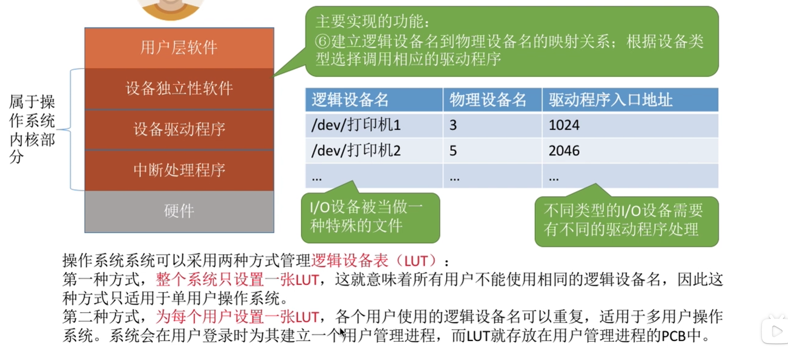

### 设备驱动程序

> 和中断处理程序一样需要与硬件打交道

.assets/image-20221003104831098.png)

.assets/image-20221003105001502.png)

### 中断处理程序 ~第一章讲过~

> 此处是I/O下的中断处理

.assets/image-20221003105705363.png)

### ==总结==

.assets/image-20221003105943127.png)

## I/O核心子系统 ~设备独立软件中功能具体实现~

### 知识总览

.assets/image-20221003110239276.png)

+ ### ==注意==：**假脱机技术（SPOOLing技术）是用户层实现的功能**

### I/O调度

.assets/image-20221003110756033.png)

### 设备保护

> 与文件保护类似，可以将设备看做成特殊的文件

.assets/image-20221003110942233.png)

### 假脱机技术 ~用户层实现的~

#### 什么是 脱机技术

.assets/image-20221003111615435.png)

.assets/image-20221003111729333.png)

#### 假脱机技术原理

.assets/image-20221003112041222.png)

+ #### 输入进程、输出进程：类似于==外围控制机==

+ #### 输入井、输出井：类似于==磁带==

.assets/image-20221003112343581.png)

#### 共享打印机原理 ~假脱机技术的应用~

.assets/image-20221003112729050.png)

.assets/image-20221003112852041.png)

#### ==总结==

.assets/image-20221003112911867.png)

### 设备的分配与回收

#### 设备分配时需要考虑的因素

.assets/image-20221003113546769.png)

.assets/image-20221003113534250.png)

.assets/image-20221003113853740.png)

#### 静态分配和动态分配

.assets/image-20221003114332920.png)

#### 设备分配管理中的数据结构

> 可以有多个通道

.assets/image-20221003114442036.png)

##### 设备控制表（DCT）

.assets/image-20221003114633328.png)

##### 控制器控制表（COCT）

.assets/image-20221003114759252.png)

##### 通道控制表（CHCT）

.assets/image-20221003115033462.png)

##### 系统设备表（SDT）

.assets/image-20221003115131555.png)

#### 设备分配的步骤

.assets/image-20221003115221542.png)

.assets/image-20221003115304051.png)

.assets/image-20221003115349344.png)

.assets/image-20221003115409750.png)

#### 设备分配的步骤改进

.assets/image-20221003115716981.png)

.assets/image-20221003115844682.png)

#### 总结

.assets/image-20221003120131276.png)

### 缓冲区管理

#### 什么是缓冲区？有什么作用？

.assets/image-20221003120430946.png)

.assets/image-20221003120736182.png)

#### 缓冲区管理策略

##### 单缓冲

.assets/image-20221003121016091.png)

###### 计算每处理一块数据平均需要多少时间

+ #### T>C

.assets/image-20221003121154081.png)

+ #### T<C

.assets/image-20221003121442512.png)

###### 结论

##### 双缓冲

.assets/image-20221003121659988.png)

.assets/image-20221003122006828.png)

##### 使用单/双缓冲策略在~通信时~的区别

.assets/image-20221003122155154.png)

###### 管道通信中的管道就是缓冲区

.assets/image-20221003122232399.png)

##### 循环缓冲区

.assets/image-20221003122442325.png)

##### 缓冲池

>  一堆缓冲放一起

.assets/image-20221003123007099.png)

##### ==总结==

.assets/image-20221003123159300.png)

# end
