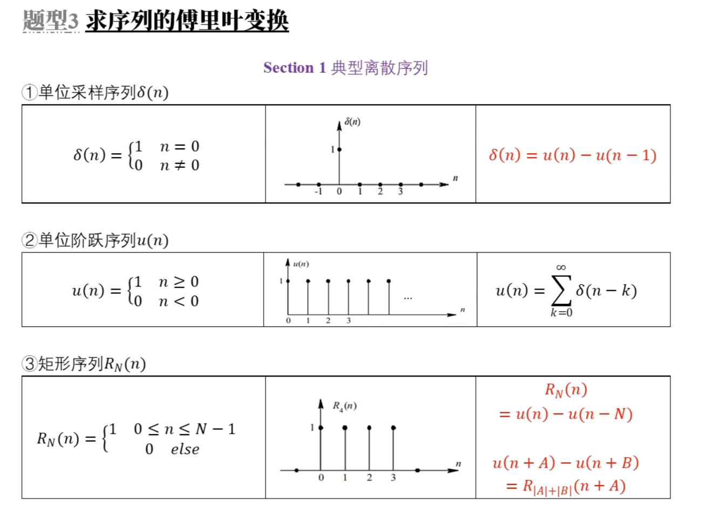
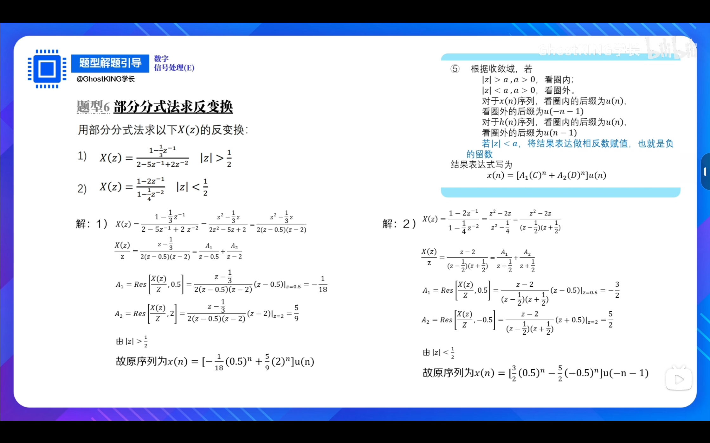
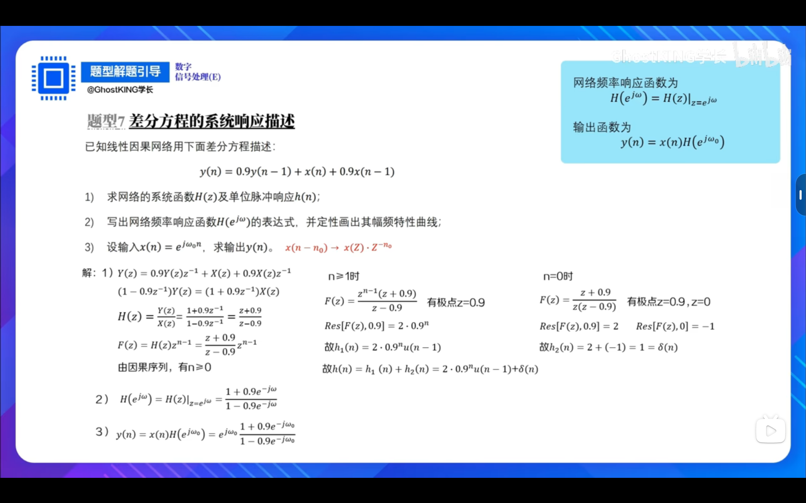
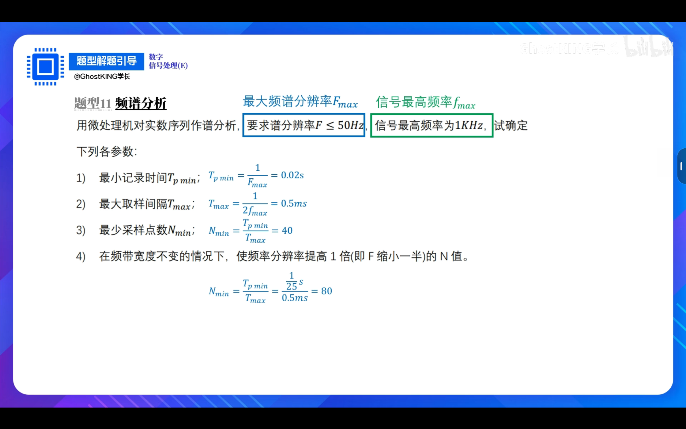
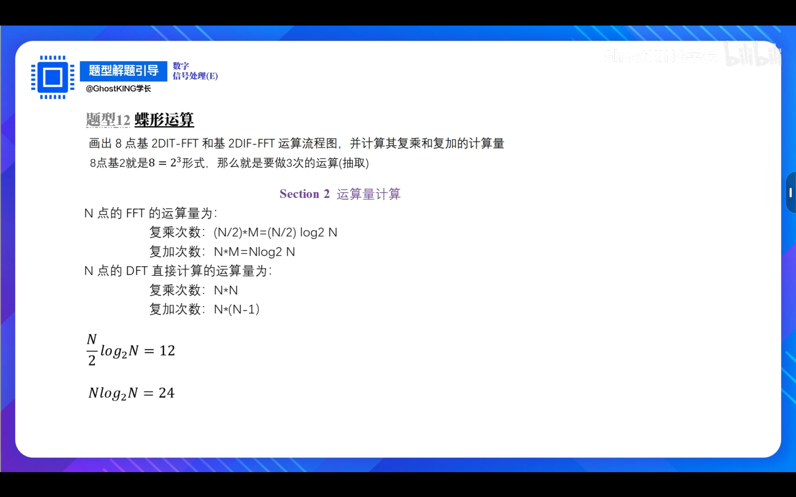
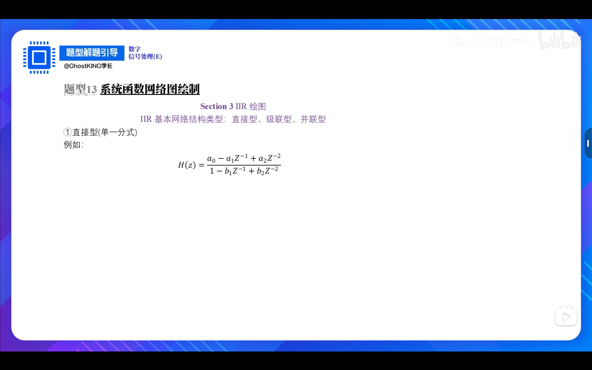
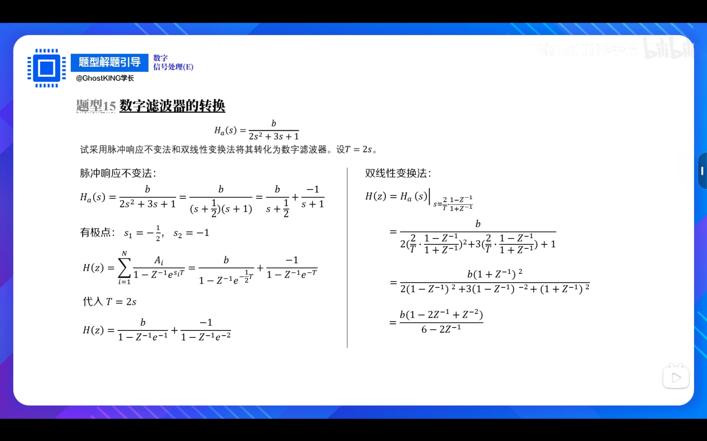
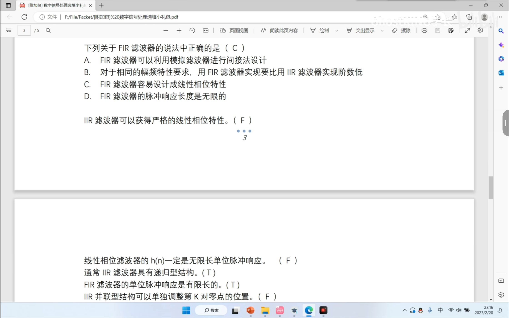

# 01 序列周期判断

## 题目

## 相关知识点

# 02 序列卷积运算

# 03 求序列的傅里叶变换

## 题目

## 相关知识点

## 解答

# 04 求序列的Z变换与收敛域

## 题目

## 相关知识点

## 解答

# 05 一般法求反变换

## 题目

## 相关知识点

## 解答

# 06 部分分式法求反变换

## 题目

## 解答

# 07 差分方程的系统响应描述

## 题目

## 解答

# 08 计算N点DFT

## 题目

## 相关知识

## 解答

### （1）

### （5）

### （6）

### 特殊 （2）

### 特殊（3）

### 特殊（4）

# 09 有限长序列循环卷积

## 题目

# 10 N点DFT的应用

## 题目

## 解答

# 11 频谱分析

## 题目

## 相关知识

## 解答

# 12 蝶形运算

## 题目

## 相关知识

## 解答

# 13 系统函数网络图绘制

## 题目

### IIR型

#### 直接性（单一分式）

#### 级联型（将分式化为分式相乘的形式）

#### 并联型（将分式化为分式相加的形式）

### FIR型

### 例题

## 相关知识

## 解答

# 14 巴特沃斯低通滤波器设计

## 题目

## 解答

# 15 数字滤波器的转换

## 题目

​    

## 相关知识

## 解答

# 16 FIR的幅频与相位特性函数

## 解答

# 17 窗函数设计

# 选择题

