# 高数

## 函数极限

### 无穷小量比较

### 周期函数的极限sin(n)

### 二极限组合存在性

#### 乘积

> 乘积可能存在、可能不存在（二者都存在，乘积存在）
>
> ​	二者都不存在、或一存在一不存在

#### 和差

> 二者都不存在，则和与差不能同时存在

### ln里含指数e

> 将e提出

### x—>2

> 换元u = x - 2，方便用等价无穷小和泰勒

### 收敛函数的有界性

> sinx！

### 泰勒展开注意展开项数

> 无论外层还是内层泰勒展开保证$O(x^n)$的==阶数与分母一致==

### 乘积可先求极限

### 极限定义求极限

### 无函数关系的极限

## 函数微专题

### 求反函数

#### 分段（定义域看内层）

> 区间对应即可，注意定义域看内层

#### arccos、arcsin

> 回归到原函数区间，正负号（==y>0变为y<0==）
>
> arccos是(0, π) arcsin是(-pi/2, pi/2)

#### 含根式（一边仅保留一个）

#### f(x) 与 f(1\x)

### 分段求导，定义域（660）

## ==数列极限==

### 判断数列极限是否存在（反例）

#### 复合函数（外层偶，内不定）

#### an = Sn - Sn-1

#### an收敛 Sn不一定收敛

#### a1 = Pn/Pn-1 两者互不能推收敛

> sin n

### 夹逼（放缩——>不等式）

### 定积分极限（660）

### 化级数求和极限

> 高数一道注题

### {xn} 与 {yn} 的无穷小比较

### ==无穷小阶的比较==

> 带系数

### 连乘

#### 取对数

#### 连锁消项

### 极限定义

#### 极限存在，不一定|xn - a| < 1/n

#### 复合函数的极限

### 数列最值

#### 有限的前N项，n > N时的无限项

> 求极限，再划分区间

### 证明题

#### 单调有界（三种方法证单调）

#### 数学归纳法证明有界

X1 ——> Xn-1 ——> Xn

#### 不等式证有界

#### 定积分和级数 不等式

#### 使用极限的定义证有界

## 连续、间断与导数

### 绝对值在零点可导的充要条件

> 对与|f(x)|——>f(x) = 0，==f’(x) ≠ 0== 导数不存在
>
> 根号也有不可导点！！！

### 绝对值夹逼

### 间断点（tanx 和 e^x^ 的组合）

> 注意tan cot函数图像，以及sin cos取0处

### 导函数与原函数间断点关系

### 最值定理（极限下）

### 导数定义

> 非动点，两个方向都存在 例如 0^+^、0^-^

### 分段函数间断点

> 注意区间是闭区间还是开区间

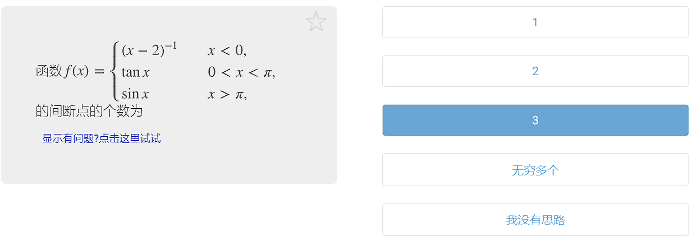

### 高阶导数

#### 递推找规律

#### 代入有0型（公式法）

> 分配，让代入等于0的一边求导到只剩常数，（其他的都被其代入等于0了）

#### 泰勒展开取n项

#### 公式法

### 阶梯函数的导数

> 用定义 + 夹逼

### 穿针引线法求极值点、拐点

### 660错题

#### 导函数概念（660）

> 目标图形{/ /}

#### 极值点包括不可导点

#### $f^{'}(x)$在有限开区间上有界，$f(x)$有界

#### $f(x)$在区间$[a,b]$上有界，且只有有限个间断点，可积

> 振荡也可以

#### 傻瓜错题

## ==中值定理==

> 主要分析==（不）等式==，其他均为可用条件

### 证明一个点$\xi \in(a,b)$，使$F[\xi,f(\xi),f^{'}(\xi)]=0$

> 微分方程法!!!!!!!!
>
> 找原函数+罗尔定理or最大最小值
>
> 找原原函数+三点（零点）

### 证明存在两个中值点$\xi,\mu\in(a,b)$，使$F[\xi,\mu,f(\xi),f(\mu),f^{'}(\xi),f^{'}(\mu)]=0$

### 证明存在一个中值点$\xi\in(a,b)$，使$F[\xi,f^{n}(\xi)]\ge0(n\ge2)$

#### 泰勒展开

#### 细节做法

### 找原函数方法

#### 微分方程法

#### 加项减项（$f^{''}与f$）

#### 复合还原（加项减项换元）

#### 积分原函数$\int_{0}^{\pi}f(x)cosxdx $

### 找$f^{'}(\xi)=0$方法

#### 罗尔定理$f(a)=f(b)$

#### 介值定理$\sum_{i=1}^{n}p_i=1, \sum_{i=1}^{n}p_if(x_i)=C$

> 零点定理是特殊的介值定理

### 求参数（两种思路）

#### 题目中求参数$a$（化成分式、$f^{''}$）可以用（==柯西==）

#### 高阶导$f^{''}、f^{''}...$ 在条件最多点泰勒(等于参数c、介值定理)

### $|f^{'}(x)|\le a$

> 在点出展开

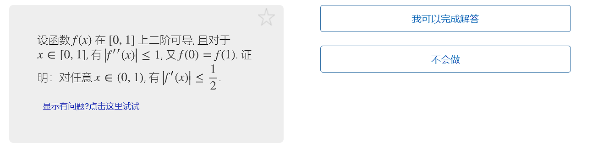

### 双中值选点技巧（逆推）

## 导数应用

### 方程根的存在性

#### 零点定理

#### 罗尔定理（找原函数）

### ==方程根的个数==

#### 单调性

#### 罗尔定理推论

> $f^{n}(x)\ne 0$ 则 $f$ 最多 $n$ 个零点
>
> 若$f^{(k)}(x)$有1个零点 任何阶导和其零点个数之和相等

#### ==利用特殊点判断方程根，不等式判断无零点==

#### 分离参数（方程本身的根）

#### 偶函数分区间

### 构建方程求最值

### 渐近线

> +∞ 与 -∞的渐近线一样的时候是一条
>
> 注意lnx 0点处没有？？？？垂直渐近线，ln|x|则有

### 线性函数+无穷小有渐近线

### 单调函数性质

> 极限 = 0才是有上（下）界

### 导函数极值点

> 第一充分条件：异号
>
> 第二充分条件：偶数导不为0

### 导函数拐点

> 第一充分条件：异号
>
> 第二充分条件：奇数导不为0

### 凹凸函数性质

#### 几何性质

#### 一阶导数单增

### 极坐标方程——>参数方程

### 曲率圆性质

> 在公共点处一阶导和二阶导都相等

## 导数证明

### ==证明函数不等式==

#### 单调性

> 一阶导看不出，导2次

##### 参数型$(a,b)$

> 令$b=x$

#### 泰勒公式

#### 拉格朗日中值定理

#### 凹凸性

> $在(a,b)上，f^{''}(x)>0，则f(x)\le f(a) \ and\ f(x)\le f(b)$，

#### 最大最小值

## 积分1

### ==利用对称性化简==

#### 变换区间

### 常见积分公式

> arcsin的x前系数为1

### 直接积分、凑微分积分

> 分母：有平方，根号可凑微分

### 分部积分法

### 换元积分法

#### 根号

#### 三角换元

> sin^2^x + cos^2^x = 1、sec^2^x = 1 + tan^2^x、和差化积

> tan(a + b)、sin(a + b)、cos(a + b)

> 和差化积——>用于积分

sin2x = (cosx + sinx)^2 - 1

### 多项式拆解

> 加、减项，拆解

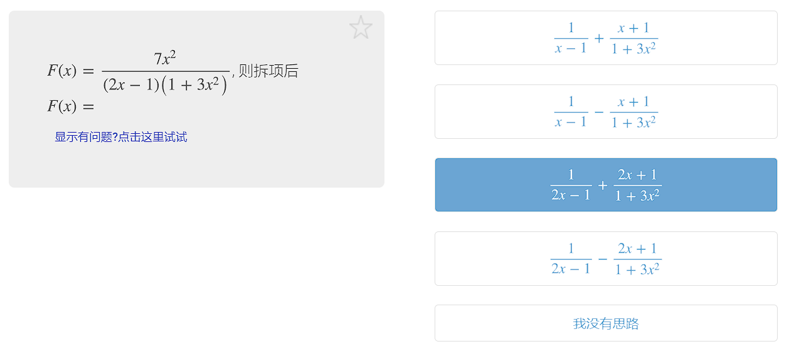

### 万能公式

### 不定积分开根号不用绝对值

## 积分2

### 定积分

> 不定积分基础上

#### 分部积分法

> \+ 牛顿莱布尼兹

### 反常积分判敛散

> (0 , 1) 注意极限是x—>0^—^与x—>1^+^ 

#### 无穷区间

#### 无界函数的反常积分

> 若题目说在a=0处连续，则该点不为瑕点

#### lnx在分子决定不了敛散

> 对于x—>2^—^

### 对称区间

> x = a + b - t
>
> 一般对称区间用

### 三角函数的加项减项

### 对称区间上的奇偶性

> 求a、b值使得积分最小

### 配方换元

### 内部整体代换

### 定积分开根号要绝对值

### e^-x*x^的反常积分

### 定积分的和

## 定积分应用

### 求弧长公式三条

### 质心坐标

#### 密度函数与y轴无关之时

### ==质量矩==

### 柱体对一点万有引力

> 方法：确定微分、微元法

### 函数严格单调，其反函数亦然

### 旋转体侧面积==半径加绝对值==

### 旋转体体积求法

> 特别的绕x轴和y轴，注意函数的形式选取积分方法

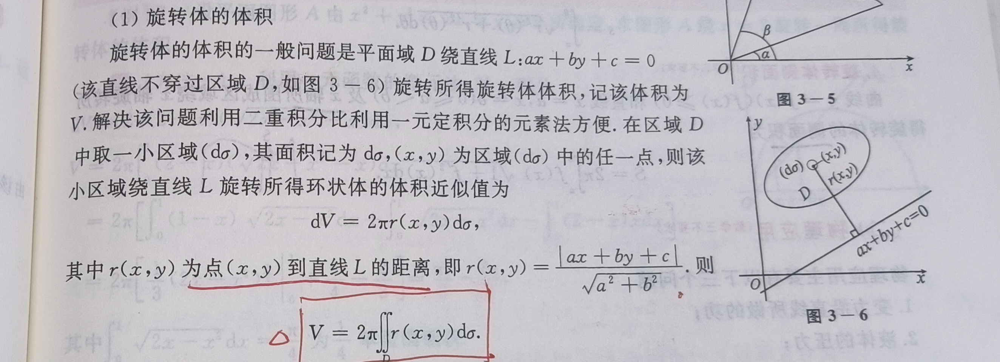

### 容器抽水

### 多元积分中值定理

### 旋转面、柱面、投影曲线

### 660错题

#### 积分不等式证明（660）

> 判断是否大于0：划分正负区间
>
> 判断是否大于1：改写1，合并用单调性判断

#### 周期函数积分判断（660）

> 划分到同一区间（往结果靠）

#### 注意积分区域（660）

> 注意x

#### 过程中写出f(x)表达式可以判断可导（660）

#### 含绝对值积分

> t = xy

#### 极坐标交换积分次序

> 建立r与$\Theta$的直角坐标系

#### 周期函数的导与原

## 多元微分

### 无条件极值

#### 失效（AC-B^2^=0）

> 极限下判断：多元微分极值
>
>  含参数代回去用定义分析
>
> ​	构造路径使其不满足定义：存在区域f(x, y) < f(x~0~, y~0~)
>
> ​	该点处的极限分析（保号性）

### 条件极值

#### 直接代入

#### 均值、柯西不等式

> 将目标函数放缩到约束方程

> 平方和——》柯西不等式

#### 拉格朗日

> 写出方程组

##### 化简含参方程（三种思路）

> 减和除都是为了消掉nangda
>
> 行列式（二元一次方程）
>
> 此处x y不能同时等于0，说明有非零解，行列式为0

#### 证明不等式（划分）

> 一边为目标函数，一边为约束条件

### 区域上的极值(=、<、<=)

> 区域内、边界（<=）、边界交点

### 重极限~存在性、多元微分极值~

> 辅助：等价无穷小、无穷小x有界量

#### 构造路径（存在性、极值）

##### 方法一 ：y = kx

##### 方法二 ：y = x + x^k^ 

##### 方法三 ：y = 0, x = 0

#### 夹逼（存在性）

> 不等式放缩

#### 极限保号性（极值）

#### 脱帽法 + 构造路径（极值）

> 含有抽象f(x, y)

#### 连续性、可导性、可微性判定

##### 定义

##### 抽象函数特殊法

> 

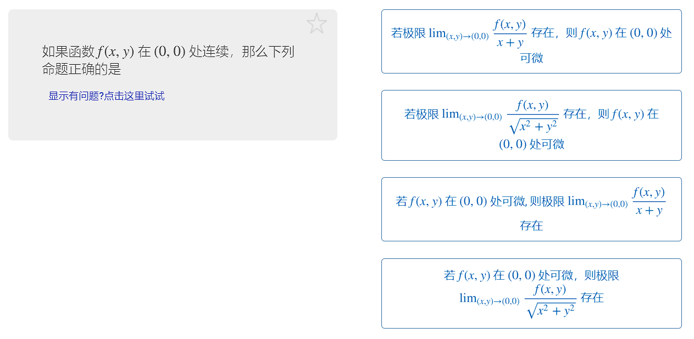

### 连续、一阶偏导、可微关系

### 全微分的充要条件

### 二阶泰勒展开

### 方向导数的定义==记忆==

### 方向导数的最大值

### 梯度散度旋度

### 转动惯量

$I_{x} = \iint\limits_{D}^{}y^2\rho (x,y)d\varrho  $

$I_{x} = \iiint\limits_{\Omega }^{}(y^2+x^2)\rho (x,y,z)dv  $

$I_{x} = \int\limits_{l}^{}(y^2+x^2)\rho (x,y,z)ds  $

$I_{x} = \iint\limits_{\Sigma }^{}(y^2+x^2)\rho (x,y,z)dS  $

### 660错题

> 目标导向求f——>对x，y偏导

#### 一类题型（微分方程+积分）

#### 给三个解求微分方程（660）

> 通解 + 代入特解

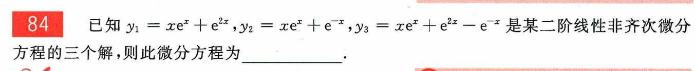

#### 解组合还为解的充分必要条件

> 线性无关

#### ==判断偏导数连续方法（**易混淆**）==

> 把图像拆分

> 可以直观看出图像在$(0,0)$处不连续

> 在分区间分点求导（可看出偏导数不连续）

+ 补充

  + B选项的第一个的几何意义是：f对x的偏导沿着y=0（轴）方向连续

  + 偏导连续是沿着任何方向都连续

+ 对f进行偏导数求导：在分段点处用定义（第一个），在分段线处用定义（第二个），在其他正常求导
  + 对函数在点处求导用第一个，对区间求导用第二个

## 重积分

### ==第一步用对称性、轮换性化简==

### 划分积分区域利用奇偶性

### 椭圆、球可快速化为关于z积分

> 其他的老老实实算

## 微分方程

### 一阶微分方程

#### 可分离变量

#### 齐次方程（Y/X）

#### 线性方程（e）

> y’ + p(x)y = Q(x)

#### 伯努利方程（y^n^）

> y’ + p(x)y = Q(x)y^n^

#### 全微分方程（充要条件）

> du(x, y) = P(x, y)dx + Q(x, y)dy = 0  <=> 

+ 通解为 u(x, y) = c
+ 方法：1、偏积分 2、==凑微分== 3、线积分

### 可降阶高阶方程

#### y\'\' = f(x, y’) 

#### y\'\' = f(y’, y) 

### 高阶线性微分方程

> 齐次通解，非齐次通解、特解

### 常系数齐次线性微分方程

### 常系数非齐次线性微分方程

#### 非齐次解化为（非）齐次解

> 系数和为1，特解、系数和为0，齐次解

### 欧拉方程

> 注意 x > 0 与 x < 0
>
> 1、x > 0 令 x = e^t^
>
> 2、x < 0 令 x = -e^t^

### ==换元==

### 构造方程，解微分

## 曲线积分

### 一型线

#### 三个公式

#### 空间曲线参数方程直接代入

### 二型线

#### 直接法（直接代入、非环曲线）

#### 格林公式（环）

#### 补线格林公式（环）

#### 路径无关（点到点）

#### 无定义处的挖洞格林

> 可补线格林之后产生无定义点 分母处

#### ==空间曲线==

##### 直接代入（参数方程）

##### 特殊落在三个坐标面的曲线

### 一型线与二型线的关系

### 变力做功

> 写出F的向量表达式
>
> 假设$F = xi +yj$
>
> $W=\int_{l}^{} xdx+ydy$

## 曲面积分

### ==先用对称性和轮换性化简==

### 一型面

#### 直接法

### 二型面

#### 思路

+ 高斯（补面高斯）
+ 轮换投影法（就是一型面和二型面的关系推广）
+ 直接法（投影到坐标面）
  + 柱面最适合

#### 高斯公式

#### 含奇点的高斯公式

> 高斯公式 - 分母面

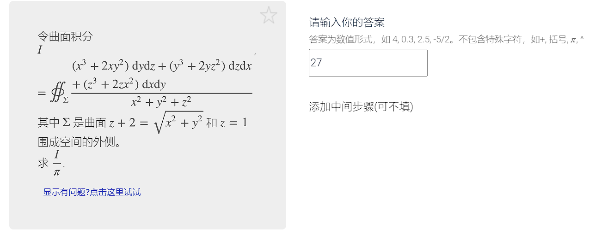

#### 轮换投影法

#### 直接法（投影到坐标面）

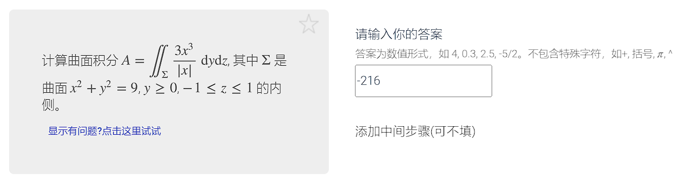

### 椭圆的极坐标 !

## ==级数判敛==

### 比较判别法

#### 不等式

 
展开查看
 

 
展开查看

### 比较法极限形式

#### 常规

 
展开查看

#### 先等价无穷小

##### 等价无穷小

 
展开查看

##### 泰勒展开

****

 
展开查看

    

### 比值法、根植法（等于1！）

> 1、含参数时将值代回方程判断
>
> 2、若1得出收敛 再代回原方程判断
>
> 一般都是发散

### 积分判比法使用条件

### 平均值极限

 
展开查看

### a~n~ 与 a~n-1~相加减 ——>S~n~

> Sn极限存在

 
展开查看

### a~n~ 和 a~n-1~ 相除——>比值递推a~1~

> a~n~不断放缩到a~1~

### 条件收敛，正项和负项级数发散

 
展开查看

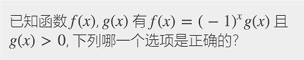、

### 莱布尼兹准则（正项！）

#### 注意正项

 
展开查看

#### cos或者sin的数列极限

> 先将根号内的凑平方，然后在加减（）pi，前项提出去（形成(-1)^n^）后项有理化（用于单减） + 莱布尼兹准则（正项！）（N~1~）

### 660错题

#### ==画括号收敛判定（易混淆）==

> 画括号的：写出$S_{n}$，判断其极限，或者考察它的一般项$a_{n}$
>
> 没画括号的：写出$S_{2n}$，在写出$S_{2n+1}=S_{2n}+??$的形式判断二者极限是否一致

## 幂级数

### 常见函数展开及收敛域

### ==求和函数==（x=0 + 收敛域）

> 在常见函数收敛域基础上、判断端点是否收敛
>
> ​	x = 0 + 收敛域
>
> 一般通过求导、求原函数来做

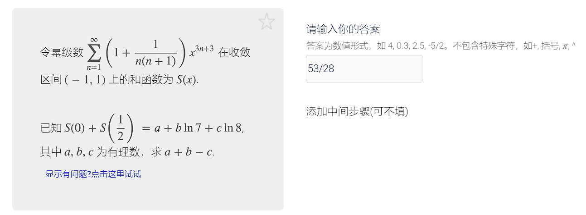

### ==和函数之和==

> 先将x配平，在提系数求和

### 泰勒级数收敛定理

### 和函数+a~0~+a~1~x..（an+1 = an）

> 化为微分方程

### 数列和化为x的和函数

## 傅里叶级数

### 傅里叶级数相关公式==$\frac{a_{0} }{2} $==

### 收敛定理（狄利克雷）

### 傅里叶级数周期性2π|2l

### 傅里叶级数奇偶性

### 展开成傅里叶级数

# 不等式（夹逼、定积分大小、级数判敛）

# 概念题（导数、极限）

# 证明题(反正法！！！)

> 正向难证明，想到反证法——>反证的时候，可以直接把反面当结论用，只要矛盾，原题得证

## 证明函数不等式的五个思路

### 单调性

### 泰勒公式

### 拉格朗日中值定理

### 凹凸性

### 最大最小值

## 泰勒公式（有$f^{''},f^{'''}$...）

### 证明函数不等式

### 证明极限

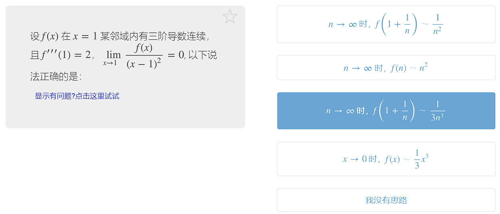

## 拉格朗日中值定理

### 求极限范围

### 求不等式

## 数列极限证明题

## 积分不等式（辅导讲义p118）

## 微分中值定理三类型

## ==反证法==案例及分析

> 反正法就是==结论的对立面==当条件用，然后推翻原题条件，就说明该假设错误，原题得证

### 题设条件说$??\ne??$

