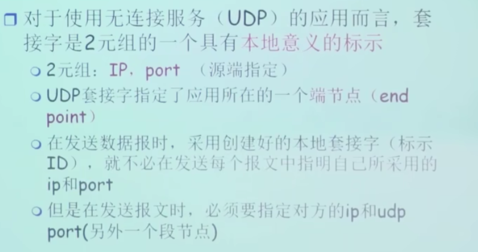
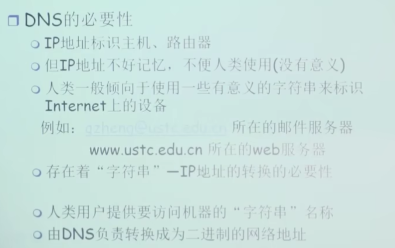
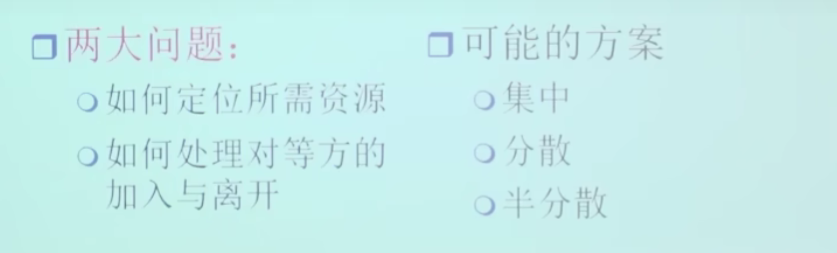

# [计算机网络（自顶向下）](https://blog.csdn.net/qq_53111905/category_11228995.html)

应用层

传输层

网络层

链路层和物理层

# 第1章：概述

## 1.1 什么是Internet

+ 网络

  + 点与边构成（与大小形状无关）
  + 人际关系网络、蜘蛛网、神经元网络……

+ 计算机网络

  + 有联网的计算机构成的系统

  + 包含节点

    + ▢主机节点：数据的源，也是数据的目标、工作在==链路层==

    + ○数据交换机点（路由器、交换机）：数据的中转节点、工作在==网络层==
    + 高层负载均衡设配……………
    + 不只是硬件设备,还有设备上的操作系统、应用程序……

  + 边（通信链路）

    + 接入网络链路：主机连到互联网的链路
    + 主干链路：路由器间的链路

  + 互联网(大写的Internet)
    + 以TCP/IP协议为一簇的网络(普及广泛的网络)
  + 其他网络(intrenet内联网)
    + 比如银行内网,企业内网

+ ==从具体角度==
+ ==协议==（对等层的协议、比如：TCP是传输层的一个协议）控制发送和接收信息
    + 协议定义了在两个或多个通信实体之间的==报文格式==和==次序==，以及在报文传输和/或接收/或其他事件方面所采取的==动作==
  + 
    + 如TCP、IP、HTTP、FTP、PPP
    
  + Internet：（网络的网络）
  
    + 松散的层次结构，互连的ISP
  + 公共Internet vs intranet
  
  + Internet标准
  
    + RFC：Request for comments
  + IETF：Internet Engineering Task Force

+ ==从服务角度==————***我的理解***：应用层上不同地方的进程通过应用层之下的为其提供通信服务
  + 使用通信设施进行通信的**分布式应用**
    + Web、VoIP、email、分布式游戏、电子商务、社交网络
    + **即应用层上的进程**
  + **通信基础设施**（*应用层之下*）为apps提供编程接口（API）（通信服务）
    + 将发送和接收数据的apps与互联网连接起来
    + （传输层）为app应用（应用层）提供服务选择，类似于邮政服务：
      + 无连接不可靠服务（UDP）————————————————————————————————
      + 面向连接的可靠服务（TCP）——————***即两个应用进程在通信之前要不要打招呼***————————

+ **网络结构**
+ 
  + ==*网络边缘*==
    + 主机
    + 应用程序（客户端和服务器）
  + ==*网络核心*==
    + 互联着的路由器
    + 网络的网络
  + ==*接入网、物理媒体*==
    + 有线或无线通信链路

## 1.2 网络边缘

+ **端系统**（主机）
  + 运行应用程序
  + 如Web、email
  + 在“网络的边缘”
+ **客户**/**服务器模式**（client/server）
  + 客户端向服务器请求、接收服务
  + 如Web浏览器/服务器：email客户端/服务器
+ **对等**（**peer**-**peer**）**模式**——————我的理解（即是客户端也是服务器）
  + 很少（甚至没有）专门的服务器
  + 如Gnutella、KaZaA、Emule

### 采用网络设施的面向连接服务

+ 即端系统知道，但是中间的链路不知道

+ **目标**：在端系统之间传输数据
  + **握手**：在数据传输之前做好准备
    + 人类协议中：你好、你好
    + 两个通信主机之间为==连接建立状态==
  + **TCP**-传输控制协议（Transmission Control Protocol）
    + Internet上面向连接的服务

+ **TCP**服务（RFC 793）
  + **可靠地**（**reliable**）、**按顺序地传送数据**
    + 确认和重传
  + **流量控制**
    + 协调发送方的发送速度和接收方的接收速度
    + 发送方不会淹没接收方
  + **拥塞控制**
    + 当网络拥塞时，发送方降低发送速率
  + **不能提供服务**
    + 时间保证、最小吞吐(保证和安全)
+ **TCP应用**
  + HTTP（Web），FTP（文件传送）、Telnet（远程登陆）、SMTP（email）

### 采用基础设施的无连接服务

+ 即不需要握手

+ **目标**：在端系统之间传输数据
  + UDP-用户数据报协议（User Datagram Potocol）
    + 无连接服务

+ **UDP**（RFC 768）：
  + **无连接**
  + **不可靠数据传输**
  + **无流量控制**
  + **无拥塞控制**
+ **UDP应用**
  + 流媒体、远程会议、DNS、Internet电话

## 1.3 网络核心

+ 路由器的网状网络

### **基本问题：数据怎样通过网络进行传输？**

### 1. **电路（线路）交换**

+ 为每个呼叫预留一条专有电路（==需要线路建立的时间==）：如电话线

+ ==怎么分片==

+ **电路交换不适合计算机之间的通信**

  + 连接建立时间长

  + 计算机之间的通信有突发性，如果使用线路交换，则浪费的片较多
    + 即使这个呼叫没有数据传递，其所占据的片也不能够被别的呼叫使用

  + 可靠性不高？

### 2. **分组交换**（hop to hop）：

+ 将要传送的数据分成一个一个单位：分组
+ 将分组从一个路由器传到相邻路由器（hop）（*相邻路由之间要前面的先把packet完全存储在转发给下一个——**实现共享***），一段段最终从源端传到目标端
+ 每段：采用链路的最大传输能力（带宽）

+ **以分组为单位存储**-**转发方式**
  + 网络带宽资源不在分为一个个片（与电路交换相比），传输时使用全部带宽
  + 主机之间传输的数据被分为一个个分组
+ **资源共享**，==**按需使用**==
  + 存储-转发：分组每次移动一跳（hop）
    + 再转发之前，节点必须收到整个分组
    + 延迟比线路交换要大
    + 排队和延迟（==*换取了共享性*==）
      + 如果到达速率（输入路由器）>链路的传输速率（路由器输出）
        + 分组会排队，等待传输
        + 如果路由器的缓存用完了，分组会被抛弃——>==1.6 分组延时、丢失和吞吐量==
+ **统计多路复用**（一种分片的方式~与电路分组的分别类似~）
  + 类似于分时间片，但与电路分组的不同的是，不会固定线路是某个主机使用，**==按时间段==**随机分配给不同主机使用
+ **分组交换按有没有网络层的连接分为**
  + **数据报网络**——*无连接*（两个主机在通讯之前不需要握手）
    + 分组的目标地址决定下一跳（携带了目标主机的完整地址）
    + 在不同的阶段，（*IP虽然没变*）路由表可以改变——导致路线不同
    + 类似：网络
    + Internet
  + **虚电路网络**——先建立起虚电路（vc，利用信令）（两个主机要握手，保持通讯的状态）
    + 每个分组都带标签（虚电路号，而非目标主机地址）

### **网络核心关键功能**

+ 路由：决定分组采用的源到目标的路径
  + 路由算法
+ 转发：将分组从路由的输入链路转移到输出链路

## 1.4 接入网和物理媒体

### **怎样将端系统和边缘路由器连接**

+ 住宅接入网络
+ 单位接入网络（学校、公司）
+ 无线接入网络
+ **注意**
  + 接入网络的带宽（bits per second）
  + 共享/专用？

#### **住宅接入**：**modem**

+ 将上网数据调制加载音频信号上， 在电话线上传输，在局端将其中的 数据解调出来；反之亦然
   调频  调幅  调相位  综合调制
+ 拨号调制解调器
  - 56Kbps 的速率直接接入路由器 (通常更低)
  - 不能同时上网和打电话：不能 总是在线
+ **接入网: digital subscriber line (DSL)**

+ 采用现存的到交换局DSLAM的**电话线**
  + DSL线路上的数据被传到互联网 （>4kHz，上行、下行再分频率）
    + DSL线路上的语音被传到电话网 （< 4kHz）
    + < 2.5 Mbps上行传输速率(typically < 1 Mbps)
    + < 24 Mbps下行传输速率(typically < 10 Mbps)

+ **接入网: 线缆网络**

  + **有线电视信号线缆双向改造**

    + FDM: 在不同频段传输不同信道的数据， 数字电视和上网数据（上下行）

    + HFC: hybrid fiber coax
      + 非对称: 最高30Mbps的下行传输速率, 2 Mbps 上行传输 速率
    + 线缆和光纤网络将个家庭用户接入到 ISP 路由器（***Internet Service Provider***）
    + 各用户共享到线缆头端的接入网络
      + 与DSL不同, DSL每个用户一个专用线路到CO（central office）
+ **住宅接入：电缆模式**
  + fiber optic transport——光纤传输
+ **接入网：家庭网络**
  + 无线路由器

#### 企业接入网络

#### 无线接入网络

### 物理媒体（第0层）

+ **Bit**：
  + 在传输-接收对时间传播
+ **物理链路**
  + 在每个传输-接收对，跨越一种物理媒体

#### **导引型媒体**

+ 信号沿着固体媒介被引导；同轴电缆、光纤、双绞线
  + 双绞线
    + 两根绝缘铜线
      + 5类：100Mbps Ethernet Gbps 以太网
      + 6类：10Gbps

#### 非导引型媒体

+ 信号自由传播：如无线电

#### 物理媒体：同轴电缆、光纤

#### 物理媒介：无线电路

## 1.5 Internet结构和ISP

#### 互联网结构：网络的网络

#### ISP(Internet Service Provider)

+ **每两个ISP连接——不可扩展**

+ **global ISP**

+ **==竞争==：多个global ISP &==合作：== peering link**

+ **regional net**——局部业务 && **流量中心 IXP**

#### ICP(Internet Content Providers)e.g. Google

#### ISP,ICP总览

#### 归纳：Internet的结构：network of networks

##### 中心：第一层ISP

##### 第二层ISP

##### 第三层local ISP

##### ISP（include ICP）之间的联络

## 1.6 分组延时、丢失和吞吐量

#### 与网络核心中==分组交换==相联系

+ **分组丢失和延时是怎么发生的**

### 四种分组延时(each hop)

#### 1. 节点处理延时

+ 检查bit级差错
+ 检查分组首部和决定将部分组导向何处

#### 2. 排队延时（等待）

+ 在输出链路上等待传输的时间
+ 依赖于路由器的拥塞程度

#### 3. 传输延时（传出）

+ R=链路宽度（bps）
+ L=分组长度（bits）
+ 将分组发送到链路上的时间=L/R
+ 存储转发延时

#### 4. 传播延时（传中）

+ d=物理链路的长度
+ s=在媒体上的传播速度（~2*10^8^m/sec）
+ 传播延时=d/s

### 分组丢失

### 吞吐量

+ **有效的数据量（被接收）**

#### 平均吞吐量取决于——瓶颈链路

 

## 1.7 协议层次和服务模型

### 层次化方式实现复杂网络功能

+ 将网络复杂的功能分层功能明确的层次，每一层实现其中一个或一组功能，功能中有其上层可以使用的功能：==服务==
+ 本层协议实体相互交互执行本层的==协议动作==，==目的==是实现本层功能。通过接口为上层提供更好的服务
+ 在实现本层协议的时候，直接==利用了下层所提供的服务==
+ 本层的服务：借助下层服务实现的本层协议实体之间交互带来的新功能（上层可以利用）+跟下称所提供的服务

### 服务、SAP(Services Access point)

#### 面向连接的服务TCP

#### 无连接服务UDP

### 服务和协议

### 数据单元

### Internet协议栈

#### 物理层

+ 在线路上传送bit
+ 数据单元：**位（bit）**

#### 链路层

+ 在物理层服务之上在相邻==两点之间==传输以帧为单位的数据
+ **点到点通信**，**可靠或不可靠**
+ 点对点协议**PPP**，**802.11(wifi)**，**Ethernet**
+ 数据单元：**帧（frame）**

#### 网络层

+ 为数据报**从源到目的**==选择路由==

  + 在链路层点到点的基础上提供端到端的数据传输 
  + **主机与主机之间的通信**，**端到端的通信**，**不可靠**

  + **IP，路由协议**……

+ 数据单元：**分组（packet）（如果是无连接方式（IP网络）：数据报datagram）**

#### 传输层

+ 主机之间的数据传输
  + 在网络层提供的端到端通信基础上，**细分为进程到进程**，将不可靠的通信编程可靠的通信
  + **TCP，UDP**
+ 数据单元：**报文段（segment）：TCP段，UDP段**

#### 应用层

+ 网络应用
  + 为人类用户或者其他应用进程提供网络应用服务
  + **FTP，SMTP，HTTP，DNS**……
+ 数据单元：**报文（Message）**

### 七层（表示层、会话层）

### 具体过程

# 第2章：应用层

## 2.0 应用层概述

## 2.1 应用层原理

### 网络应用例子

### 创建一个新的网络应用

### 网络应用的体系结构

#### 客户端-服务器模式（C/S:client/server）

***随着访问用户增多，达到一定值服务器性能呈现断崖式缩减***

#### 对等模式（P2P:Peer To Peer）

#### 混合体：客户-服务器和对等模式体系结构

#### 进程通信

#### 分布式进程通信需要解决的问题（假设传输层的服务已经被调用）

##### 问题1：对进程进行编址

##### 问题2.1：传输层提供的服务-需要穿过层间的信息

##### 问题2.2：传输层提供的服务-层间信息的代表

###### TCP socket

+ ***TCP之上的套接字（socket）——两两之间的会话标识***

+ ***4元组，包含自己和对方的IP，端口***
  + ***传输的时候只用传==socket和数据==***

###### UDP socket

***2元组，只包含自己的IP，端口***

+ ***所以打包数据的时候，要传==socket和对方IP，端口和数据==***

###### 套接字（socket）

##### 问题3：如何使用传输层提供的服务实现应用

###### 应用层协议（应用实体）

###### 应用层需要像传输层提供的服务

###### Internet应用及其应用层协议和传输层协议

###### 安全TCP

## 2.2 Web and Http

### 一些术语

### HTTP概况

### HTTP连接

#### 非持久HTTP

##### 响应时间模型

#### 持久HTTP

### HTTP请求报文

+ GET 向客户端请求——head和body都要
+ ***PST 向客户端上载***
+ HEAD 只拿头部信息（HTML）——一般搜索引擎用
+ HOST —— 主机名
+ User-agent 用户代理程序及版本
+ Connection——是否建立连接（持久与非持久）

#### HTTP请求报文：通用格式

+ cr if —— 回车符

### 方法类型

### HTTP响应报文

+ HTTP：Content-Length——用于进程之间的划界限
  + 因为TCP不会维护进程间的界限，例如传了两个15k，对方TCP收到时是30k交给上层
  + 所以要让HTTP自己维护

### HTTP响应状态码

### 用户-服务器状态

#### cookie维护文件

#### Web缓存（代理服务器）

##### 缓存例子

##### 如何更新缓冲信息

## 2.3 FTP（文件传输协议）(C/S)

+ **有状态协议**

### 控制连接与数据连接分开

+ ***控制连接和数据连接在不同的TCP端口进行***

### FTP命令、响应

## 2.4 Email（应用）(C/S)

+ **从邮件服务器到用户代理器之间，用户代理器（e.g.outlook）还要通过 协议 将邮件从邮箱拉过来呈现给用户**
  + ==看邮件访问协议==

### Email：SMTP

+ **持久连接**

#### SMTP总结

### 邮件报文格式

### 报文格式：多媒体扩展

+ 通过（base64）将不在ASCLL范围内的字符（e.g. 中文，图片...）映射到ASCLL码进行传输
  + 因为只能传ASCLL码

### 邮件访问协议

+ IMAP：远程目录维护

#### POP3协议

#### POP3协议（续）与IMAP

## 2.5 DNS（Domain Name System）（C/S）

+ 域名解析系统

### DNS的历史

### DNS系统需要解决的问题

#### 问题1： 如何命名设备

##### DNS的名字空间

+ ***域名是逻辑上的，与不是物理网络***

#### 问题2：解析问题-名字服务器（Name Server）

##### 区域名字服务器维护资源记录

##### DNS记录

###### DNS大致工作流程

###### 本地服务器（Local Name Server）

###### 本地服务器没有缓存

+ **递归查询**

+ **迭代查询**

##### DNS协议/报文

##### 提高性能：缓存

#### 问题三：维护问题：新增一个域

### 攻击DNS

## P2P

### 纯P2P

### 文件分发：C/S vs. P2P

#### C/S

#### P2P

#### Client-server vs. P2P:例子

#### P2P文件分发

+ #### 后面随机选择peer是为了找黑马

#### P2P共享

##### P2P 非结构化

###### P2P：集中式目录

###### P2P：完全分布式

###### P2P：混合体（小组）

##### DHT P2P 结构化

# end