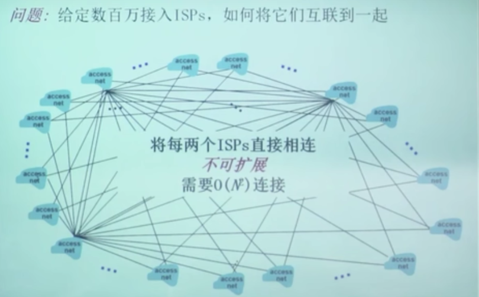
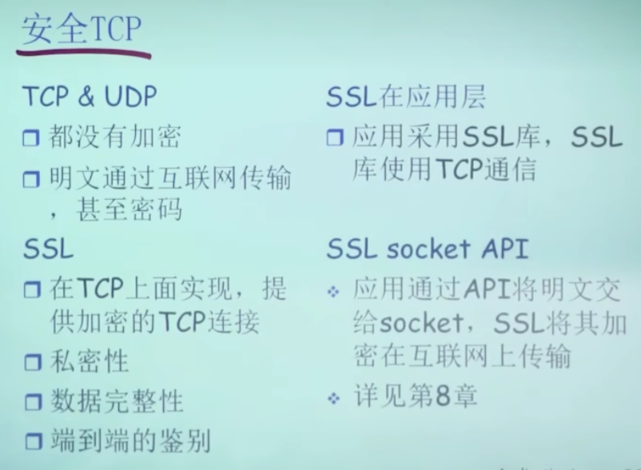
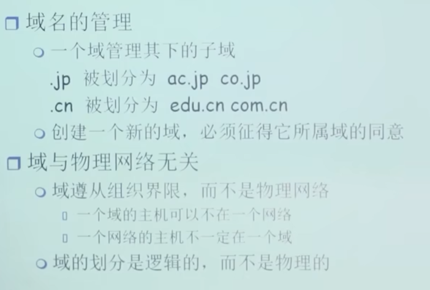
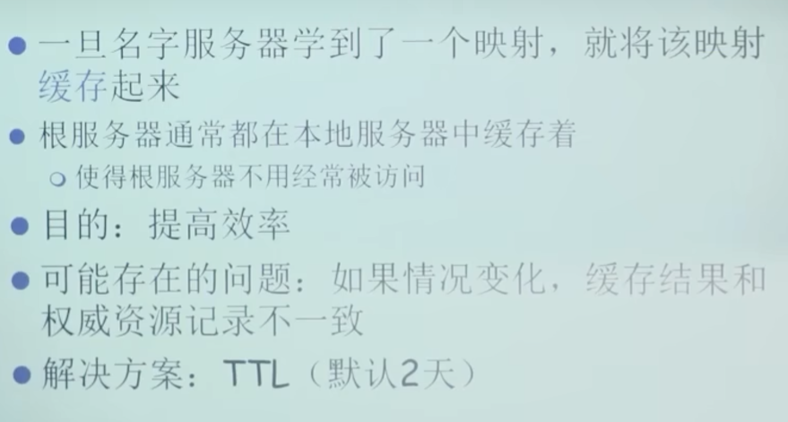
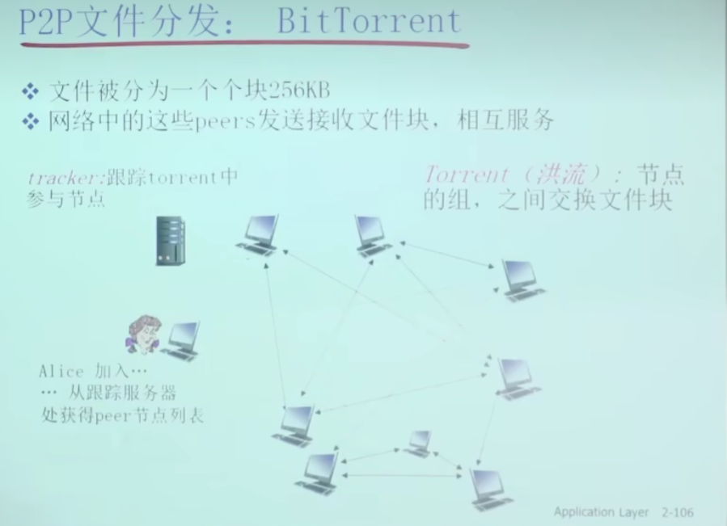
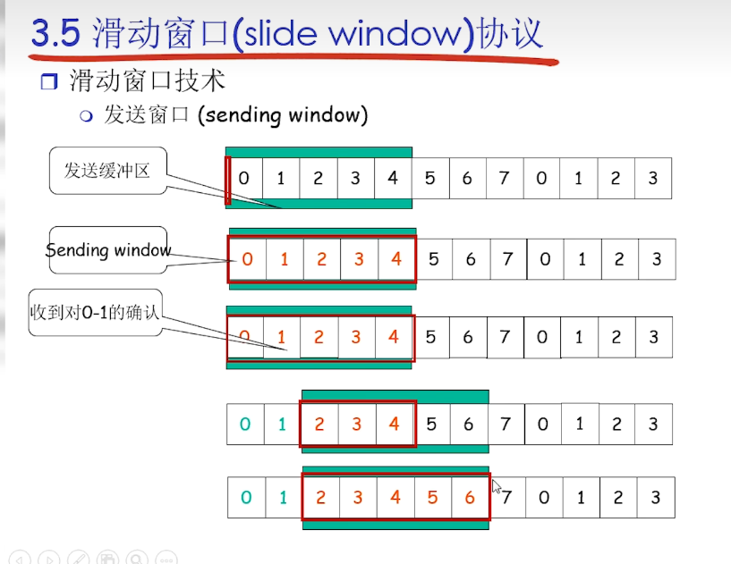

# [计算机网络（自顶向下）](https://blog.csdn.net/qq_53111905/category_11228995.html)

+ # 全球网络技术大会

+ 2018-2020打开IPv6

应用层

传输层

网络层

链路层

物理层

# 第1章：概述

## 1.1 什么是Internet

+ 网络

  + 点与边构成（与大小形状无关）
  + 人际关系网络、蜘蛛网、神经元网络……

+ 计算机网络

  + 有联网的计算机构成的系统

  + 包含节点

    + ▢主机节点：数据的源，也是数据的目标、工作在==链路层==

    + ○数据交换机点（路由器、交换机）：数据的中转节点、工作在==网络层==
    + 高层负载均衡设配……………
    + 不只是硬件设备,还有设备上的操作系统、应用程序……

  + 边（通信链路）

    + 接入网络链路：主机连到互联网的链路
    + 主干链路：路由器间的链路

  + 互联网(大写的Internet)
    + 以TCP/IP协议为一簇的网络(普及广泛的网络)
  + 其他网络(intrenet内联网)
    + 比如银行内网,企业内网

+ ==从具体角度==
+ ==协议==（对等层的协议、比如：TCP是传输层的一个协议）控制发送和接收信息
    + 协议定义了在两个或多个通信实体之间的==报文格式==和==次序==，以及在报文传输和/或接收/或其他事件方面所采取的==动作==
  + 
    + 如TCP、IP、HTTP、FTP、PPP
    
  + Internet：（网络的网络）
  
    + 松散的层次结构，互连的ISP
  + 公共Internet vs intranet
  
  + Internet标准
  
    + RFC：Request for comments
  + IETF：Internet Engineering Task Force

+ ==从服务角度==————***我的理解***：应用层上不同地方的进程通过应用层之下的为其提供通信服务
  + 使用通信设施进行通信的**分布式应用**
    + Web、VoIP、email、分布式游戏、电子商务、社交网络
    + **即应用层上的进程**
  + **通信基础设施**（*应用层之下*）为apps提供编程接口（API）（通信服务）
    + 将发送和接收数据的apps与互联网连接起来
    + （传输层）为app应用（应用层）提供服务选择，类似于邮政服务：
      + 无连接不可靠服务（UDP）————————————————————————————————
      + 面向连接的可靠服务（TCP）——————***即两个应用进程在通信之前要不要打招呼***————————

+ **网络结构**
+ 
  + ==*网络边缘*==
    + 主机
    + 应用程序（客户端和服务器）
  + ==*网络核心*==
    + 互联着的路由器
    + 网络的网络
  + ==*接入网、物理媒体*==
    + 有线或无线通信链路

## 1.2 网络边缘

+ **端系统**（主机）
  + 运行应用程序
  + 如Web、email
  + 在“网络的边缘”
+ **客户**/**服务器模式**（client/server）
  + 客户端向服务器请求、接收服务
  + 如Web浏览器/服务器：email客户端/服务器
+ **对等**（**peer**-**peer**）**模式**——————我的理解（即是客户端也是服务器）
  + 很少（甚至没有）专门的服务器
  + 如Gnutella、KaZaA、Emule

### 采用网络设施的面向连接服务

+ 即端系统知道，但是中间的链路不知道

+ **目标**：在端系统之间传输数据
  + 全双工的：即连接双方的进程可以在此连接上同时进行报文收发
  + **握手**：在数据传输之前做好准备
    + 人类协议中：你好、你好
    + 两个通信主机之间为==连接建立状态==
  + **TCP**-传输控制协议（Transmission Control Protocol）
    + Internet上面向连接的服务
  

+ **TCP**服务（RFC 793）
  + **可靠地**（**reliable**）、**按顺序地传送数据**
    + 确认和重传
  + **流量控制**
    + 协调发送方的发送速度和接收方的接收速度
    + 发送方不会淹没接收方
  + **拥塞控制**
    + 当网络拥塞时，发送方降低发送速率
    + 当发送方和接收方之间的网络出现拥塞时，TCP的拥塞控制机制会抑制发送进程（客户端或服务器）
  + **不能提供服务**
    + 时间保证、最小吞吐(保证和安全)
+ **TCP应用**
  + HTTP（Web），FTP（文件传送）、Telnet（远程登陆）、SMTP（email）

### 采用基础设施的无连接服务

+ 即不需要握手

+ **目标**：在端系统之间传输数据
  + UDP-用户数据报协议（User Datagram Potocol）
    + 无连接服务

+ **UDP**（RFC 768）：
  + **无连接**
  + **不可靠数据传输**
  + **无流量控制**
  + **无拥塞控制**
+ **UDP应用**
  + 流媒体、远程会议、DNS、Internet电话

## 1.3 网络核心

+ 路由器的网状网络

### **基本问题：数据怎样通过网络进行传输？**

### 1. **电路（线路）交换**

+ 为每个呼叫预留一条专有电路（==需要线路建立的时间==）：如电话线

+ ==怎么分片==

+ **电路交换网络中的复用**
  + 频分复用
  + 时分复用

+ **电路交换不适合计算机之间的通信**
+ 连接建立时间长
  
+ 计算机之间的通信有突发性，如果使用线路交换，则浪费的片较多
    + 即使这个呼叫没有数据传递，其所占据的片也不能够被别的呼叫使用
  
+ 可靠性不高？

### 2. **分组交换**（hop to hop）：

+ 将要传送的数据分成一个一个单位：分组
+ 将分组从一个路由器传到相邻路由器（hop）（*相邻路由之间要前面的先把packet完全存储在转发给下一个——**实现共享***），一段段最终从源端传到目标端
+ 每段：采用链路的最大传输能力（带宽）

+ **交换机**
  + 主要有两类：**路由器**，**链路层交换机**

+ **以分组为单位存储**-**转发方式**
  + 网络带宽资源不在分为一个个片（与电路交换相比），传输时使用全部带宽
  + 主机之间传输的数据被分为一个个分组
+ **资源共享**，==**按需使用**==
  + 存储-转发：分组每次移动一跳（hop）
    + 再转发之前，节点必须收到整个分组
    + 延迟比线路交换要大
    + 排队和延迟（==*换取了共享性*==）
      + 如果到达速率（输入路由器）>链路的传输速率（路由器输出）
        + 分组会**排队**，等待传输
        + 如果路由器的缓存用完了，分组会被抛弃——>==1.6 分组延时、丢失和吞吐量==
+ **统计多路复用**（一种分片的方式~与电路分组的分别类似~）
  + 类似于分时间片，但与电路分组的不同的是，不会固定线路是某个主机使用，**==按时间段==**随机分配给不同主机使用
+ **分组交换按有没有网络层的连接分为**
  + **数据报网络**——*无连接*（两个主机在通讯之前不需要握手）
    + 分组的目标地址决定下一跳（携带了目标主机的完整地址）
    + 在不同的阶段，（*IP虽然没变*）路由表可以改变——导致路线不同
    + 类似：网络
    + Internet
  + **虚电路网络**——先建立起虚电路（vc，利用信令）（两个主机要握手，保持通讯的状态）
    + 每个分组都带标签（虚电路号，而非目标主机地址）

### **网络核心关键功能**

+ 路由：决定分组采用的源到目标的路径
  + 路由算法
+ 转发：将分组从路由的输入链路转移到输出链路

## 1.4 接入网和物理媒体

### **怎样将端系统和边缘路由器连接**

+ 住宅接入网络
+ 单位接入网络（学校、公司）
+ 无线接入网络
+ **注意**
  + 接入网络的带宽（bits per second）
  + 共享/专用？

#### **住宅接入**：**modem**

+ 将上网数据调制加载音频信号上， 在电话线上传输，在局端将其中的 数据解调出来；反之亦然
   调频  调幅  调相位  综合调制
+ 拨号调制解调器
  - 56Kbps 的速率直接接入路由器 (通常更低)
  - 不能同时上网和打电话：不能 总是在线
+ **接入网: digital subscriber line (DSL)**

+ 采用现存的到交换局DSLAM的**电话线**
  + DSL线路上的数据被传到互联网 （>4kHz，上行、下行再分频率）
    
    > 分频传输不同数据——频分**复用**技术
    
    + DSL线路上的语音被传到电话网 （< 4kHz）
    + < 2.5 Mbps上行传输速率(typically < 1 Mbps)
    + < 24 Mbps下行传输速率(typically < 10 Mbps)
    + 接入是不对称的
  
+ **接入网: 线缆网络**

  + **有线电视信号线缆双向改造**

    + FDM: 在不同频段传输不同信道的数据， 数字电视和上网数据（上下行）

    + HFC: hybrid fiber coax
      + 非对称: 最高30Mbps的**下行**传输速率, 2 Mbps **上行**传输 速率
    + 线缆和光纤网络将个家庭用户接入到 ISP 路由器（***Internet Service Provider***）
    + 各用户共享到线缆头端的接入网络
      + 与DSL不同, DSL每个用户各有一个专用线路到CO（central office）
    + 接入是不对称的
  
+ **住宅接入：电缆模式**
  
  + 光纤到户：Fiber To The Home，FTTH
  + fiber optic transport——光纤传输
  
+ **接入网：家庭网络**
  + 无线路由器

#### 企业接入网络

+ 局域网LAN

  > Local Area Network

+ Ethernet(以太网）是一种传输速率为10Mbps的常用局域网（LAN）标准。

#### 无线接入网络

+ 无线LAN
+ 广域无线接入

### 物理媒体（第0层）

+ **Bit**：
  + 在传输-接收对时间传播
+ **物理链路**
  + 在每个传输-接收对，跨越一种物理媒体

#### **导引型媒体**

+ 信号沿着固体媒介被引导；同轴电缆、光纤、双绞线
  + 双绞线
    + 两根绝缘铜线
      + 5类：100Mbps Ethernet Gbps 以太网
      + 6类：10Gbps

#### 非导引型媒体

+ 信号自由传播：如无线电

#### 物理媒体：双绞铜线

+ 已经作为高速LAN联网的主导性解决方案

#### 物理媒体：同轴电缆、光纤

#### 物理媒介：无线电路

无线电信道

+ 局域无线电信道
  + 个人设备如无线头戴式耳机，键盘和医疗设备，无线LAN
+ 广域无线电信道
  + 蜂窝接入技术（电话、3G...）

## 1.5 Internet结构和ISP

#### 互联网结构：网络的网络

#### ISP(Internet Service Provider)

+ **每两个ISP连接——不可扩展**

+ **global ISP**

+ **==竞争==：多个global ISP &==合作：== peering link**

+ **regional net**——局部业务 && **流量中心 IXP**

#### ICP(Internet Content Providers)e.g. Google

#### ISP,ICP总览

#### 归纳：Internet的结构：network of networks

##### 中心：第一层ISP

##### 第二层ISP

##### 第三层local ISP

##### ISP（include ICP）之间的联络

+ IXP (Internet Exchange Point, IXP) 因特网交换点
+ 内容提供商在第一层，e.g. Google
  + 减少了像顶层ISP支付费用

## 1.6 分组延时、丢失和吞吐量

#### 与网络核心中==分组交换==相联系

+ **分组丢失和延时是怎么发生的**

### 四种分组延时(each hop)

#### 1. 节点处理延时

+ 检查bit级差错
+ 检查分组首部和决定将部分组导向何处

#### 2. 排队延时（等待）

+ 在输出链路上等待传输的时间
+ 依赖于路由器的拥塞程度

#### 3. 传输延时（传出）

+ R=链路宽度（bps）
+ L=分组长度（bits）
+ 将分组发送到链路上的时间=L/R
+ 存储转发延时

#### 4. 传播延时（传中）

+ d=物理链路的长度
+ s=在媒体上的传播速度（~2*10^8^m/sec）
+ 传播延时=d/s

### 分组丢失

### 吞吐量

+ **有效的数据量（被接收）**

#### 平均吞吐量取决于——瓶颈链路

+ 具有吞吐量要求的应用程序被称为**带宽敏感的应用**

## 1.7 协议层次和服务模型

### 层次化方式实现复杂网络功能

+ 将网络复杂的功能分层功能明确的层次，每一层实现其中一个或一组功能，功能中有其上层可以使用的功能：==服务==
+ 本层协议实体相互交互执行本层的==协议动作==，==目的==是实现本层功能。通过接口为上层提供更好的服务
+ 在实现本层协议的时候，直接==利用了下层所提供的服务==
+ 本层的服务：借助下层服务实现的本层协议实体之间交互带来的新功能（上层可以利用）+跟下层所提供的服务

+ 改变服务的实现而不影响该系统其他组件是分层的另一个重要优点

### 服务、SAP(Services Access point)

#### 面向连接的服务TCP

#### 无连接服务UDP

### 服务和协议

### 数据单元

### Internet协议栈

#### 物理层

> 物理层的任务是将给帧中的一个一个bit从一个节点移动到下一个节点。
>
> 与实际媒体相关（例如：双绞铜线、单模光纤）

+ 在线路上传送bit
+ 数据单元：**位（bit）**
+ 例如，以太网有许多物理层协议：一个是关于双绞铜线的，另一个是关于同轴电缆的，还有一个是关于光纤的。
  + 在每种场合中，跨越这些链路移动一个比特是以不同方式进行的

#### 链路层

> 在每一个节点，网络层将数据报下传给链路层，链路层沿着路径将数据报传递给下一个节点。在改下一个节点，链路层将数据报上传给网络层

+ 在物理层服务之上在相邻==两点之间==(主机或路由器之间)传输以帧为单位的数据
+ **点到点通信**，**可靠或不可靠**
+ 点对点协议**PPP**，**802.11(wifi)**，**Ethernet**
+ 链路层的例子包括以太网，WiFi和电缆接入网的DOCSIS协议
+ 数据单元：**帧（frame）**

#### 网络层~IP层~

> 因特网的网络层负责将称为数据报(datagram)的网络层分组从一台主机移动到另一台主机。在一台源主机中的因特网运输层协议(TCP或UDP)向网络层递交运输层报文段和目的地址。

+ 为数据报**从源到目的**==选择路由==

  + 在链路层点到点的基础上提供端到端的数据传输 
  + **主机与主机之间的通信**，**端到端的通信**，**不可靠**

  + **IP，路由选择协议(多种)**……

+ 数据单元：**分组（packet）（如果是无连接方式（IP网络）：数据报datagram）**

#### 运输层

> 因特网的 运输层 在应用程序端点之间传送 应用层报文。

+ 主机之间的数据传输
  + 在网络层提供的端到端通信基础上，**细分为进程到进程**，将不可靠的通信变成可靠的通信
  + **TCP，UDP**
+ 数据单元：**报文段（segment）：TCP段，UDP段**

#### 应用层

+ 应用层协议
  + 为人类用户或者其他应用进程提供网络应用服务
  + **HTTP**
    + 提供了Web文档的请求和传送
  + **SMTP**
    + 提供了电子邮件报文的传输
  + **FTP**
    + 提供了两个端系统之间的文件传送
  + **DNS**
    + 域名系统（解析域名）
+ 数据单元：**报文（Message）**
  + 应用层协议分布在多个端系统上，而一个端系统中的应用程序使用协议与另一个端系统中的应用程序交换信息分组。我们把这种未与应用层的信息分组称为报文(message)。

### OSI模型~七层~

### 具体过程

#### 封装

+ 在发送主机端·，一个**应用层报文**被传输个运输层。在最简单的情况下，运输层收取到报文并附上附加信息（所谓运输层首部信息，H~t~）给首部被接收端的运输层使用。应用层报文和运输层首部信息一道构成了运输层**报文段**，运输层报文段因此封装了应用层报文。
+ 附加信息包括允许接收端运输层向上适当的应用程序交付报文信息；差错检测位信息，该信息让接收方能过判断报文中的bit是否在途中已被改变。
+ 运输层则向网络层传递该报文段，网络层增加了如源到目的端系统地址等网络层首部信息（H~n~），生成了**网络层数据报**。
+ 该数据报接下来被传递给链路层，链路层（自然而然地）增加它自己的链路层首部信息并生成**链路层帧**。
+ 在每一层，一个分组具有两种类型的字段：首部字段和**有效载荷字段**。有效载荷通常是来自上一层的分组

+ 一个大报文可能被划分为多个运输层的报文段（这些报文段每个可能被划分为多个网络层数据报）。在接收端，则必须从其连续的数据报中重构这样一个报文段

# 第2章：应用层

## 2.0 应用层概述

+ 网络核心设备不在应用层起作用，而仅在较低层起作用，特别是网络层及下面层次起作用。这种基本设计，即将应用软件限制在端系统的方法，促进了大量的网络应用程序的迅速研发和部署

## 2.1 应用层原理

### 网络应用例子

### 创建一个新的网络应用

### 网络应用的体系结构

#### 客户端-服务器模式（C/S:client/server）

***随着访问用户增多，达到一定值服务器性能呈现断崖式缩减***

+ 为此，配备大量主机的数据中心（data center）常被用于创建强大的虚拟服务器

#### 对等模式（P2P:Peer To Peer）

#### 混合体：客户-服务器和对等模式体系结构

#### 进程通信

#### 分布式进程通信需要解决的问题（假设传输层的服务已经被调用）

##### 问题1：对进程进行编址

+ IP+port number（端口号）

##### 问题2.1：传输层提供的服务-需要穿过层间的信息

##### 问题2.2：传输层提供的服务-层间信息的代表

> 套接字是应用程序进程和运输层之间的接口
>
> 在发送端的应用程序将报文推进该套接字。在套接字的另一侧，运输层协议负责从接受进程的套接字得到该报文

###### TCP socket

> 安全套接字层（Secure Sockets Layer，SSL）
>
> ​	用SSL加强后的TCP不仅能够做传统TCP所做的一切，而且还提供了关键的进程到进程的安全性服务，包括加密、数据完整性和端点鉴别

+ ***TCP之上的套接字（socket）——两两之间的会话标识***

+ ***4元组，包含自己和对方的IP，端口***
  + ***传输的时候只用传==socket和数据==***

###### UDP socket

***2元组，只包含自己的IP，端口***

+ ***所以打包数据的时候，要传==socket和对方IP，端口和数据==***

###### 套接字（socket）

##### 问题3：如何使用传输层提供的服务实现应用

###### 应用层协议（应用实体）

###### 应用层需要像传输层提供的服务

###### Internet应用及其应用层协议和传输层协议

###### 安全TCP

## 2.2 Web and Http

> 1、Web服务器用于存储网站的所有信息和数据；而Web浏览器是用来访问和定位这些信息和数据。
>
> 2、Web浏览器发送HTTP请求，获取HTTP响应，并向客户端显示Web文档，它充当客户端和显示Web内容的服务器之间的接口。 而Web服务器获取HTTP请求，生成响应，并接受客户端数据

### 一些术语

### HTTP概况

> 超文本传输协议

> HTTP是无状态协议——HTTP服务器不保存关于客户的任何信息
>
> Web服务器总是一直打开的，具有一个固定的IP地址，且它服务于来自数以万计的不同浏览器的请求

### HTTP连接

> 持续连接和非持续连接
>
> 当浏览器收到Web页面后，向用户展示该页面。两个不同的浏览器也许会用不同的方式解释（即向用户显示）该页面。HTTP与客户如何解释一个Web页面毫无关系。HTTP范式（[RFC 1945] [RFC 2616]）仅定义了在HTTP客户程序与HTTP服务器程序之间的通信协议

#### 非持久HTTP

##### 响应时间模型

> 这涉及依次“==三次握手==”过程
>
> ​	即客户向服务器发送一个小TCP报文段，服务器用一个小TCP报文段做出确认和响应，最后，客户向服务器返回确认。
>
> ​	三次握手中前两个部分所耗费的时间占用了一个RTT(Round-time trip)。完成了三次握手的前两个部分后，客户结合三次握手的第三部分（确认）向该TCP连接发送一个HTTP请求报文。一旦该请求报文到达服务器。服务器就在该TCP连接上发送HTML文件。该HTTP请求/响应用去了另一个RRT。

#### 持久HTTP

+ ### URL

  + **URL** 代表着是统一资源定位符（Uniform Resource Locator）。URL 无非就是一个给定的独特资源在 Web 上的地址。理论上说，每个有效的 URL 都指向一个唯一的资源。这个资源可以是一个 HTML 页面，一个 CSS 文档，一幅图像，等等。而在实际中，也有一些例外，最常见的情况就是一个 URL 指向了不存在的或是被移动过的资源。由于通过 URL 呈现的资源和 URL 本身由 Web 服务器处理，因此 web 服务器的拥有者需要认真地维护资源以及与它关联的 URL。

+ [URL](https://developer.mozilla.org/zh-CN/docs/Glossary/URL), 跟踪 Web 文档的地址系统

+ [HTTP](https://developer.mozilla.org/zh-CN/docs/Glossary/HTTP), 一个传输协议，以便在给定 URL 时查找文档

+ [HTML](https://developer.mozilla.org/zh-CN/docs/Glossary/HTML), 允许嵌入超链接的文档格式

### HTTP请求报文

+ GET 向客户端请求——head和body都要
+ ***PST 向客户端上载***
+ HEAD 只拿头部信息（HTML）——一般搜索引擎用
+ HOST —— 主机名
+ User-agent 用户代理程序及版本
  + 即向服务器发送请求的浏览器类型

+ Connection——是否建立连接（持久与非持久）

#### HTTP请求报文：通用格式

+ cr if —— 回车符

### 方法类型

### HTTP响应报文

+ HTTP：Content-Length——用于进程之间的划界限
  
  > Content-Length: 首部行指示了发送对象中的字节数
  
  + 因为TCP不会维护进程间的界限，例如传了两个15k，对方TCP收到时是30k交给上层
  + 所以要让HTTP自己维护

### HTTP响应状态码

### 用户-服务器状态

>  用户与服务器的交互

#### cookie维护文件

> cookie可以在无状态的HTTP上建立一个用户会话层

### Web缓存（代理服务器）

> [代理服务器与反向代理服务器][https://www.cloudflare.com/zh-cn/learning/cdn/glossary/reverse-proxy/]

> Web cache（proxy server）

+ #### ICP

> Internet Content Provider

#### 缓存例子

#### 如何更新缓冲信息

#### 好处

+ 大大减少对客户请求的响应时间
  + 特别是当客户与服务器之间的瓶颈带宽远低于客户与Web缓存器之间的瓶颈带宽时更是如此
+ Web缓存器能够大大减少一个机构的接入链路到因特网的通信量。
  + 通过减少通信量，就不必增加带宽，因此降低了费用。
+ 此外，Web缓存器能从整体上大大减低因特网上的Web流量，从而改善了所有应用的性能
+ 通过使用**内容分发网络**(Content Distribution Network, CDN)，Web缓存器正在因特网中发挥越来越重要的作用

### Web浏览器是什么？

> 即基于HTTP协议的客户

Web浏览器可以被认为是客户端用来从服务器访问Web服务和文档的的一种应用程序软件，**充当服务器和客户端之间的接口**，其基本工作就是**显示Web文档**，允许我们在Internet上查看和浏览文档。

Web浏览器有很多种，例：internet explorer，谷歌Chrome、火狐Firefox等等

### Web服务器是什么？

Web服务器是在计算机上运行的一个软件，用于存储和托管web内容的计算机。其主要工作是在用户需要时向用户分发网页，并提供存储和组织网站页面的区域。

### Web浏览器和Web服务器的区别

1、Web服务器用于**存储**网站的所有信息和数据；而Web浏览器是用来**访问和定位**这些信息和数据。

2、Web浏览器发送HTTP请求，获取HTTP响应，并向客户端显示Web文档，它充当客户端和显示Web内容的服务器之间的接口。而Web服务器获取HTTP请求，生成响应，并接受客户端数据。

3、Web浏览器用于通过网站在Internet上搜索内容。而，Web服务器用于建立网站和Web浏览器之间的链接。

4、Web服务器的主要组件是服务器核心，服务器核心64位二进制文??件，示例应用程序，管理命令行界面等；而，Web浏览器的组件是用户界面，UI后端，布局和渲染引擎，以及网络和数据持久性零件。

## 2.3 FTP（文件传输协议）(C/S)

+ **有状态协议**

### 控制连接与数据连接分开

+ ***控制连接和数据连接在不同的TCP端口进行***

### FTP命令、响应

## 2.4 Email（应用）(C/S)

+ **从邮件服务器到用户代理器之间，用户代理器（e.g.outlook）还要通过 协议 将邮件从邮箱拉过来呈现给用户**
  + ==看邮件访问协议==

### Email：SMTP

> 异步通信媒介
>
> 简单邮件传输协议 Simple Mail Transfer Protocol

+ **持久连接**

#### SMTP总结

+ SMTP限制所有邮件的体部分（不只是其首部）只能采用简单的7比特ASCII表示

  > 即在用SMTP传送邮件前需要将二进制多媒体数据编码为ASCII码，并且在使用SMTP传输后要求将相应的ASCII码邮件解码还原为多媒体数据。（HTTP传送前不需要将多媒体数据编码为ASCII码）

+ SMTP一般不使用中间邮件服务器发送邮件，即使这两个邮件服务器位于地球的两端也是这样

+ 一旦TCP建立连接，服务器和客户执行某些==应用层的握手==

  > 就像人们在相互交流前进行自我介绍一样

#### SMTP与HTTP的对比

+ HTTP从Web服务器向Web客户（通常是一个浏览器）传送文件（也称为对象）；SMTP从一个邮件服务器向另一个邮件服务器传送文件（即电子邮件报文）
+ 当进行文件传送时，持续的HTTP和SMTP都使用持续连接。
+ 重要的区别
  + HTTP主要是一个**拉协议**(pull protocol)，即在方便的时候，某些人在Web服务器上装载信息，用户使用HTTP从该服务器拉取这些信息。特别是TCP连接时是***想接收文件的机器***发起的。
  + SMTP基本上是一个**推协议**(push protocol)，即发送邮件服务器把文件推向接收邮件服务器。特别是，这个TCP连接是由要***发送该文件的机器***发送的。
+ 第二个区别
  + 即在用SMTP传送邮件前需要将二进制多媒体数据编码为ASCII码，并且在使用SMTP传输后要求将相应的ASCII码邮件解码还原为多媒体数据。（HTTP传送前不需要将多媒体数据编码为ASCII码）
+ 第三个区别
  + 如何处理既包含文本又包含图形（也有可能是其他媒体类型）的文档。
    + HTTP把每个对象封装到它自己的HTTP响应报文中
    + SMTP则把所有报文对象放在一个报文之中

### 邮件报文格式

> 这些首部行是邮件报文本身的一部分（不同于SMTP的命令）

### 报文格式：多媒体扩展

+ 通过（base64）将不在ASCLL范围内的字符（e.g. 中文，图片...）映射到ASCLL码进行传输
  + 因为只能传ASCLL码

### 邮件访问协议

> SMTP是一个push protocol，而邮件访问需要一个pull protocol

+ **IMAP**

  > Internet Mail Access Protocol

  + 远程目录维护

+ POP3
  + 将邮件从接收方的邮件服务器传送到接收方的用户代理

#### POP3协议

> Post Office Protocol—Version 3

#### POP3协议（续）与IMAP

#### 基于Web的电子邮件

+ 浏览器(用户代理)—HTTP— 发送邮件服务器 —SMTP— 接收邮件服务器 —HTTP— 浏览器(用户代理)

## 2.5 DNS（C/S）

> Domain Name System 域名解析系统
>
> DNS：
>
> 	1. 一个由分层的**DNS服务器**(DNS server)实现的分布式数据库
> 	1. 一个使得主机能够查询分布式数据库的应用层协议
> 	1. 运行在UDP之上

### DNS的历史

+ #### 主机别名

  > p84

  + 规范主机名
  + 主机别名

+ #### 邮件服务器别名

+ #### 负载均衡

  + DNS用于冗余的Web服务器等
  + 繁忙的站点被冗余分布在多台服务器上，每台服务器运行在不同的端系统上，每个都有不同的IP地址
  + 一个IP地址集合于同一个规范主机名相联系。

+ #### 本地DNS服务器

  + 与Web缓存服务器类似，是代理服务器

+ #### DNS缓存

  + 一段时间后丢弃缓存信息（避免缓存IP地址的更改造成失败）
  + 在DNS服务器中缓存查询过的IP地址
  + 因为缓存，除了少数DNS查询以外，根服务器被绕过了

### DNS系统需要解决的问题

#### 问题1： 如何命名设备

##### DNS的名字空间

+ ***域名是逻辑上的，与不是物理网络***

#### 问题2：解析问题-名字服务器（Name Server）

##### 区域名字服务器维护资源记录

##### DNS记录

###### DNS大致工作流程

###### 本地服务器（Local Name Server）

###### 本地服务器没有缓存

+ **递归查询**

+ **迭代查询**

##### DNS协议/报文

##### 提高性能：缓存

#### 问题三：维护问题：新增一个域

### 攻击DNS

## 2.6 P2P

### 纯P2P

### 文件分发：C/S vs. P2P

#### C/S

#### P2P

#### Client-server vs. P2P:例子

#### P2P文件分发

+ #### 后面随机选择peer是为了找黑马

#### P2P共享

##### P2P 非结构化

###### P2P：集中式目录

###### P2P：完全分布式

###### P2P：混合体（小组）

##### DHT P2P 结构化

> 分布式散列表

+ 分布式散列表是一个简单的数据库，其数据库记录分布在一个P2P系统的多个对等方上。

## 2.7 视频流和内容分发网

### HTTP流和DASH

> DASH Dynamic Adaptive Streaming over HTTP 经HTPP的动态适应流

+ DASH允许用户使用的以太网接入速率流式播放具有不同编码的视频
  + DASH允许用户适应可用宽带，用户可以自行选择来自不同版本的块
  + HTTP服务器中有各个视频的版本，每个版本有对应的URL。
  + HTTP服务器也有一个**告示文件**

### CDN

> 内容分发网 Content Distribution Network

+ CDN的管理分布在多个地理位置的服务器上，在它的服务器上存储视频（和其他类型的Web内容，包括文档、图片和音频）
+ CDN可以时**专用CDN**，及它由内容提供商自己所拥有
  + 例如Google的CDN分发YouTube视频和其他类型的内容。
+ 另一种CDN可以时**第三方CDN**，它代表多个内容提供商分发内容

### CDN服务器安置原则

+ **深入**
  + 目标是靠近端用户，通过减少端用户和CDN集群之间（内容从这里收到）链路和路由器数量，从而改善用户感受的时延和吞吐量

+ **邀请做客**
  + 原则时通过少量关键位置建造大集群来邀请到ISP做客
    + 不是将集群放在接入ISP中，这些CDN通常将它们的集群放置在因特网的交换节点（IXP）
    + 通常产生较低的维护和管理开销，可能以对端用户的较高时延和较低吞吐量作为代价

### CDN操作

1. 确定此时适合用于该用户的CDN服务器集群
2. 将该用户的请求重定向到该集群的某台服务器

### 集群选择策略

> 任何CDN部署，其核心是集群选择策略

+ 指派客户到**地理上最为邻近**的集群（通过DNS服务器）
  + 每个LDNS IP 地址都映射到一个地理位置
  + 但对于某些用户而言，该执行方案可能执行效率差
    + 因为就网络路径的长度和跳数而言，地理最邻近的集群可能并不是最近的集群。
    + 此外，一种基于DNS的方法都内在具有的问题是，某些端用户使用位于远地的LDNS
    + 这种简单的策略忽略了时延和可用带宽随因特网路径时间而变化，总是指定特定的客户指派相同的集群
+ 为了基于当前流量条件作为客户决定最好的集群，CDN能够对其集群和客户之间的时延和丢包能执行周期性的**实时测量**

### 学习案例： Netflix、YouTube和 “看看”

+ **Netflix**
  + 其视频分发具有以下两个主要部件：亚马逊云和它自己的专用CDN基础设施
  + 其CDN只用来分发视频，Web网站完全运行在亚马逊云
  + 有自适应流和CDN分发
  + 不需要CDN重定向来将特殊用户连接到一台CDN服务器，相反Netflix软件（运行在亚马逊云中）直接告诉该客户使用一台特定的CDN服务器
  + 推高速缓存
    + 内容在非高峰时段的预定时间被推到服务器，而不是在高速缓存未命中时动态推入

+ YouTube
  + 拉高速缓存和CDN重定向
  + 为了平衡流经集群的负载，有时客户被定向（经CDN）到更远的集群
  + YouTube没有自适应流（例如DASH），要求用户人工选择一个版本

+ 看看
  + CDN-P2P流模式
  + 当P2P总流量满足视频播放时吗，该用户将从CDN停止流到对等放获得流
  + 如果P2P总流量不充分时，该客户重新启动CDN连接并且返回到混合CDN-P2P流模式
    + 确保短启动时延，与此同时最小地依赖成本高的基础设施服务器和带宽

## 2.8 套接字编程：生成网络应用

+ 经典的网络应用是由一对程序（即客户程序和服务器程序）组成的
  + 当运行两个程序时，创建了一个客户进程和一个服务器进程
  + 同时它们通过从套接字读出和写入数据在彼此之间进行通信

# 第3章：运输层

## 3.1 概述和运输层服务

+ 网络路由器仅作用于该数据报的网络层字段，即它们不检查封装在给数据报的运输层报文段的字段
+ 网络层提供主机之间的逻辑通信，运输层运行在不同主机上的进程之间的逻辑通信
+ 运输协议能够提供的服务常常受制于底层网络层协议的服务模型

## 3.2 多路复用和多路分解

> 运输层的多路复用和多路分解，也就是将由网络层提供的主机到主机交付服务延伸到为运行在主机上的应用程序提供程序到程序的交付服务

+ **多路分解**：将运输层报文段中的数据交付到正确的套接字的工作
+ **多路复用**：在源主机从不同套接字中收集数据块，并为每个数据块封装上首部信息（这将在以后用于分解）从而生成报文段，然后将报文段传递到网络层。
+ 运输层 多路复用的要求：
  + 套接字有唯一的标识符
  + 每个报文段有特殊字段来指示该报文段所要交付到的套接字
    + 特殊字段包括：**端源口号字段**和**目的端口号字段**
    + 0~1023范围的端口号称为**周知端口号**

+ UDP套接字：二元组（目的IP地址，目的端口号）
+ TCP套接字：四元组（源IP地址，源端口号，目的IP地址，目的端口号）

## 3.3 无连接运输：UDP

+ 运输层最低限度必须提供一种复用/分解服务
+ 自适应拥塞控制：因为假设UDP传输高比特率使得TCP拥塞控制从而大大减小了TCP传输的速率
+ 在UDP上增加可靠通信（应用程序自身建立可靠机制），这样应用程序可以进行可靠通信而无须受制于由TCP拥塞控制强加的传输速率限制
+ UDP报文段结构
  + 

+ UDP检验和
  + 发送方的UDP对报文段中的所有16比特字的和进行反码运算
  + 虽然UDP提供差错检测，但它对差错恢复无能为力。UDP的某种实现只是丢弃受损的报文段；其他实现是将受损的报文段交给应用程序并给出警告

## 3.4 可靠数据传输原理

### rtd1.0

+ 经完全可靠信道的可靠数据传输

### rtd2.0

> 经具有比特差错信道的可靠数据传输

+ 肯定确认与否定确认
+ 自动重传机制
+ 停等协议

### rtd2.1

+ 增加了序号，给分组编号

### rtd2.2

+ 只用ACK来确认（例如ACK0==NAK1）

### rtd3.0

+ 经具有比特差错的丢包信道的可靠数据传输

### 流水线可靠数据传输协议

+ 解决流水线的差错恢复有两种基本方法：
  + **回退N步**（RW=1）
    + GBN协议（Go back N）
  + **选择重传**（RW>1）
    + SR协议 （Selected Repeat）

#### 滑动窗口协议

+ 发送窗口

+ 接受窗口

## 3.5 面向连接的运输：TCP

### TCP连接

+ 三次握手：
  + 客户首先发送一个特殊的TCP报文段，服务器用一个特殊的TCP报文段作为响应，最后客户再用第三个特殊的报文段作为响应。前两个报文段不承载“有效载荷”，就是不包含应用层数据；而第三个报文段可以承载有效载荷
+ TCP可以从缓存中取出并放入报文段的数据数量受限于**最大报文段长度**（Maximun Segment Size，MSS）
+ MSS通常根据最初确定的由本地发送主机发送的最大链路层帧长度（即所谓的**最大传输单元**（Maximun Transmission Unit MTU））
+ MSS是指在报文段里应用层数据的最大长度，而不是指包括首部的TCP报文段的最大长度
+ TCP的连接组成包括：
  + 一台主机上的缓存、变量和与进程连接的套接字
  + 以及另一台主机的另一组缓存、变量和与进程连接的套接字。

> 在两台主机之间的网络元素（路由器、交换机和中继器）中，没有为该连接分配任何缓存和变量

### TCP报文段结构 

### 往返时间的估计与超时

+ 估计往返时间
+ 设置和管理重传超时间隔

### 可靠数据传输

+ TCP的可靠数据传输服务确保一个进程从其接收缓存中读出的数据流是**无损坏、无间隙、非冗余和按序的数据流**
+ 超时间隔加倍
  + 每个发送方的重传都是经过越来越长的时间间隔后进行的
+ 快速重传
  + 一旦收到三个冗余的ACK，TCP就执行**快速重传**
+ TCP的差错恢复机制也许最好被分类为GBN协议和SR协议的混合体

### 流量控制

> 如果某应用程序读取数据时相对缓慢，而发送方发送的太多、太快，发送的数据就会很容易地使该连接的接收缓存溢出
>
> 拥塞控制是因为IP网络的拥塞

### TCP连接管理

+ 三次握手
+ SYN洪泛攻击
  + 解决方案，不记录cookie或任何SYN的其他状态信息
  + 对于一个合法的ACK，在确认字段中的值等于在SYNACK字段（此时为cookie值）中的值加1.服务器则将使用在SYNACK报文段中的源和目的地址IP地址与端口号（它们与初始的SYN中的相同）以及秘密运行相同的散列函数。如果该函数的结果加1与在客户的SYNACK中的确认（cookie）值相同的话，服务器认为该ACK对应于较早的SYN报文段，因此它时合法的

### 拥塞控制原理

+ 拥塞出现的原因
  + 当分组的到达速率接近链路容量时，分组经历巨大的排队时延
  + 发送方在遇到大时延时所进行的不必要重传将会引起路由器利用其链路带宽来转发不必要的分组副本
  + 当一个分组沿一条路径被丢弃时，每个上游路由器用于转发给分组到丢弃该分组而使用的传输容量最终被浪费掉了
+ 拥塞控制的方法
  + 端到端拥塞控制
    + 端系统通过对网络行为的观察（如分组和时延）来推断。
    + TCP报文段的丢失（通过超时或3次冗余确认而得知）被认为是网络拥塞的迹象，TCP会相应地减小其窗口长度
  + 网络辅助的拥塞控制
    + 向端系统发送ATM可用比特率，能在输出链路上支持的最大主机发送速率
      + 路由器向发送方发送
      + 接收方向发送方发送

### TCP拥塞控制

> TCP必须使用端到端的拥塞控制而不是网络辅助的拥塞控制，因为IP层不向端系统提供显式的网络拥塞反馈

+ 一个丢失的报文段意味着拥塞，因此当丢失报文段时应当降低TCP发送方的速率
+ 一个确认报文段只是该网络正在向接收方交付发送方的报文段，因此，当对先前未确认报文段的确认到达时，能过增加发送方的速率
+ 带宽检测
  + 增加其速率以响应到达的ACK，除非出现丢包事件，此时才减小发送速率

+ **TCP拥塞控制算法**

  + 强制部分

    + 慢启动
      + cwnd的值以1个MSS开始并且每当传输的报文段首次被确认就增加一个MSS，再次翻番
      + 如果存在一个超时指示的丢包事件（即拥塞），用ssthresh记录cwnd的值，TCP发送方将cwnd设置为1并重新开始慢启动过程。
      + 如果检测到3个冗余的AVK，这时TCP执行一种快速重传，并进入快速恢复状态（cwnd = ssthresh + 3）

    + 拥塞避免
      + 一旦进入拥塞避免状态，cwnd的值大约是上次遇到拥塞时的值的一半，即距离拥塞可能并不遥远，因此TCP无法每过一个RRT再将cwnd翻番，而是每一个RRT增加一个MSS

  + 非必需

    + 快速恢复

> TCP分岔
>
> ​	在客户近邻搭建服务器，用该服务器建立与数据中心的连接，客户只需要与近邻服务器来间接访问数据中心数据，可以改善性能

# 第4章：网络层：数据平面

> 网络层数据平面的功能，即网络层中每台路由器的功能，该数据平面功能决定到达路由器输入链路之一的数据报（即网络层的分组）如何转发到该路由器的输出链路之一
>
> 网络层的控制平面功能，即网络范围的逻辑，该控制平面功能控制数据沿着从源主机到目的主机的端到端路径中路由器之间的路由方式。

## 网络层概述

+ 每台路由器的**数据平面**的主要作用是从其输入链路向其输出链路转发数据报；
+ **控制平面**的主要作用是协调这些本地的每路由器转发动作，使得数据报沿着源和目的地之间的路由器路径最终进行端到端的传送
+ **转发**是指将分组从输入链路接口转移到适当的输出链路接口的路由器本地操作来实现。
  + 转发发生的时间尺度很短（通常为几纳秒），因此通常用硬件来实现
+ **路由选择**是指分组从源到目的地所采取的端到端路径的网络范围处理过程。
  + 路由器的发生的时间尺度长得多（通常为几秒），因此通常用软件来实现。

### 网络层可能提供的服务

+ 确保交付
+ 具有时延上界的确保交付
+ 有序分组交付
+ 确保最小带宽交付
+ 安全性

+ 因特网的网络层提供了单一的服务，称为**尽力而为服务**。
  + 使用尽力而为服务，传送的分组既不能保证以它们的发送顺序被接收，也不能保证它们最终交付；
  + 既不能保证端到端的时延，也不能保证有最小的带宽
  + 因特网的基本尽力而为服务模型与适当带宽供给相结合已经被证明超过”足够好“，能够应用于大量应用

+ 某些分组交换机称为**链路层交换机**，基于链路层帧中的字段值做出转发决定，这些交换机因此被称为链路层（第2层）设备
+ 其他分组交换机被称为**路由器**，基于网络层数据报中的首部字段值做出转发决定。路由器因此是网络层（第3层）设备

## 路由器工作原理

### 路由器体系结构

### 输入端口处理和基于目的地转发

#### 查找技术

+ 最长前缀匹配规则
+ 三态内容可寻址存储器

+ 必须采取的其他动作
  + 必须出现物理层和链路层处理
  + 必须检查分组的版本号、检验和以及寿命字段，并且重写后两个字段
  + 必须更新用于网络管理的计数器（如接收到的IP数据报的数目）

### 交换

+ 经内存交换
  + 分组经过内存进行交换
+ 经总线交换
  + 一次只有一个分组能够跨越总线
+ 经互联网络交换
  + 纵横式交换机式**非阻塞的**
  + 如果来自两个不同输入端口的两个分组其目的地为相同的输出端口，则分组必须在输入端等待
  + 更为复杂的互联网络使用多级交换元素
    + 一个输入端口将一个分组分成K个较小的块，并且通过N个交换结构中的K个发送（”喷射“）这些块到所选择的输出端口，输出端口再将K个块装配成还原成初始的分组

### 输出端口处理

+ 排队的位置将取决于

#### 输入排队

+ 如果位于两个输出队列前端的两个分组是发往同意输出队列的，则其中的一个分组将被阻塞
+ 线路前部阻塞

#### 输出队列

+ N个到达分组必须排队等待输出链路传输
+ 没有足够内存来缓存一个分组时，要么丢弃尾部分组（弃尾），要么删除一个或多个分组

### 分组调度

+ 先进先出FIFO
+ 优先权排队
  + 同一优先级按FIFO
+ 循环和加权公平排队
  + 循环调度不同类的队列
+ 加权公平排队WFQ
  + 循环调度不同类的队列
  + WFQ与循环排队不同之处在于，每个类在任何时间间隔内可能收到不同数量的服务

## 网际协议：IPv4、寻址、IPv6及其他

### IPv4数据报格式

+ 协议
  + 该字段指示了IP数据报的数据部分应交给哪个特定的运输层协议
  + IP数据报中的协议号相当于运输层中端口号的作用
+ 首部检验和
  + 只对IP首部计算了检验和
+ IPv6已经去掉了IP选项

### IPv4数据报分片

+ 一个链路层帧能够承载的最大数据量叫做**最大传送单元**（Maximum Transmission Unit，MTU）
  + MTU严格限制着IP数据报的长度，对于大于MTU的IP数据报要进行分片
  + 数据报的重新组装的工作放在端系统中

+ 为了让目的主机执行这些重新组装的任务，IPv4的设计者将*标识、标志和片偏移*字段放在IP数据报的首部中

### IPv4编址

+ IP地址按照**点分十进制记法**
+ 子网
  + 子网掩码
+ 一个组织通常被分配一块连续的地址，即具有相同前缀的一段地址
  + 在这种情况下，该组织内部的设备的IP地址将共享共同的前缀
  + 当该组织的外部的一台路由器转发一个数据报，且该数据报的目的地址位于该组织内部时，仅需要考虑该地址的前面x比特，这相当大地减小了在这些路由器中转发表的长度

#### 获取一块地址

+ ISP将自己分配的地址分组给组织（子网）使用
+ ICANN组织
  + 分配IP地址，管理DNS根服务器

#### 获取主机地址：动态主机配置协议DHCP

+ 使某给定主机每次与网络连接时能得到一个相同的IP地址
+ 或者某主机将被分配一个**临时的IP地址**，每次与网络连接时该地址也许是不同的
+ 由于DHCP具有将主机连接进一个网络的网络相关方面的自动能力，故它又常被称为**即插即用协议**或**零配置协议**

#### 网络地址转换

+ NAT使能路由器

+ NAT对外界的行为就如同一个具有单一IP地址的单一设备

+ NAT工作原理
  + 家庭网络主机请求某台Web服务器上的一个网页，该主机为其指派了一个端口号，NAT接收到该数据报后为其跟换一个新的端口号，将该主机的IP替换为NAT的IP地址。
  + 当外界报文到达NAT路由器后，路由器使用目的IP地址与目的端口号从NAT转换表中检索出家庭网络浏览器使用的适当IP地址和目的端口号

### IPv6

#### IPv6的数据格式

+ 流标签
  + 能够对一条流中的某些数据报给出优先权，或者它能够用来给来自某些应用（例如IP话音）的数据报给出更高的优先权
+ 跳限制
  + 相当于寿命

#### IPv4到IPv6的迁移

+ 将两台IPv6路由器之间的中间IPv4路由器的集合称为一个**隧道**
+ 引用应用层协议比引用网络层协议快的多

#### 通用转发和SDN

+ 软件定义网络（SDN）
+ 通用”匹配加动作“范式
  + 将分组转发到一个或多个输出端口（就像在基于目的地转发中一样）
  + 跨越多个通向服务的离开接口进行负载均衡分组（就像在负载均衡一样）
  + 重写首部值（就像在NAT一样）
  + 有意识地阻挡/丢弃某个分组（就像在防火墙一样）
  + 为进一步处理和动作而向某一个特定的服务器发送一个分组（就像在DPI一样）

#### 匹配

#### 动作

+ 转发
  + 一个入分组可以转发到一个特定的物理输出窗口，广播到所有端口（分组到达的端口除外），或通过所选的端口集合进行多播。该分组可能被封装并发送到用于该设备的远程控制器。该控制器则可能（或不可能）对该分组采取某些动作，包括安装新的流表项，以及可能将分组返回给该设备以在更新的流表项规则集合下进行转发
+ 丢弃
  + 没有动作的流表项表明某个匹配的分组应当被丢弃
+ 修改字段
  + 在分组被转发到所选的输出端口之前，分组首部10个字段（除了IP协议字段外的所有第二、三、四层的字段）中的值可以重写

# 第5章：网络层：控制平面

## 概述

+ **每路由器控制**
  + 每台路由器中运行一种路由选择算法的情况
+ **逻辑集中式控制**
  + 逻辑集中式控制器计算并分发转发表以供每台路由器使用的情况
  + 这种控制器经一种定义良好的协议与每台路由器中的一个控制代理（CA）进行交互，以配置和管理该路由器的转发表
  + CA一般具有很少功能，其任务是与控制器通信并按控制器命令行事
  + 与路由选择算法不同，这些CA不能相互交互，也不能主动参与计算转发表
    + 这是每路由器控制和逻辑集中式控制之间的关键差异

## 路由选择算法

+ 集中式和分散式
  + **集中式路由选择算法**
    + 以所有节点之间的连通性及所有链路的开销的输入
    + 具有全局状态的算法通常被称作==**链路状态（Link State）算法**==
  + **分散式路由选择算法**
    + 通过迭代计算过程以及与相邻节点的信息交换，一个节点逐渐计算出到达某目的节点或一组目的节点的最低开销路径
    + 例如：==**距离向量（Distance-Vector，DV）算法**==
+ 静态还是动态
  + **静态路由选择算法**
    + 路由随时间的变化非常缓慢，通常是人工进行调整
  + **动态路由选择算法**
    + 随着网络流量负载或拓扑发生变化而改变路由选择路径
    + 更容易受到诸如路由选择循环、路由震荡之类问题的影响
+ 负载敏感或负载迟钝
  + **负载敏感算法**
  + **负载迟钝**
    + 当今的因特网路由选择算法都是==**负载迟钝**==的，因为某条链路开销不明确地反映其当前（或最近）的拥塞水平

### 链路状态路由选择算法

+ Dijkastra算法

### 距离向量路由选择算法

+ Bellman-Ford方程
  + d~x~(y) = min~v~ { c(x , v)+ d~v~(y)}
  + 方程中min~v~是对于x的所有邻居的。
  + 实际上，从x到v遍历完之后，如果我们接下来取从v到y的最低开销路径，则该路径开销将是c(x, v)+d~v~(y)
  + 链路开销改变和链路故障
  + 路由选择环路
    + 增加毒性逆转（善意的谎言）
  + 健壮性
    + DV算法中一个不正确的节点计算值会扩散到整个网络

## 因特网中==自治系统内部==的路由选择：OSPF

+ 管理自治
  + 因特网是ISP的网络，其中每个ISP都有它自己的路由器网络。ISP通常希望按自己的意愿运行路由器，或对外部隐藏其网络的内部组织面貌
+ AS（自治系统）
  + 通常在一个ISP中的路由器以及与它们互联的链路构成一个AS
  + 在一个系统内运行的路由选择算法叫做**自治系统内部路由选择协议**
+ 开放最短路优先OSPF
  + OSPF是一种链路状态协议，它使用洪泛链路状态信息和Dijkstra最低开销路径算法
  + OSPF协议必须自己实现诸如可靠报文传输、链路状态广播等功能
  + OSPF的优点
    + 安全
    + 多条相同开销路径
    + 对单播与多播路由选择的综合支持
    + 支持在单个AS中的层次结构

## ==ISP之间==的路由选择：BGP

+ 自治系统间路由选择协议
  + 因为AS间路由选择协议涉及多个AS之间的写台哦，所以AS通信必须运行相同的AS间路由选择协议，这种协议称为**边界网关协议**

+ BGP为每台路由器提供了完成以下任务的手段
  + 从邻居AS获得前缀的可达性信息
  + 确定到该前缀的“最好的”路由

### 通告BGP路由信息

+ 每台路由器要么是**网关路由器**，要么是一台**内部路由器**
+ 跨越两个AS的BGP连接称为**外部BGP**（eBGP）连接，而在相同AS中的两台路由器之间的BGP会话称为**内部BGP**（iBGP）连接
+ 热土都路由选择
  + 热土豆是自私的算法，尽可能地将分组传给下一个AS
+ 路由选择算法
  + 路由被指派一个**本地偏好**
  + 从余下路由中（所有具有相同的最高本地偏好值），将选择具有最短AS-PATH的路由。
  + 从余下的路由中（所有具有相同的最高本地偏好值和相同的AS-PATH长度）
    + 使用热土豆路由选择
  + 如果仍留下多条路由，该路由器使用BGP标识符来选择路由

### IP任播

+ 许多分散的不同地理位置，替换不同服务器上的相同内容
+ 让每个用户从最靠近的服务器访问内容——>使用BGP

### 拼装在一起：在因特网中实现

+ p264 

## SDN控制平面

+ SDN体系结构具有有4个关键特征
  + 基于流转发
    + SDN控制的交换机的分组转发工作，能够基于运输层、网络层或链路层首部中任意数量的首部字段值进行
  + 数据平面与控制平面分离
    + 
  + 网络控制功能：位于数据平面交换机外部
    + 控制器是逻辑上集中的，通常在几台服务器上实现，这些服务提供协调的、可扩展的性能和高可用性
  + 可编程的网络

### SDN控制平面：SDN控制器和SDN网络控制应用程序

### OpenFlow协议

+ OpenFlow协议运行在SDN控制器和SDN控制的交换机或其他实现OpenFlow API的设备之间

### 数据平面和控制平面交互的例子

## ICMP：因特网控制报文协议

+ 被主机和路由器用来彼此沟通网络层信息
+ 最典型用途是差错报告
+ Traceroute程序也是用ICMP

# 第6章：链路层和局域网

## 链路层概述

+ 将运行链路层协议的任何设备称为**节点**
  + 节点包括：主机、路由器、WiFi接入点和交换机
+ 再通过特定的链路时，传输节点将数据报封装在**链路层帧**中，并将该帧传送到链路中
+ 点对点链路、广播链路

### 链路层提供的服务

+ 成帧
  + 一个帧由数据字段和若干首部字段组成
+ 链路接入
  + **媒体访问控制**（MAC）协议规定了帧在链路上的传输规则
+ 可靠交付
  + 通过确认和重传
  + 对于无线链路使用可靠交付
  + 对于有线的链路（如光纤、同轴电缆和许多双绞线链路）
+ 差错检测和纠错
  + 使用硬件进行检测
  + 不仅能检测帧中出现的比特差错，还能精准定位帧中出错的位置

### 链路层在何处实现

+ 路由器的线路卡中
+ 主机体系结构
  + 链路层的主体部分是在**网络适配器**中实现的，网络适配器有时称为**网络接口卡**
  + 位于网络适配器核心的是链路层控制器
    + 该控制器通常是实现了许多链路层服务（成帧，链路接入、差错检测等）的专用芯片
    + 链路层控制器很多功能是在硬件实现的
  + 部分链路层实在运行于CPU上的软件实现的
    + 链路层软件组件实现了高层链路层功能，如组装链路层寻址信息和激活控制器硬件
+ 链路层是软件和硬件的结合体

## 差错检测和纠正技术

+ 奇偶检验
  + p289

+ 检验和方法
  + p290

+ 循环冗余检测
  + p291

## 多路访问链路和协议

+ 对于广播链路
  + 多个发送节点和多个接收节点都连接到相同的、单一的、共享的广播信道
+ 将任何多路访问协议划分为3种类型之一
  + **信道划分协议**
  + **随机接入协议**
  + **轮流协议**

### 信道划分协议

+ 时分多路复用（TDM）
+ 频分多路复用（FDM）
+ **码分多址**
  + CDMA对每个节点分配一种不同的编码。然后每个节点用它唯一的编码来对它发送的数据进行编码
  + CDMA的使用于无线信道紧密相关

### 随机接入协议

+ ALOHA
+ CSMA/CD
+ 轮流协议
+ DOCSIS
  + 用于电缆因特网接入的链路层协议

## 交换局域网

### 链路层寻址和ARP

#### MAC地址

+ 事实上，并不是主机或路由器具有链路层地址，而是它们的适配器（即网络接口）具有链路层地址
+ MAC地址是扁平的，而IP地址层次的（网络部分+主机部分）

#### 地址解析协议（ARP）

+ 将网络层地址和链路层地址之间进行转换
+ 于DNS解析器的区别
  + DNS为在因特网中任何地方的主机解析主机名
  + ARP只为在同一个子网上的主机和路由器解析IP地址
+ 子网内方式
  + ARP向子网中发送广播帧来查询
  + 适配的配置器会发挥响应的标准帧
+ 吧ARP看成是跨越链路层和网络层边界两边的协议

#### 发送数据报到子网以外

### 以太网

+ 有线局域网

+ 以太网帧结构

### 链路层交换机

+ 交换机自身对子网中的主机和路由器是**透明的**
+ 自学习
+ 即插即用设备
+ 双工的
+ 性质
  + 消除碰撞
  + 异质的链路
    + 将链路彼此隔离
  + 管理

### 虚拟局域网

  

## 链路虚拟化：网络作为链路层

 

## 数据中心网络

# END